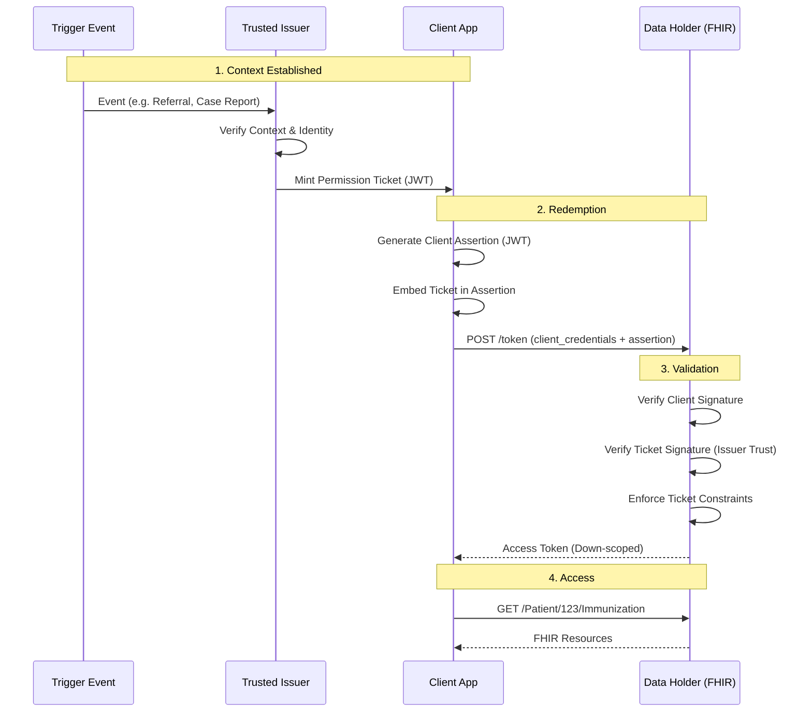

**Enabling Granular, Context-Aware Authorization in Health Networks**

### Executive Summary

Current interoperability standards (SMART on FHIR, TEFCA) face a "granularity gap." Authorization flows effectively force a choice between two extremes:
1.  **User-Centric friction:** Relying on patients to manually log in to **N** different portals to authorize a single app.
2.  **System-Centric rigidity:** Relying on backend configurations where trusted nodes get broad, "super-user" access because defining granular rules per-patient is administratively impossible.

**Permission Tickets** solve this by introducing a **Capability-Based Access Control** model to OAuth. Instead of the Data Holder asking, "Who are you and what is your pre-configured role?", it asks, "What proof do you hold that authorizes this specific request?"

A Permission Ticket is a portable, cryptographically signed artifact. It uses standard **FHIR Resources** as data models to describe the *Subject* (Patient), the *Actor* (Requesting Agent), and the *Context* (Trigger Event), enabling precise access control without requiring realtime user interaction at the data source.

---

### Problem Space

#### "N Portals" Bottleneck (Consumer Access)
In standard SMART flows, if a patient wants to aggregate their data from five different hospitals into a personal health app, they must locate five different portals, remember five usernames/passwords, and click "Approve" five times. This friction destroys adoption. Furthermore, the scopes are coarse; a user can usually only say "Yes" to everything or "No" to everything.

#### "All-or-Nothing" Network (Backend Services)
In B2B flows (like TEFCA Treatment or Payer exchange), Client Apps authenticate via certificates. Because it is too hard to configure specific permissions for every patient and every external partner, Data Holders often default to binary trust: if the partner is a "Trusted Node," they get access to the firehose. This is unacceptable for sensitive use cases like Research, Public Health, or Social Care.

---

### Solution: Permission Tickets

A **Permission Ticket** is a JWT minted by a Trusted Issuer. It acts as a self-contained authorization grant.

#### Core Principles
1.  **Issuer-Signed:** The ticket is minted by an entity the Data Holder trusts (e.g., a Trust Broker, an Identity Verifier, or the Data Holder itself).
2.  **Client-Bound:** The ticket is cryptographically bound to the Client ID of the requesting application.
3.  **FHIR-Native:** The payload uses strict FHIR Resource structures (`Patient`, `PractitionerRole`, `Organization`) to define identities, making integration with existing EHR logic seamless.
4.  **Zero-Interaction:** The Data Holder validates the ticket signature and grants access immediately. No user login page is presented.

#### Authorization Flow



---

### Technical Specification

#### Transport: SMART Backend Services Profile
This architecture is a strict profile of **[SMART Backend Services](https://build.fhir.org/ig/HL7/smart-app-launch/backend-services.html)** (which itself profiles **RFC 7523**).

The key difference is the payload of the `client_assertion`. In standard SMART Backend Services, the assertion proves the client's identity. In this architecture, the assertion **also carries the Permission Tickets** as an extension claim.

##### Trust*   **Automatic Registration**: Clients can be automatically registered using [OpenID Federation 1.0](https://openid.net/specs/openid-federation-1_0.html). The client includes a `trust_chain` in the **header** of its `client_assertion`, allowing the Authorization Server to verify the client's metadata and trust status dynamically.
*   **Client IDs** MUST be **URL Entity Identifiers** (e.g., `https://app.example.com`).
*   Clients SHOULD include a `trust_chain` in their assertion. This allows Data Holders to verify the client's legitimacy via a common Trust Anchor without requiring manual pre-registration of every client.

**The Request:**
```http
POST /token HTTP/1.1
Host: fhir.hospital.com
Content-Type: application/x-www-form-urlencoded

grant_type=client_credentials
&client_assertion_type=urn:ietf:params:oauth:client-assertion-type:jwt-bearer
&client_assertion=eyJhbGciOiJ... (Signed JWT containing tickets and trust_chain)
&scope=system/Patient.r
```

##### Full Client Assertion Example
Here is what the `client_assertion` looks like when decoded. Note the `trust_chain` for automatic registration and the embedded `ticket_context`.



#### Artifact: Ticket Structure
The ticket payload is a JWT. It wraps standard FHIR JSON objects within a `ticket_context` claim.

```javascript
{
  "iss": "https://trust-broker.org",  // Who vouches for this?
  "sub": "https://app.client.id",     // Which App can use this?
  "aud": "https://network.org",       // Where is it valid?
  "exp": 1710000000,
  
  "ticket_context": {
    // WHO is the data about? (Uses FHIR Patient shape)
    "subject": { "resourceType": "Patient", ... },

    // WHO is requesting it? (Uses FHIR Practitioner/Role/Org shapes)
    // Optional: If missing, implies the App Client is the sole actor.
    "actor": { "resourceType": "PractitionerRole", ... },

    // WHY is this allowed? (Trigger Context)
    "context": { 
      "type": { "system": "http://terminology.hl7.org/CodeSystem/v3-ActReason", "code": "REFER" },
      "focus": { "system": "http://snomed.info/sct", "code": "49436004", "display": "Atrial fibrillation" }
    },

    // WHAT data is allowed?
    "capability": { "resources": [] }
  }
}
```

### Downloads
*   **[Full Specification (PDF)](full-ig.pdf)**
*   **[Source Code & Examples (ZIP)](source-code.zip)**: Includes TypeScript scripts for key generation, ticket signing, and example generation.
*   **[Permission Ticket Logical Model](StructureDefinition-permission-ticket.html)** for formal definitions.

#### Server-Side Validation
The Data Holder must perform a two-layer validation:

1.  **Layer 1: Client Authentication (Standard SMART)**
    *   Verify the `client_assertion` signature using the Client's registered public key (JWK).
    *   Ensure the client is registered and active.

2.  **Layer 2: Ticket Validation (Permission Ticket Specific)**
    *   Extract the `https://smarthealthit.org/extension_tickets` array from the assertion.
    *   For each ticket:
        *   **Verify Signature:** Use the `iss` (Trust Broker) public key.
        *   **Verify Trust:** Is this `iss` in the Data Holder's trusted list?
        *   **Verify Binding:** Does `ticket.sub` match `assertion.sub` (Client ID)?
    *   **Grant Access:** If valid, grant the requested scopes *constrained* by the ticket's `capability` rules.

---

### Developer Documentation

This section provides technical details for developers implementing the Permission Ticket Architecture, including strict schema definitions, signing algorithms, and validation logic.

#### TypeScript Interfaces

The following TypeScript interfaces define the structure of the Permission Ticket and the Client Assertion. These can be used for strict type checking in your implementation.

```typescript
export interface PermissionTicket {
    iss: string;          // Issuer URL (Trust Broker)
    sub: string;          // Client ID (App)
    aud: string;          // Audience (Network/Data Holder)
    exp?: number;         // Expiration Timestamp
    jti?: string;         // Unique Ticket ID
    ticket_context: {
        subject: {
            type?: "match" | "reference"; 
            resourceType?: string; 
            id?: string; 
            identifier?: any[]; 
            traits?: {
                resourceType: "Patient";
                name?: { family?: string; given?: string[] }[];
                birthDate?: string;
                identifier?: any[];
                [key: string]: any;
            };
            reference?: string;
            [key: string]: any; 
        };
        actor?: {
            resourceType: "PractitionerRole" | "RelatedPerson" | "Organization" | "Practitioner";
            name?: any;
            identifier?: any[];
            telecom?: any[];
            type?: any[];
            relationship?: any[];
            contained?: any[];
            practitioner?: { reference: string };
            organization?: { reference: string };
            [key: string]: any; 
        };
        context?: {
            type: {
                system?: string;
                code?: string;
                display?: string;
            };
            focus?: {
                system?: string;
                code?: string;
                display?: string;
            };
        };
        capability: {
            scopes?: string[];
            periods?: {
                start?: string;
                end?: string;
            }[];
            locations?: any[]; // FHIR Address
            organizations?: any[]; // FHIR Organization
        };
    };
}

export interface ClientAssertion {
  iss: string; // Client ID (URL)
  sub: string; // Client ID (URL)
  aud: string; // Token Endpoint URL
  jti: string; // Unique ID
  iat: number; // Issued At
  exp: number; // Expiration
  
  // The Permission Ticket(s)
  "https://smarthealthit.org/permission_tickets": string[];
}

#### Signing and Validation

##### Signing Algorithm
*   **Algorithm:** ES256 (ECDSA using P-256 and SHA-256) is RECOMMENDED. RS256 is also supported.
*   **Header:** Must include `alg` and `kid` (Key ID) to facilitate key rotation.
*   **Keys:**
    *   **Issuer:** Signs the `PermissionTicket`. Public keys must be exposed via a JWK Set URL (e.g., `https://trust-broker.org/.well-known/jwks.json`).
    *   **Client:** Signs the `ClientAssertion`. Public keys must be registered with the Data Holder or exposed via JWKS.

##### Server-Side Validation Steps
When a Data Holder receives a token request with a `client_assertion`, it must perform the following checks:

1.  **Validate Client Assertion:**
    *   Verify the signature using the Client's public key.
    *   Check `iss` == `sub` == Client ID.
    *   Check `aud` matches the Token Endpoint URL.
    *   Check `exp` is in the future.

2.  **Extract Tickets:**
    *   Parse the `https://smarthealthit.org/extension_tickets` array.

3.  **Validate Each Ticket:**
    *   **Signature:** Verify the signature using the Issuer's public key (fetched from `iss` JWKS).
    *   **Trust:** Verify the `iss` is a trusted Trust Broker.
    *   **Binding:** Verify `sub` matches the Client ID from the Client Assertion.
    *   **Expiration:** Check `exp` is in the future.

4.  **Enforce Permissions:**
    *   Map `ticket_context.capability` to OAuth Scopes.
    *   Log `ticket_context.actor` and `ticket_context.context` for audit purposes.
    *   Issue an Access Token with the calculated scopes.

---

### Catalog of Use Cases

Here are seven scenarios demonstrating how FHIR resources are used to model diverse authorization needs.

#### Use Case 1: Network-Mediated Patient Access
*A patient uses a high-assurance Digital ID wallet to authorize an app to fetch their data from multiple hospitals.*

##### Ticket Schema
*   **Subject:** `Patient` (Matched by Demographics: Name, DOB, Identifier).
*   **Actor:** None (Implicitly the App/Patient).
*   **Context:** None.
*   **Capability:** `mode` = `read`, `resources` = `Immunization`, `AllergyIntolerance`.



#### Use Case 2: Authorized Representative (Proxy)
*An adult daughter accesses her elderly mother's records. The relationship is verified by a Trust Broker, not the Hospital.*

##### Ticket Schema
*   **Subject:** `Patient` (Matched by Identifier).
*   **Actor:** `RelatedPerson` (Name, Telecom, Relationship Code).
*   **Context:** None.
*   **Capability:** `mode` = `read`, `search` (Full Access).



#### Use Case 3: Public Health Investigation
*A Hospital creates a Case Report. The Public Health Agency (PHA) uses the report as a ticket to query for follow-up data.*

##### Ticket Schema
*   **Subject:** `Patient` (Matched by Hospital ID).
*   **Actor:** `Organization` (Name, Identifier, Type).
*   **Context:** `type` = `PUBHLTH` (Public Health), `focus` = `Tuberculosis` (SCT 56717001).
*   **Capability:** `scopes` = `patient/*.read`, `periods` (Start Date).



#### Use Case 4: Social Care (CBO) Referral
*A transactional/ad-hoc user. A Food Bank volunteer needs to update a referral status. She does not have an NPI or a user account.*

##### Ticket Schema
*   **Subject:** `Patient` (Reference).
*   **Actor:** `PractitionerRole` (Contained `Practitioner` + `Organization`).
*   **Context:** `type` = `REFER` (Referral), `focus` = `Food insecurity` (SCT 733423003).
*   **Capability:** `scopes` = `patient/ServiceRequest.read`, `patient/ServiceRequest.write`, `patient/Task.read`, `patient/Task.write`.



#### Use Case 5: Payer Claims Adjudication
*A Payer requests clinical documents to support a specific claim.*

##### Ticket Schema
*   **Subject:** `Patient` (Reference).
*   **Actor:** `Organization` (Payer NPI).
*   **Context:** `type` = `CLMATTCH` (Claim Attachment), `focus` = `Appendectomy` (SCT 80146002).
*   **Capability:** `scopes` = `patient/DocumentReference.read`, `patient/Procedure.read`.



#### Use Case 6: Research Study
*A patient consents to a study. The ticket proves consent exists without requiring the researcher to be a "user" at the hospital.*

##### Ticket Schema
*   **Subject:** `Patient` (MRN).
*   **Actor:** `Organization` (Research Institute ID).
*   **Context:** `type` = `RESCH` (Biomedical Research), `focus` = `Malignant tumor of lung` (SCT 363358000).
*   **Capability:** `scopes` = `patient/*.read`, `periods` (Start/End Date).



#### Use Case 7: Provider-to-Provider Consult
*A Specialist (Practitioner) requests data from a Referring Provider.*

##### Ticket Schema
*   **Subject:** `Patient` (Reference).
*   **Actor:** `Practitioner` (NPI).
*   **Context:** `type` = `REFER` (Referral), `focus` = `Atrial fibrillation` (SCT 49436004).
*   **Capability:** `scopes` = `patient/*.read`.


