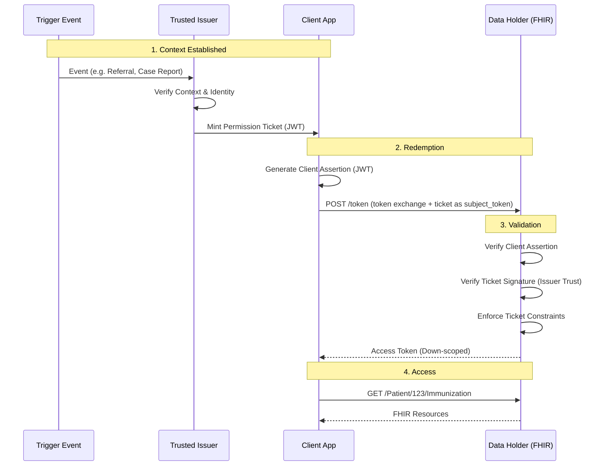



### Introduction

A Permission Ticket is an issuer-signed JWT presented to a Data Holder's token endpoint via [OAuth 2.0 Token Exchange (RFC 8693)](https://www.rfc-editor.org/rfc/rfc8693). It allows a client to redeem a portable authorization grant at any Data Holder that falls within the ticket's intended audience and satisfies its constraints, without requiring the issuer to know where the subject has received care.

The ticket is built around a **portable kernel**: only the signed fields that a Data Holder plausibly needs in order to say yes or no to a request live in the common shell. Each ticket conveys a **subject** (whose data), an optional **requester** (on whose behalf), an **access** grant (what resources and constraints), and an optional **context** object whose schema is selected by `ticket_type`.

When present, `presenter_binding` cryptographically binds the ticket to the presenting client's key and/or trust-framework identity. A Data Holder authenticates the client, verifies the ticket signature against the issuer's published keys, enforces presenter binding if present, and grants access scoped to the intersection of requested and authorized access. No user login is required at the Data Holder.

### Scope and Non-Goals

**This specification defines:**
- The Permission Ticket artifact format and required claims
- Presentation via OAuth 2.0 Token Exchange (RFC 8693) at the token endpoint
- A custom `subject_token_type` for Permission Tickets
- Discovery of Permission Ticket support via SMART configuration
- Optional sender-constrained binding via `presenter_binding`
- Audience validation for single-Data-Holder and network-wide audience sets
- Subject resolution and validation rules
- Access calculation and access constraint enforcement
- Must-understand semantics for base kernel fields and profile extensions
- Seven use-case ticket types

**This specification does not define:**
- How a ticket issuer verifies real-world facts before minting a ticket
- Trust framework governance or membership validation procedures
- User-facing consent or authorization UX
- Ticket issuance protocols between clients and issuers
- A universal schema for all possible use cases (ticket types define use-case-specific constraints)
- Constraints on downstream data use, retention, or re-disclosure by the client after data has been received; these are governed by the trust framework under which the client operates and applicable law

> **Open Question (OQ-1): Consent Beyond Ticket Fields.** What concrete use cases would require a FHIR Consent reference that the current ticket fields cannot express? The ticket's explicit fields — `access.permissions`, `data_period`, `data_holder_filter`, `sensitive_data` — already model a substantial portion of what patients and authorizing parties want to express about data sharing. If specific scenarios surface where these fields are insufficient, the specification would need a mechanism to embed or reference a FHIR Consent resource within the ticket. The working group is seeking concrete scenarios rather than theoretical ones.
{: .callout .callout-open-question #oq-1}

### Terms and Roles

This specification uses the following role terms consistently:

* **Issuer** — the party that verifies real-world facts and signs the Permission Ticket.
* **Client** — the software application that presents a Permission Ticket. When redeeming a particular ticket, this specification may refer to the client as the **presenting client** to emphasize redemption-time behavior.
* **Data Holder** — the party or system that evaluates the ticket and answers with data.
* **Authorization Server** — the token endpoint surface operated by or for a Data Holder.
* **Resource Server** — an API surface that serves data for a Data Holder.
* **Subject** — the person whose data the ticket concerns.
* **Requester** — the real-world party for whom the grant exists, as attested by the issuer.
* **Organization** — the organizational identity used in `data_holder_filter.organization`.
* **Endpoint** — a technical API surface through which a Data Holder answers.
* **Trust Framework** or **Network** — a broader participant set used in framework-style audience validation.

Unless otherwise stated, this specification uses **Data Holder** as the primary receiving-side role term and **Client** as the primary software actor term. Terms like **site** or clinic labels may appear in examples or user-interface discussion, but they are not normative protocol terms unless explicitly identified as such.

### Protocol Overview


```mermaid
sequenceDiagram
    participant Trigger as Trigger Event
    participant Issuer as Trusted Issuer
    participant Client as Client App
    participant Server as Data Holder (FHIR)

    Note over Trigger, Client: 1. Context Established
    Trigger->>Issuer: Event (e.g. Referral, Case Report)
    Issuer->>Issuer: Verify Context & Identity
    Issuer->>Client: Mint Permission Ticket (JWT)

    Note over Client, Server: 2. Redemption
    Client->>Client: Generate Client Assertion (JWT)
    Client->>Server: POST /token (token exchange + ticket as subject_token)

    Note over Server: 3. Validation
    Server->>Server: Verify Client Assertion
    Server->>Server: Verify Ticket Signature (Issuer Trust)
    Server->>Server: Enforce Ticket Constraints
    Server-->>Client: Access Token (Down-scoped)

    Note over Client, Server: 4. Access
    Client->>Server: GET /Patient/123/Immunization
    Server-->>Client: FHIR Resources
```

A trusted issuer mints a Permission Ticket and delivers it to the client. The client presents the ticket as a `subject_token` in an [RFC 8693](https://www.rfc-editor.org/rfc/rfc8693) token exchange request, authenticating itself separately. The Data Holder authenticates the client using its supported OAuth client-authentication mechanism, then validates the ticket: signature, issuer trust, audience, presenter binding, and access constraints. If valid, it issues an access token scoped to the intersection of requested and ticket-authorized access.

---

### Technical Specification

#### Transport: Token Exchange (RFC 8693)

Permission Tickets are presented via [OAuth 2.0 Token Exchange (RFC 8693)](https://www.rfc-editor.org/rfc/rfc8693). The client authenticates using a standard OAuth client-authentication mechanism and presents the Permission Ticket as a separate `subject_token` parameter. A common pattern is a JWT `client_assertion` per **RFC 7523**, as profiled by **[SMART Backend Services](https://build.fhir.org/ig/HL7/smart-app-launch/backend-services.html)** and **UDAP**. This cleanly separates client **authentication** from the authorization **grant**: the client-authentication artifact proves client identity; the `subject_token` carries the Permission Ticket.

Using a distinct grant type (`urn:ietf:params:oauth:grant-type:token-exchange`) ensures that Data Holders that do not support Permission Tickets will reject the request with `unsupported_grant_type` rather than silently ignoring the ticket.

##### Discovery

Data Holders that support Permission Tickets SHALL advertise this in their `.well-known/smart-configuration`:

```json
{
  "grant_types_supported": [
    "client_credentials",
    "urn:ietf:params:oauth:grant-type:token-exchange"
  ],
  "smart_permission_ticket_types_supported": [
    "https://smarthealthit.org/permission-ticket-type/patient-self-access-v1",
    "https://smarthealthit.org/permission-ticket-type/public-health-investigation-v1"
  ]
}
```

| Field | Description |
|-------|-------------|
| `grant_types_supported` | SHALL include `urn:ietf:params:oauth:grant-type:token-exchange` |
| `smart_permission_ticket_types_supported` | Array of `ticket_type` URIs the Data Holder accepts. Clients SHOULD check this before presenting a ticket. |

##### Trust and Client Registration

This specification is designed so that **client identity does not need to be universally understood**. The Permission Ticket carries the authorization context; the client only needs to prove it holds the key bound to the ticket (or satisfies the framework binding). Data Holders need to authenticate clients, but do not need to maintain a shared global client registry.

Many client identity approaches are compatible with this architecture. The same approach typically appears in two contexts: **registration** (how a Data Holder learns the client's keys) and **ticket binding** (how a ticket constrains which client may redeem it). These are related but not identical: for example, a manually registered unaffiliated client may still be bound by key thumbprint if the issuer knows the exact client key, or may be left unbound if the issuer does not know which client will redeem the ticket. The table below summarizes a few common examples; it is illustrative, not exhaustive, and other trust frameworks fit the same pattern.

| Approach | Registration | Binding | Key Discovery |
|----------|-------------|---------|---------------|
| **Manual** | Direct key exchange with each Data Holder | `jkt` or none | Pre-registered JWK/JWKS |
| **Well-Known JWKS** | Keys at `{entity_uri}/.well-known/jwks.json`; trust frameworks list recognized entities | `trust_framework_client` | Fetched from well-known endpoint |
| **OpenID Federation** | `trust_chain` in `client_assertion` header; validated via common Trust Anchor | `trust_framework_client` | Resolved from `trust_chain` |
| **UDAP** | X.509 certificate chain from a trusted CA | `trust_framework_client` | `x5c` header of `client_assertion` |

Client ID format and registration details are determined by the chosen approach. Client-to-Issuer issuance protocol details are out of scope for this specification; profile-specific guides may define them.

For the **Well-Known JWKS** approach, this specification uses a deterministic client identifier convention:

- the client's stable identifier is `well-known:{entity_uri}`
- `entity_uri` is the HTTPS URL identity of the client
- the same `entity_uri` yields the same `client_id` at every Data Holder, so no per-holder registration-assigned identifier is needed for this class of client

This is how a set of independently operated Data Holders can recognize the same well-known client consistently. The `well-known:` prefix indicates that the remainder of the `client_id` is an entity URL whose keys are published at `{entity_uri}/.well-known/jwks.json`. When a client presents a `client_assertion` with `iss = sub = well-known:{entity_uri}`, the Data Holder strips the prefix, resolves the JWKS from the entity's well-known location, verifies the signature, and then applies any relevant trust-framework checks for that entity.

**The Request:**
```http
POST /token HTTP/1.1
Host: fhir.hospital.com
Content-Type: application/x-www-form-urlencoded

grant_type=urn:ietf:params:oauth:grant-type:token-exchange
&subject_token=eyJhbGciOiJ... (Permission Ticket JWT, signed by issuer)
&subject_token_type=https://smarthealthit.org/token-type/permission-ticket
&scope=patient/Observation.rs
&client_assertion_type=urn:ietf:params:oauth:client-assertion-type:jwt-bearer
&client_assertion=eyJhbGciOiJ... (Client authentication JWT)
```

| Parameter | Value |
|-----------|-------|
| `grant_type` | `urn:ietf:params:oauth:grant-type:token-exchange` |
| `subject_token` | The signed Permission Ticket JWT |
| `subject_token_type` | `https://smarthealthit.org/token-type/permission-ticket` |
| `scope` | Requested SMART scopes |
| `client_assertion_type` | `urn:ietf:params:oauth:client-assertion-type:jwt-bearer` |
| `client_assertion` | Client authentication JWT (for example, a SMART Backend Services or UDAP assertion) |

##### Full Example
Here is what the `client_assertion` looks like when decoded. This example uses SMART Backend Services conventions; it does not contain the Permission Ticket.



The Permission Ticket is sent separately in the `subject_token` parameter. See the [use case examples](#catalog-of-use-cases) below for decoded ticket payloads.

##### Presentation Model

Client authentication and authorization are separated:

- The **client-authentication artifact** authenticates the client separately from the ticket. In the common JWT-based profiles shown here, the `client_assertion` contains only `iss`, `sub`, `aud`, `jti`, and `exp` — no ticket content.
- The **`subject_token`** carries the Permission Ticket. It is a separate form parameter, not embedded in the assertion.

The ticket's `presenter_binding` claim determines how tightly the ticket is bound to a specific client. There are three modes:

1. **Key-bound** (`presenter_binding.method = "jkt"`): the ticket can only be redeemed by the client whose key matches the bound thumbprint.
2. **Framework-bound** (`presenter_binding.method = "trust_framework_client"`): the ticket can only be redeemed by a client whose trust-framework-recognized identity matches the bound entity (for example `well-known`, `oidf`, or `udap`).
3. **No binding** (`presenter_binding` absent): any authenticated client in the ticket's `aud` may redeem it.

In all three modes, the Data Holder authenticates the client through its standard mechanism (e.g., `client_assertion` JWT). The binding claims add constraints on top of that authentication, not in place of it. See [Presenter Binding](#presenter-binding) below for full verification rules.

The Data Holder SHALL NOT rely on any cross-party-stable client identifier inside the Permission Ticket itself. Client identity is established by the `client_assertion` (`iss`/`sub`).

#### Artifact: Ticket Structure
The ticket payload is a JWT. It carries top-level `subject`, `access`, optional `requester`, and optional `context` claims alongside the standard JWT envelope. `ticket_type` is the sole discriminator for the context schema and processing rules.



See the JSON Schema and generated TypeScript definitions below for formal structural definitions.

Every Permission Ticket SHALL include `ticket_type`. The `ticket_type` identifies the ticket's schema and processing rules. The Data Holder uses `ticket_type` to select validation and access logic.

#### Presenter Binding
A Permission Ticket MAY bind redemption to a specific client using the `presenter_binding` claim. `presenter_binding` is a discriminated union selected by `method`, with two shapes:

- **Key binding**:
  ```json
  {
    "method": "jkt",
    "jkt": "<RFC 7638 thumbprint>"
  }
  ```
- **Framework binding**:
  ```json
  {
    "method": "trust_framework_client",
    "trust_framework": "<trust framework id>",
    "framework_type": "<udap | well-known | oidf>",
    "entity_uri": "<client entity URI>"
  }
  ```

**Note on `cnf`:** Standard JWT confirmation uses the `cnf` claim ([RFC 7800](https://www.rfc-editor.org/rfc/rfc7800)). This specification uses `presenter_binding.method = "jkt"` with a sibling `jkt` field instead, keeping all presenter-binding semantics in one place. The binding semantics are the same as `cnf.jkt`; only the claim shape differs.

##### Binding Modes

| Mode | `method` | Verification |
|------|----------|--------------|
| **Key-bound** | `"jkt"` | Data Holder computes the JWK Thumbprint ([RFC 7638](https://www.rfc-editor.org/rfc/rfc7638)) of the `client_assertion` signing key and compares it to `presenter_binding.jkt`. Reject on mismatch. |
| **Framework-bound** | `"trust_framework_client"` | Data Holder confirms the client matches `entity_uri` within the named `trust_framework`. For UDAP: certificate SAN matches `entity_uri`. For well-known: fetch `{entity_uri}/.well-known/jwks.json` and verify `client_assertion`. For OIDF: validate the client's federation material for `entity_uri` under the named trust framework and verify the presented `client_assertion` keys through that federation trust chain. |
| **No binding** | *(absent)* | Any authenticated client in the ticket's `aud` may redeem it. |

In all modes, the Data Holder authenticates the presenting client through its standard mechanism. Presenter binding adds a constraint on top of that authentication, not in place of it.

##### Presenter Binding per Ticket Type

`presenter_binding` is REQUIRED for individual-access use cases (UC1, UC2) and OPTIONAL for B2B use cases. Some deployments will require it more broadly by local policy or narrower profiles.

| Ticket Type | `presenter_binding` | Rationale |
|-------------|---------------------|-----------|
| UC1: Patient Access | Required | Individual access; ticket must be bound to the presenting client |
| UC2: Authorized Rep | Required | Authorized representative; ticket must be bound to the presenting client |
| UC3: Public Health | Optional | B2B; `aud` + client auth sufficient |
| UC4: Social Care | Optional | B2B; `aud` + client auth sufficient |
| UC5: Payer Claims | Optional | B2B; `aud` + client auth sufficient |
| UC6: Research | Optional | Issuer may use binding, but base model does not require it |
| UC7: Provider Consult | Optional | B2B; strictly better than status quo even without key binding |

#### Server-Side Validation
The Data Holder SHALL perform a two-layer validation:

1.  **Layer 1: Client Authentication (Standard OAuth)**
    *   Validate the client's authentication according to the locally supported OAuth client-authentication mechanism.
    *   When JWT `client_assertion` authentication is used, verify the signature using the configured key material or trust framework for that client.
    *   Ensure the client is eligible to authenticate using that mechanism.

2.  **Layer 2: Ticket Validation (Permission Ticket Specific)**
    *   Verify the `subject_token_type` is `https://smarthealthit.org/token-type/permission-ticket`.
    *   Parse the `subject_token` as a JWT.
    *   **Verify Signature:** Use the `iss` (Trusted Issuer) public key.
    *   **Verify Trust:** Is this `iss` accepted under the Data Holder's locally configured trust policy?
    *   **Verify Type:** `ticket_type` SHALL be present and recognized. The Data Holder SHALL verify the `ticket_type` is listed in its `smart_permission_ticket_types_supported`.
    *   **Verify Presenter Binding:** If `presenter_binding` is present, verify it according to `presenter_binding.method`.
    *   **Check `must_understand`:** If `must_understand` is present, verify the Data Holder recognizes every listed claim name. Reject with `invalid_grant` if any entry is unrecognized.
    *   **Enforce Kernel Fields:** Every kernel field present in the ticket is must-understand. If the Data Holder encounters a kernel field it cannot enforce, it SHALL reject with `invalid_grant`.
    *   **Grant Access:** If valid, grant the requested scopes *constrained* by the ticket's `access` rules.

#### Subject Resolution

The `subject` identifies whose data the ticket authorizes access to. Every ticket SHALL include `subject.patient`, a FHIR Patient resource carrying the demographic facts needed for matching (name, date of birth, identifiers). The patient may be thin — it only needs enough information for the Data Holder to resolve to a local record.

Optionally, `subject.recipient_record` may provide a direct-target optimization: a FHIR Reference that can carry a `.reference` (literal resource URL), a `.identifier` (business identifier such as an MRN at the target Data Holder), or both. When `recipient_record` is present, the Data Holder SHOULD use it as a hint for faster resolution, falling back to demographic matching on `subject.patient` if the reference does not resolve.

If subject resolution yields zero matches, or more than one match, the Data Holder SHALL reject the request with `invalid_grant` and an appropriate `error_description`.

#### Issuer-Attested Claims

`requester` and `context` are issuer-attested facts. The Data Holder uses them for local policy evaluation and audit. The Data Holder does NOT independently re-verify the requester's identity, delegation relationship, consent, mandate, or contract — the issuer's reputation and trust-framework membership back that trust.

If `requester` is absent, the ticket does not assert a separate third-party requester (i.e., it is self-access by the patient identified in `subject.patient`). This does not mean anonymous access — the presenting client is still authenticated by the outer `client_assertion`.

When `ticket_type` defines no context fields, `context` MAY be omitted entirely or be `{}`.

---

### Access Calculation

The Data Holder calculates granted access through the **intersection** of:

1. **Requested Scopes**: The `scope` parameter in the token request
2. **Ticket Access**: Constraints from `access`
3. **Client Registration**: Scopes the client is permitted to request

If the intersection yields no valid access, return `invalid_scope` error.
Requested scopes SHALL use SMART scope grammar. This specification allows either `patient/*` or `system/*` scopes depending on ticket type. The `patient/*` versus `system/*` scope prefix reflects the OAuth client/access mode at the Data Holder, not whether the ticket is single-patient or population-level. In the current base kernel, every ticket still identifies a single patient via `subject.patient`. For single-patient ticket types, clients SHOULD request SMART v2 CRUDS suffix scopes (for example, `patient/Observation.rs`).

#### SMART Scope Projection

The `access.permissions` array is the normative authorization model. Each `DataPermission` maps to SMART v2 scopes as follows:

* `resource_type` maps to the SMART resource type (e.g., `Observation`, `Condition`, or `*` for all resources)
* `interactions` map to SMART CRUDS suffixes: `create` = `c`, `read` = `r`, `update` = `u`, `delete` = `d`, `search` = `s`

For example, a permission `{ kind: "data", resource_type: "Observation", interactions: ["read", "search"] }` projects to a SMART scope such as `patient/Observation.rs` or `system/Observation.rs`, depending on the applicable ticket profile and client mode.

`OperationPermission` rules (e.g., `$everything`, `$export`) do not have a direct SMART scope equivalent; Data Holders should map these to appropriate local operation-level authorization.

> **Open Question (OQ-2): Ticket-Level Scope Mode for Future Non-Patient Subjects.** The current base kernel always includes `subject.patient`, so current tickets naturally project to patient-level semantics even when redeemed by backend clients. If future use cases introduce a different subject shape (for example, `Group`) or no subject at all, the working group may need an explicit ticket-level scope mode (for example, `patient` vs `system`) or a profile rule that changes SMART scope projection. This question is only relevant if future use cases require non-individual or subjectless tickets.
{: .callout .callout-open-question #oq-2}

#### Access Constraints

The `access` object defines what access the ticket authorizes:

| Field | Type | Description |
|-------|------|-------------|
| `permissions` | PermissionRule[] | **Required.** Array of typed permission rules (DataPermission or OperationPermission). Each DataPermission specifies a `resource_type`, required `interactions`, and optional narrowing filters (`category_any_of`, `code_any_of`). Each OperationPermission specifies a FHIR operation `name` and optional `target`. |
| `data_period` | Period | One coarse timeframe. Data Holder SHALL filter results to resources whose clinically relevant date falls within this period. If disjoint windows are needed, mint separate tickets. |
| `data_holder_filter` | DataHolderFilter[] | Optional Data Holder-side scoping. Each entry is either a jurisdiction filter (`{ kind: "jurisdiction", address }`) or an organization filter (`{ kind: "organization", organization }`). A Data Holder may answer if it matches **any** listed filter. |
| `sensitive_data` | "exclude" \| "include" | Sensitive data policy. If absent, the Data Holder applies its own default policy. |

##### Constraint Algebra

Constraints combine as follows:

- **Across dimensions** (AND): returned data must satisfy every present constraint (`permissions`, `data_period`, `data_holder_filter`, `sensitive_data`). An absent dimension means no restriction.
- **Across permission entries** (OR): a resource matching any single `DataPermission` rule is authorized.
- **Within a permission's filters** (AND across groups, OR within): if both `category_any_of` and `code_any_of` are populated, a resource must match at least one category AND at least one code.
- **Within `data_holder_filter`** (OR): a Data Holder may answer if it matches any listed filter.

##### Example Walkthrough

```json
"access": {
  "permissions": [
    {
      "kind": "data",
      "resource_type": "Observation",
      "interactions": [
        "read",
        "search"
      ],
      "category_any_of": [
        {
          "system": "http://terminology.hl7.org/CodeSystem/observation-category",
          "code": "laboratory"
        },
        {
          "system": "http://terminology.hl7.org/CodeSystem/observation-category",
          "code": "vital-signs"
        }
      ],
      "code_any_of": [
        {
          "system": "http://loinc.org",
          "code": "718-7"
        },
        {
          "system": "http://loinc.org",
          "code": "4548-4"
        }
      ]
    },
    {
      "kind": "data",
      "resource_type": "Condition",
      "interactions": [
        "read",
        "search"
      ]
    }
  ],
  "data_period": {
    "start": "2023-01-01",
    "end": "2024-12-31"
  },
  "data_holder_filter": [
    {
      "kind": "jurisdiction",
      "address": {
        "state": "CA"
      }
    },
    {
      "kind": "jurisdiction",
      "address": {
        "state": "NY"
      }
    },
    {
      "kind": "organization",
      "organization": {
        "resourceType": "Organization",
        "identifier": [
          {
            "system": "http://hl7.org/fhir/sid/us-npi",
            "value": "123"
          }
        ]
      }
    }
  ],
  "sensitive_data": "exclude"
}
```

This example applies all four constraint dimensions together:

- **`data_holder_filter`** (OR): only a Data Holder operating in CA, in NY, or matching organization NPI `123` may answer at all.
- **`permissions`** (OR across entries): at a matching Data Holder, an Observation is authorized if it matches at least one listed category AND at least one listed code. A Condition is authorized by the second rule regardless of those filters.
- **`data_period`**: only resources with clinically relevant dates in 2023–2024 are returned. Relevant dates are `authored`, `recorded`, `issued`, or `effective[x]`, falling back to encounter timing. Identity-type resources (Patient, Practitioner, Organization, Location) are exempt.
- **`sensitive_data`**: locally classified sensitive data is excluded.

Because dimensions are ANDed: a matching Observation from a non-matching Data Holder is still not authorized, and data outside the period is excluded even if it matches a permission rule. If disjoint time windows are needed, mint separate tickets.

Data Holders that cannot enforce a presented constraint SHALL reject the ticket with `invalid_grant` and `error_description` indicating the unsupported constraint.

#### Sensitive Data

* `"exclude"` means the Data Holder should exclude locally classified sensitive data.
* `"include"` means the ticket permits such data, **subject to local law and Data Holder policy** — even with `resource_type: "*"` and `sensitive_data: "include"`, the Data Holder may still withhold data that local law prohibits releasing (e.g., 42 CFR Part 2 substance abuse records without proper consent).
* If `sensitive_data` is absent, Data Holders apply their own default policy.
* If classification is unknown and the ticket says `"exclude"`, Data Holders should default conservatively.

> **Open Question (OQ-3): Sensitive Data Granularity.** The current two-value model (`"exclude"` / `"include"`) is intentionally coarse. Real-world patient preferences often involve specific categories — for example, sharing general medical data but excluding substance use treatment records, reproductive health history, or behavioral health records. Future versions of this specification may define a richer vocabulary of sensitive-data categories. The working group is seeking feedback on whether a categorical model is operationalizable given the current state of data tagging in production systems, and whether a middle ground exists between a single boolean and a full sensitivity taxonomy.
{: .callout .callout-open-question #oq-3}

#### Data Holder Filters

* `data_holder_filter` restricts which Data Holders may respond to the ticket.
* Each entry is one of:
  * `{ kind: "jurisdiction", address }`
  * `{ kind: "organization", organization }`
* The filter gates the responding Data Holder, not individual clinical resources.
* `aud` identifies the coarse intended Data Holder audience for the ticket; `data_holder_filter` narrows within that audience.
* Endpoints are technical response surfaces, not the scoped object. A ticket does not fundamentally scope one specific FHIR endpoint, DICOMweb endpoint, or other API URL.
* Matching is one-hop against the responding Data Holder, not a provenance chain.
* Multiple filter entries are ORed together.

<div class="callout callout-info" markdown="1">

**Implementation Note: An organization filter may authorize a broader shared Data Holder.**

In the real-world ecosystem, a single Data Holder frequently serves multiple independent physical clinics, hospitals, and sometimes entirely distinct organizations through one or more shared technical endpoints. Within these shared systems, clinical data such as Allergies, Problems, and Medications is integrated into a unified patient chart and often cannot be reliably attributed to or filtered by a specific leaf-node facility.

Because `data_holder_filter.organization` evaluates whether the Data Holder *as a whole* is authorized to answer, a Data Holder that accepts a ticket will typically return the integrated patient record it holds, subject to the ticket's other constraints. This specification does not guarantee that a patient-facing site or clinic selection maps to a separately enforceable technical boundary.

Ticket Issuers SHOULD, where such information is available, use directory or network information (for example, published endpoint networks, trust framework directories, or SMART Brands data) to clarify when a selected facility or organization is actually served through a broader shared Data Holder. Exact topology is not always knowable in advance, and this specification does not require the Issuer to resolve it perfectly before minting a ticket.

If the Issuer can determine that a selected facility or organization is served through a broader shared Data Holder, it should say so explicitly. If it cannot determine that precisely, it should warn more generically that the resulting disclosure boundary may be broader than the patient-facing site or clinic label suggests. Future versions may explore optional ways to communicate finer disclosure-boundary hints, but this specification does not define them.

</div>

#### Jurisdiction Filters

* Jurisdiction filters are modeled with country/state-style values only.
* A Data Holder checks whether its own jurisdiction matches the listed address.
* A Data Holder operating in multiple jurisdictions SHOULD answer if any of its jurisdictions match the filter, and MAY apply narrower internal filtering if its architecture supports that attribution.

#### Organization Filters

* Organization filters positively scope which Data Holders may answer.
* Matching is by organizational identity, typically an NPI carried in `organization.identifier`.
* A Data Holder may answer if it matches the named organization or is authorized to answer on that organization's behalf.
* This filter is endpoint-agnostic. If a Data Holder operates multiple technical endpoints, a single organization filter authorizes access through any endpoint by which that organization is authorized to answer and that supports the Permission Ticket grant type.
* Data Holders that manage integrated records across multiple facilities evaluate this filter at the Data Holder level, not as a resource-by-resource clinical data filter.

#### Token-Time and Resource-Time Enforcement

Some access constraints — especially `data_period`, `data_holder_filter`, and `sensitive_data` — may require filtering at the Resource Server rather than at the token endpoint. If a constraint cannot be fully enforced at token issuance, the Authorization Server SHALL carry the normalized constraint set forward in the issued access token (or make it available via token introspection) so the Resource Server can enforce it.

If a component responsible for enforcing a constraint cannot do so, the request SHALL be rejected rather than silently ignoring the constraint.

#### Using Multiple Tickets

A single Permission Ticket confers one set of access constraints that applies uniformly to all Data Holders in its audience. When an authorizing party requires different access constraints for different Data Holders — for example, sharing lab results from one responder but only conditions from another, or using different lifetimes, Data Holder filters, or sensitive-data handling — the issuer should mint separate tickets, each with its own `access` block and, optionally, a narrower `aud` or `data_holder_filter`.

Clients managing multiple tickets present the appropriate ticket in each token exchange request. Since each request carries exactly one `subject_token`, the client selects which ticket to present based on which Data Holder it is connecting to.

This pattern also applies when one set of intended permissions simply does not fit cleanly into one ticket shape. Rather than modeling heterogeneous authorization inside one ticket, issuing a set of tickets keeps each individual ticket simple and its constraints unambiguous.

---

### Must-Understand Semantics

#### Base Must-Understand Set

Every field defined in the kernel is must-understand when present. If a Data Holder receives a ticket containing a kernel field it cannot enforce, it SHALL reject with `invalid_grant`. The base must-understand set includes:

* JWT envelope: `iss`, `aud`, `exp`, `jti`, `ticket_type`
* `presenter_binding`
* `subject` (`subject.patient` and optional `subject.recipient_record`)
* `requester`
* `access.permissions`
* `access.data_period`
* `access.data_holder_filter`
* `access.sensitive_data`
* `context`
* `revocation`

#### `must_understand` for Extensions

Profile-specific claims not in the base set are safe to ignore **unless** the issuer lists them in `must_understand`. A Data Holder that sees a `must_understand` entry it does not recognize SHALL reject the ticket with `invalid_grant`.

`must_understand` lists **top-level claim names** that the Data Holder MUST understand beyond the base kernel. Each entry is a string matching a top-level claim in the ticket payload. This is inspired by the JWS `crit` header parameter ([RFC 7515](https://www.rfc-editor.org/rfc/rfc7515) Section 4.1.11) but applied to payload claims rather than header parameters.

#### Unknown Fields

Fields not in the base kernel, not in `must_understand`, and not recognized by the Data Holder are safe to ignore. This is standard JWT behavior.

#### Extension Example

A profile adds encounter-class filtering via a new top-level claim and lists it in `must_understand`:

```json
{
  "iss": "https://issuer.example.org",
  "aud": "https://network.example.org/token",
  "exp": 1775328000,
  "jti": "ext-example-1",
  "ticket_type": "https://example.org/ticket-types/encounter-filtered-v1",
  "must_understand": ["encounter_class_filter"],
  "encounter_class_filter": {
    "include": [
      {
        "system": "http://terminology.hl7.org/CodeSystem/v3-ActCode",
        "code": "AMB"
      }
    ]
  },
  "subject": { "..." : "..." },
  "access": { "..." : "..." },
  "context": {}
}
```

A Data Holder that understands `encounter_class_filter` enforces it. A Data Holder that does not recognize the name rejects the ticket because it appears in `must_understand`. If the issuer had omitted `encounter_class_filter` from `must_understand`, Data Holders that do not recognize it would simply ignore it.

Extensions should be modeled as new top-level claims rather than injecting fields into existing kernel structures. This keeps extensions visible and prevents profiles from silently altering the semantics of base claims.

---

### Requester Semantics

`requester` is an **issuer-attested claim** about the real-world party for whom the grant exists. It is distinct from the presenting software client (the presenter authenticates via `client_assertion` and optional `presenter_binding`).

* Absent for self-access. For self-access, the patient's identity is already in `subject.patient`; a separate `requester` would be redundant.
* Present for proxy, organizational, clinician, or other non-self use cases.
* The Data Holder trusts the issuer's attestation; it does **not** independently verify the requester's identity against the client authentication event.
* The Data Holder **may use `requester` for local policy decisions** — scoping data, applying sensitivity rules, choosing which local access-control policies apply, audit logging, etc.
* The **security gate** for ticket redemption remains: issuer trust, ticket signature, presenter binding, and audience validation. `requester` is not part of that gate.
* The level of real-world verification the issuer performed before attesting to the requester varies by use case. For delegation, the issuer typically identity-proofed the requester and confirmed the patient's intent to delegate. For B2B use cases (public health, payer, consult), the issuer has institutional knowledge of the requesting organization rather than individual identity proofing.

#### Relationship between `presenter_binding` and `requester`

The `requester` and `presenter_binding` will often identify the same organization — the requesting organization is also the one operating the client software. But they do not need to align. Multiple requesters may share a client; an organization may operate a client on behalf of several requesters; or a platform provider may present tickets on behalf of various requesting organizations. The `requester` describes who the grant is for; the presenter binding constrains which software may redeem it.

#### Delegation and RelatedPerson.relationship

For delegated access, the `requester` is a `RelatedPerson`. FHIR's `RelatedPerson.relationship` field (0..* CodeableConcept, Preferred binding) can express both the personal relationship **and** the legal authority type using stacked codings from v3-RoleCode:

* Familial: `DAU` (daughter), `MTH` (mother), `SPS` (spouse), etc.
* Legal authority: `GUARD` (guardian), `HPOWATT` (healthcare power of attorney), `DPOWATT` (durable POA), `POWATT` (power of attorney), `SPOWATT` (special POA)

R5 explicitly added the legal authority codes to the RelatedPerson relationship value set. A single `requester` can carry both:

```json
"requester": {
  "resourceType": "RelatedPerson",
  "relationship": [
    {
      "coding": [
        {
          "system": "http://terminology.hl7.org/CodeSystem/v3-RoleCode",
          "code": "DAU"
        }
      ]
    },
    {
      "coding": [
        {
          "system": "http://terminology.hl7.org/CodeSystem/v3-RoleCode",
          "code": "HPOWATT"
        }
      ]
    }
  ],
  "name": [
    {
      "family": "Reyes",
      "given": [
        "Elena"
      ]
    }
  ]
}
```

This tells the Data Holder: "the requester is the patient's daughter and holds healthcare power of attorney." The Data Holder can use this for local policy decisions (e.g., applying different rules for a guardian vs. a POA holder). The actual POA document, if needed for audit or review, is outside the base ticket kernel.

---

### Issuer vs. Data Holder Responsibility

The issuer does all real-world verification. The ticket carries only what the Data Holder needs for matching, filtering, and local policy selection.

#### What the Issuer Verifies Before Minting

* Patient identity (via digital ID, in-person verification, portal authentication, etc.)
* Requester identity and relationship to patient (for delegation: POA, guardianship, parental authority; for B2B: organizational identity)
* Legal/regulatory basis for access (consent obtained, mandate exists, contract in force, care relationship established)
* Scope appropriateness (the requested access is within the delegation scope, study protocol, mandate authority, etc.)
* Any jurisdiction-specific requirements

#### What the Data Holder Uses from the Ticket

* **For matching**: `subject.patient` to resolve to a local patient record
* **For cryptographic validation**: signature, `iss` (issuer trust), `exp`, `aud`, `presenter_binding`
* **For access filtering**: `access.permissions`, `data_period`, `data_holder_filter`, `sensitive_data`
* **For local policy selection**: `requester` (type, identity, relationship), `ticket_type`, `context` — the Data Holder may apply different local policies based on these (e.g., broader release for a public health investigation than for a payer claim)
* **For audit**: all of the above

#### What the Data Holder Does NOT Do

* Re-verify the delegation relationship, consent, mandate, or contract
* Independently authenticate the requester's identity (the client is authenticated; the requester is an issuer attestation)
* Require off-ticket supporting documents to say yes or no (unless a narrower profile says otherwise)

The Data Holder trusts the issuer for all real-world verification. The issuer's reputation and trust-framework membership back that trust.

---

### Context (Ticket-Type-Specific Semantics)

The `context` claim carries ticket-type-specific mandatory workflow semantics. `ticket_type` is the sole discriminator; there is no separate `context.kind`.

A fact belongs in `context` if every instance of that ticket type needs it for the Data Holder to say yes or no, but other ticket types do not.

| Ticket Type | Required Context Fields |
|-------------|------------------------|
| UC1, UC2 | *(none; `context` may be omitted)* |
| UC3 | `reportable_condition` |
| UC4 | `concern`, `referral` |
| UC5 | `service`, `claim` |
| UC6 | `study` |
| UC7 | `reason`, `consult_request` |

UC1 and UC2 intentionally define no context fields. Delegation is expressed by the presence and type of `requester`, not by a context discriminator.

---

### Ticket Audience (`aud`) and Effective Eligible Data Holder Set

For Permission Tickets, `aud` identifies the coarse intended Data Holder audience for the ticket. It does not imply that the issuer knows where the subject has received care or where data is actually held, and it does not by itself determine the final eligible set. The effective eligible Data Holder set is determined by Data Holders that trust the issuer, match the ticket's `aud`, and satisfy `data_holder_filter` when present.

Optional `aud_type` indicates how `aud` should be interpreted. When present, it applies uniformly to the singleton value or to every entry in the `aud` array. Mixed arrays are invalid. This specification defines two values: `data_holder_url` and `trust_framework`. This base specification allows `aud_type` to be omitted for backward compatibility, but profiles SHOULD populate it whenever ambiguity is possible.

This is distinct from `aud` in the outer client-authentication artifact. In JWT `client_assertion` profiles such as SMART Backend Services or UDAP, that `aud` remains the Data Holder's token endpoint URL.

When `aud` is a **specific Data Holder URL** (or array of URLs), the Data Holder's base URL SHALL exactly match one of the values. `aud_type: "data_holder_url"` makes this explicit:

```json
{ "aud": "https://fhir.hospital.com", "aud_type": "data_holder_url" }
```

When `aud` is a **trust framework identifier**, the Data Holder SHALL be a verified participant in that framework (e.g., the Data Holder's Entity ID appears in the framework's federation). `aud_type: "trust_framework"` makes this explicit:

```json
{ "aud": "https://tefca.hhs.gov", "aud_type": "trust_framework" }
```

#### Recommendations

| Scenario | Recommended `aud` |
|----------|-------------------|
| Ticket for known single Data Holder | Specific Data Holder URL |
| Ticket valid across a network | Trust framework identifier |
| Ticket for multiple known Data Holders | Array of Data Holder URLs |

Data Holders SHALL reject tickets where `aud` validation fails with error `invalid_grant` and `error_description`: "Ticket not valid for this server".

---

### Ticket Type Registry

Each use case maps to a `ticket_type` URI that identifies the ticket's schema and processing rules:

* [Use Case Catalog](use-case-catalog.html)

Data Holders advertise which `ticket_type` URIs they support via `smart_permission_ticket_types_supported` in their `.well-known/smart-configuration`. Unknown `ticket_type` values SHALL be rejected with `invalid_grant`.

> **Note on future multi-token composition:** RFC 8693 defines an optional `actor_token` parameter alongside `subject_token`. Future versions of this specification may use `actor_token` to support multi-token composition scenarios (e.g., a separate identity ticket from a verified identity provider combined with an authorization ticket from a trusted issuer). All current use cases require only a single Permission Ticket as the `subject_token`.

---

### Ticket Lifecycle

#### Validity Period

- Tickets SHALL include an `exp` (expiration) claim
- Data Holders SHALL reject expired tickets
- Recommended validity periods:

| Use Case | Recommended `exp` |
|----------|-------------------|
| Interactive/real-time | 1-4 hours |
| Batch processing | 24 hours |
| Standing authorization | Up to 1 year (with revocation) |

#### Long-Lived Access

For scenarios requiring access beyond a single session (e.g., ongoing care relationships, research studies), two approaches are supported:

**Approach 1: Refresh via Issuer**

The client periodically obtains fresh tickets from the issuer. Suitable when:
- Issuer interaction is low-friction (automated, no user involvement)
- Access should be re-validated regularly

**Approach 2: Long-Lived Tickets with Revocation**

The issuer mints a ticket with extended validity (weeks to months) and supports revocation. Suitable when:
- Issuer interaction is high-friction (e.g., in-person identity verification via Clear, notarized documents)
- Access may need to be terminated before natural expiration
- The cost of re-issuance (user time, verification fees) is prohibitive

> **Open Question (OQ-4): Tickets as Refresh Credentials.** For long-lived access, a promising pattern may eliminate dedicated refresh tokens entirely. A long-lived revocable ticket with presenter binding serves as the refresh credential: the client re-presents the ticket whenever it needs a fresh short-lived access token. The Data Holder validates the ticket (including a revocation check against the status list) and issues a new access token without maintaining dedicated refresh-token state. This provides single-point revocation — one bit flip in the issuer's status list terminates access everywhere — and can avoid per-session refresh-token state at the Data Holder. Open operational questions: revocation-check latency and status-list caching strategy. The working group is seeking input on whether this pattern should be developed into normative guidance.
{: .callout .callout-open-question #oq-4}

#### Revocation

Issuers MAY support revocation of individual tickets before expiration.

**Status List Pointer**

Tickets supporting revocation include a `revocation` claim:



| Field | Description |
|-------|-------------|
| `revocation.url` | URL of the issuer's status list for this category of tickets |
| `revocation.index` | Zero-based bit index for this ticket in the published status list |

**Status List Format**

The status list is a JSON file served at the URL specified in the ticket:



| Field | Description |
|-------|-------------|
| `kid` | Optional key identifier for the ticket-signing key family covered by this list |
| `bits` | Base64url-encoded gzip-compressed bitstring. A set bit marks the corresponding `revocation.index` as revoked. |

**Revocation Checking**

*Issuers:*
- SHALL publish the status list at the URL specified in tickets
- SHALL serve the status list over HTTPS

*Data Holders:*
- If `revocation` is present in the ticket, SHALL fetch or use a valid cached copy of the status list
- MAY cache status-list responses respecting HTTP cache headers
- SHALL reject tickets whose `revocation.index` bit is set
- If revocation status cannot be determined (no valid cache and retrieval failure), SHALL reject the request (fail-closed)

**Grouping for Privacy**

Issuers MAY use multiple status-list URLs to group tickets by category, preventing unnecessary cross-ticket correlation when checking revocation.

#### Reusability

A ticket may be presented any number of times during its validity period, to the same or different Data Holders. Data Holders SHALL NOT reject a ticket solely because they have previously seen its `jti`.

---

### Catalog of Use Cases

Here are seven scenarios demonstrating how Permission Tickets model diverse authorization needs. Each use case maps to a single `ticket_type`.

The detailed registry, per-profile constraint matrix, and worked examples now live on the dedicated catalog page:

* [Use Case Catalog](use-case-catalog.html)

---

### Developer Reference

#### TypeScript Types

The published TypeScript definitions are maintained alongside the canonical Zod schema using lightweight FHIR aliases, then copied into the IG include path during snippet sync.

They are published on a dedicated page to keep this main architecture page lighter:

* [TypeScript Definitions](typescript-definitions.html)

#### Signing Algorithm

*   **Algorithm:** ES256 (ECDSA using P-256 and SHA-256) is RECOMMENDED. RS256 is also supported.
*   **JWS Header:** SHALL include `alg` and `kid` (Key ID) to facilitate key rotation.
*   **Roles:**
    *   The **issuer** signs the `PermissionTicket`.
    *   The **client** signs the `ClientAssertion` it presents to the Data Holder.
*   **Binding:** When present, `presenter_binding.method = "jkt"` binds redemption to a specific client key via its JWK Thumbprint ([RFC 7638](https://www.rfc-editor.org/rfc/rfc7638)). `presenter_binding.method = "trust_framework_client"` binds redemption to a trust-framework-recognized entity. When `presenter_binding` is absent, `aud` + client authentication provide the trust boundary.

For where issuer and client signing keys are published and discovered, see [Issuer Key Publication](#issuer-key-publication) and [Client Key Publication](#client-key-publication) below.

#### Issuer Key Publication

Every Permission Ticket issuer SHALL publish its verification keys as a JWK Set at `${iss}/.well-known/jwks.json`. This is the required framework-agnostic baseline publication path for Permission Ticket verification.

Issuers that participate in a trust framework MAY additionally publish through that framework's native discovery format. The Data Holder MAY use the baseline JWKS path, a framework-native mechanism, or both, according to its own configured trust policy.

*   **OpenID Federation** — the issuer publishes its leaf entity configuration at `${iss}/.well-known/openid-federation`. See [OpenID Federation for Permission Ticket Issuers](oidf-issuers.html) for the metadata layout, the structural binding between `iss` and the OIDF leaf entity ID, the federation-signing vs ticket-signing key separation, and the verifier pipeline.
*   **UDAP** — discovery begins from `${iss}/.well-known/udap`.

Implementations that publish the same issuer through multiple mechanisms SHOULD keep any shared `kid` values aligned across those publication surfaces. This is an interoperability recommendation, not a token-time validation requirement.

#### Client Key Publication

Client public keys used to verify a `ClientAssertion` SHALL be available through the client identity approach accepted by the Data Holder, such as out-of-band registration, configured JWKS discovery, certificate-based validation, or trust-framework-native resolution. The specific publication path depends on the client identity approach in use; see [Trust and Client Registration](#trust-and-client-registration) above for representative patterns.

#### Error Responses

When ticket validation fails, the Data Holder SHALL return an OAuth 2.0 error response per RFC 6749.

| Scenario | `error` | `error_description` |
|----------|---------|---------------------|
| Grant type not supported | `unsupported_grant_type` | "Token exchange not supported" |
| Missing or wrong `subject_token_type` | `invalid_request` | "Unsupported subject token type" |
| Missing `subject_token` | `invalid_request` | "No permission ticket provided" |
| Malformed ticket (not valid JWT) | `invalid_grant` | "Malformed permission ticket" |
| Missing `ticket_type` | `invalid_grant` | "Missing ticket type" |
| Ticket signature invalid | `invalid_grant` | "Ticket signature verification failed" |
| Issuer not trusted | `invalid_grant` | "Ticket issuer not trusted: {iss}" |
| Issuer JWKS unavailable | `invalid_grant` | "Unable to retrieve issuer keys" |
| Ticket expired | `invalid_grant` | "Ticket expired" |
| Presenter binding mismatch (key or trust framework) | `invalid_grant` | "Ticket presenter binding mismatch" |
| `aud` mismatch | `invalid_grant` | "Ticket not valid for this server" |
| Unknown `ticket_type` | `invalid_grant` | "Unsupported ticket type" |
| Unrecognized `must_understand` entry | `invalid_grant` | "Unrecognized must_understand claim: {name}" |
| Unsupported kernel field | `invalid_grant` | "Cannot enforce kernel field: {field}" |
| Subject not resolvable | `invalid_grant` | "Unable to resolve ticket subject" |
| Ambiguous subject match | `invalid_grant` | "Ambiguous ticket subject match" |
| Ticket revoked | `invalid_grant` | "Ticket has been revoked" |
| Unsupported constraint | `invalid_grant` | "Unsupported access constraint: {field}" |
| No valid scopes after intersection | `invalid_scope` | "No authorized scopes" |

---

### Conformance

This section defines requirements using RFC 2119 keywords (SHALL, SHOULD, MAY).

#### Data Holder Requirements

**SHALL:**
- Support the `urn:ietf:params:oauth:grant-type:token-exchange` grant type at the token endpoint
- Advertise `urn:ietf:params:oauth:grant-type:token-exchange` in `grant_types_supported` in `.well-known/smart-configuration`
- Advertise supported ticket types in `smart_permission_ticket_types_supported` in `.well-known/smart-configuration`
- Accept `subject_token_type` of `https://smarthealthit.org/token-type/permission-ticket`
- Validate client authentication per the locally supported OAuth client-authentication mechanism (for example, SMART Backend Services or UDAP)
- Verify the ticket's signature, `ticket_type`, `aud`, and `exp`
- If `presenter_binding` is present, verify it according to `presenter_binding.method`
- Validate `ticket_type` is recognized (listed in `smart_permission_ticket_types_supported`) and select processing rules accordingly
- Process `must_understand`: reject with `invalid_grant` if any listed claim name is unrecognized
- Reject with `invalid_grant` if any present kernel field cannot be enforced
- Resolve `subject.patient` to a local patient record; reject if zero or ambiguous matches
- Calculate granted access as intersection of requested scopes, ticket `access.permissions`, and client registration
- Enforce all presented `access` constraints (`permissions`, `data_period`, `data_holder_filter`, `sensitive_data`) or reject with `invalid_grant`
- Enforce subset constraints at the appropriate layer (token endpoint, resource server, or both)
- If `revocation` is present, perform revocation checking before issuing a token; if revocation status cannot be determined, reject the request
- Return appropriate error codes on validation failure

**SHOULD:**
- Cache issuer JWKS with appropriate TTL
- Cache revocation responses per HTTP cache headers
- Log `requester` and `context` for audit trail

**MAY:**
- Support trust framework audience validation
- Use `subject.recipient_record` as a hint for faster patient resolution


The OAuth `error` codes above are normative. The `error_description` values are representative examples; implementations may use different wording while conveying the same failure.

#### Client Requirements

**SHALL:**
- Use `grant_type=urn:ietf:params:oauth:grant-type:token-exchange`
- Include the Permission Ticket as `subject_token` with `subject_token_type=https://smarthealthit.org/token-type/permission-ticket`
- Authenticate to the token endpoint using a Data Holder-supported OAuth client-authentication mechanism
- When using a JWT client assertion, use identical value for `iss` and `sub` in that assertion (the Client ID URL)

For well-known clients, that Client ID URL is the deterministic identifier `well-known:{entity_uri}` rather than a Data Holder-assigned registration identifier.

**SHOULD:**
- Check `smart_permission_ticket_types_supported` in the Data Holder's `.well-known/smart-configuration` before presenting a ticket
- Request only scopes authorized by held tickets
- For single-patient ticket types, request SMART v2 CRUDS suffix scopes (for example `patient/Observation.rs`)
- When using a JWT client assertion, include `jti` in that assertion for replay protection
- Refresh tickets before expiration for continued access
#### Issuer Requirements

**SHALL:**
- Sign tickets with keys published at `{iss}/.well-known/jwks.json`
- Include claims: `iss`, `aud`, `exp`, `jti`, `ticket_type`, `subject`, `access`, and `context` when the ticket type defines context fields
- When using `presenter_binding`, bind the ticket appropriately with one method (`jkt` or `trust_framework_client`)
- If `revocation` is present, publish the status list at the URL specified in tickets

**SHOULD:**
- Verify real-world facts (patient identity, requester identity, legal basis, scope appropriateness) before minting
- Include `iat` for audit
- Use short expiration for interactive use cases (1-4 hours)
- Support revocation for long-lived tickets
- Include `must_understand` when minting tickets with profile-specific extension claims

---

### Downloads

*   **[Source Code & Examples (ZIP)](source-code.zip)**: Includes TypeScript scripts for key generation, ticket signing, and example generation.
*   **Permission Ticket JSON Schema** and **generated TypeScript types** in the Developer Reference section for formal structural definitions.
