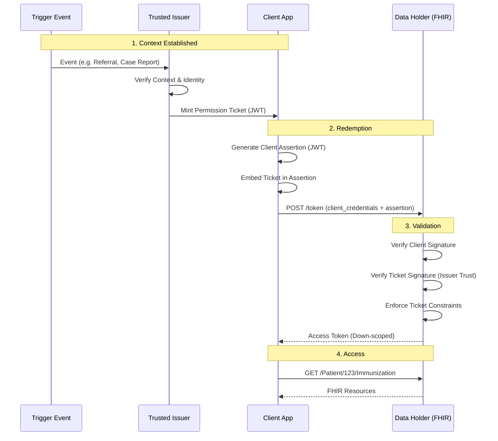

**Enabling Granular, Context-Aware Authorization in Health Networks**

### Executive Summary

Current interoperability standards and frameworks (SMART on FHIR, TEFCA) face a "granularity gap." Authorization flows effectively force a choice between two extremes:
1.  **User-Centric friction:** Relying on patients to manually log in to **N** different portals to authorize a single app.
2.  **System-Centric rigidity:** Relying on backend configurations where trusted nodes get broad, "super-user" access because defining granular rules per-patient is administratively impossible.

**Permission Tickets** solve this by introducing a **Capability-Based Access Control** model to OAuth. Instead of the Data Holder asking, "Who are you and what is your pre-configured role?", it asks, "What proof do you hold that authorizes this specific request?"

A Permission Ticket is a portable, cryptographically signed artifact. It uses standard **FHIR Resources** as data models to describe the *Subject* (Patient), the *Actor* (Requesting Agent), and the *Context* (Trigger Event), enabling precise access control without requiring realtime user interaction at the data source.

---

### Problem Space

#### "N Portals" Bottleneck (Consumer Access)
In standard SMART flows, if a patient wants to aggregate their data from five different hospitals into a personal health app, they must locate five different portals, remember five usernames/passwords, and click "Approve" five times. This friction destroys adoption. Furthermore, the scopes are coarse; a user can usually only say "Yes" to everything or "No" to everything.

#### "All-or-Nothing" Network (Backend Services)
In B2B flows (like TEFCA Treatment or Payer exchange), Client Apps authenticate via certificates. Because it is too hard to configure specific permissions for every patient and every external partner, Data Holders often default to binary trust: if the partner is a "Trusted Node," they get access to the firehose. This is unacceptable for sensitive use cases like Research, Public Health, or Social Care.

---

### Solution: Permission Tickets

A **Permission Ticket** is a JWT minted by a Trusted Issuer. It acts as a self-contained authorization grant.

#### Core Principles
1.  **Issuer-Signed:** The ticket is minted by an entity the Data Holder trusts (e.g., a Trust Broker, an Identity Verifier, or the Data Holder itself).
2.  **Client-Bound:** The ticket is cryptographically bound to the Client ID of the requesting application.
3.  **FHIR-Native:** The payload uses strict FHIR Resource structures (`Patient`, `PractitionerRole`, `Organization`) to define identities, making integration with existing EHR logic seamless.
4.  **Zero-Interaction:** The Data Holder validates the ticket signature and grants access immediately. No user login page is presented.

#### Authorization Flow


```mermaid
sequenceDiagram
    participant Trigger as Trigger Event
    participant Issuer as Trusted Issuer
    participant Client as Client App
    participant Server as Data Holder (FHIR)

    Note over Trigger, Client: 1. Context Established
    Trigger->>Issuer: Event (e.g. Referral, Case Report)
    Issuer->>Issuer: Verify Context & Identity
    Issuer->>Client: Mint Permission Ticket (JWT)
    
    Note over Client, Server: 2. Redemption
    Client->>Client: Generate Client Assertion (JWT)
    Client->>Client: Embed Ticket in Assertion
    Client->>Server: POST /token (client_credentials + assertion)
    
    Note over Server: 3. Validation
    Server->>Server: Verify Client Signature
    Server->>Server: Verify Ticket Signature (Issuer Trust)
    Server->>Server: Enforce Ticket Constraints
    Server-->>Client: Access Token (Down-scoped)
    
    Note over Client, Server: 4. Access
    Client->>Server: GET /Patient/123/Immunization
    Server-->>Client: FHIR Resources
```

---

### Technical Specification

#### Transport: SMART Backend Services Profile
This architecture is a strict profile of **[SMART Backend Services](https://build.fhir.org/ig/HL7/smart-app-launch/backend-services.html)** (which itself profiles **RFC 7523**).

The key difference is the payload of the `client_assertion`. In standard SMART Backend Services, the assertion proves the client's identity. In this architecture, the assertion **also carries the Permission Tickets** in a dedicated `https://smarthealthit.org/permission_tickets` claim.

##### Trust

*   **Automatic Registration**: Clients can be automatically registered using [OpenID Federation 1.0](https://openid.net/specs/openid-federation-1_0.html). The client includes a `trust_chain` in the **header** of its `client_assertion`, allowing the Authorization Server to verify the client's metadata and trust status dynamically.
*   **Client IDs** MUST be **URL Entity Identifiers** (e.g., `https://app.example.com`).
*   Clients SHOULD include a `trust_chain` in their assertion. This allows Data Holders to verify the client's legitimacy via a common Trust Anchor without requiring manual pre-registration of every client.

**The Request:**
```http
POST /token HTTP/1.1
Host: fhir.hospital.com
Content-Type: application/x-www-form-urlencoded

grant_type=client_credentials
&client_assertion_type=urn:ietf:params:oauth:client-assertion-type:jwt-bearer
&client_assertion=eyJhbGciOiJ... (Signed JWT containing tickets and trust_chain)
&scope=system/Patient.r
```

##### Full Client Assertion Example
Here is what the `client_assertion` looks like when decoded. Note the `trust_chain` for automatic registration and the embedded `ticket_context`.



#### Artifact: Ticket Structure
The ticket payload is a JWT. It wraps standard FHIR JSON objects within a `ticket_context` claim.

```javascript
{
  "iss": "https://trust-broker.org",  // Who vouches for this?
  "sub": "https://app.client.id",     // Which App can use this?
  "aud": "https://network.org",       // Where is it valid?
  "exp": 1710000000,
  
  "ticket_context": {
    // WHO is the data about? (Uses FHIR Patient shape)
    "subject": { "resourceType": "Patient", ... },

    // WHO is requesting it? (Uses FHIR Practitioner/Role/Org shapes)
    // Optional: If missing, implies the App Client is the sole actor.
    "actor": { "resourceType": "PractitionerRole", ... },

    // WHY is this allowed? (Trigger Context)
    "context": { 
      "type": { "system": "http://terminology.hl7.org/CodeSystem/v3-ActReason", "code": "REFER" },
      "focus": { "system": "http://snomed.info/sct", "code": "49436004", "display": "Atrial fibrillation" },
      
      // Optional: Issuer-specific identifiers (e.g., Case ID, Referral ID)
      // Can be used for internal tracking or opaque tokens for the issuing server.
      "identifier": [
        { "system": "https://issuer.org/cases", "value": "CASE-123" }
      ]
    },

    // WHAT data is allowed?
    "capability": { "scopes": ["patient/*.read"] }
  }
}
```

See the [Logical Model](StructureDefinition-PermissionTicket.html) for formal definitions.

#### Server-Side Validation
The Data Holder must perform a two-layer validation:

1.  **Layer 1: Client Authentication (Standard SMART)**
    *   Verify the `client_assertion` signature using the Client's registered public key (JWK).
    *   Ensure the client is registered and active.

2.  **Layer 2: Ticket Validation (Permission Ticket Specific)**
    *   Extract the `https://smarthealthit.org/permission_tickets` array from the assertion.
    *   For each ticket:
        *   **Verify Signature:** Use the `iss` (Trust Broker) public key.
        *   **Verify Trust:** Is this `iss` in the Data Holder's trusted list?
        *   **Verify Binding:** Does `ticket.sub` match `assertion.sub` (Client ID)?
    *   **Grant Access:** If valid, grant the requested scopes *constrained* by the ticket's `ticket_context.capability` rules.

---

### Access Calculation

The Data Holder calculates granted access through the **intersection** of:

1. **Requested Scopes**: The `scope` parameter in the token request
2. **Ticket Capability**: Constraints from `ticket_context.capability`
3. **Client Registration**: Scopes the client is permitted to request

If the intersection yields no valid access, return `invalid_scope` error.

#### Capability Constraints

The `capability` object defines what access the ticket authorizes:

| Field | Type | Description |
|-------|------|-------------|
| `scopes` | string[] | SMART scopes (e.g., `patient/*.read`). Wildcard scopes expand to match specific requests. |
| `periods` | Period[] | Time restrictions. Data Holder SHOULD filter results to resources with relevant dates within these periods. |
| `locations` | Address[] | Jurisdictional restrictions at **state granularity**. If present, Data Holder SHOULD limit results to data from matching jurisdictions. |
| `organizations` | Organization[] | Source restrictions. If present, Data Holder SHOULD limit results to data from matching organizations (by identifier or name). |

**Constraint Semantics:**
- All present constraints are **conjunctive** (AND): data must satisfy all constraints
- Empty or absent constraint means "no restriction" for that dimension
- Data Holders that cannot enforce a constraint MUST reject the ticket with `invalid_grant` and `error_description` indicating the unsupported constraint

**Example Capability:**
```json
{
  "capability": {
    "scopes": ["patient/Condition.read", "patient/Procedure.read"],
    "periods": [{ "start": "2023-01-01", "end": "2024-12-31" }],
    "locations": [{ "state": "CA" }, { "state": "NY" }],
    "organizations": [{ "identifier": [{ "system": "http://hl7.org/fhir/sid/us-npi", "value": "1234567890" }] }]
  }
}
```
This ticket authorizes read access to Conditions and Procedures, but only for data:
- With dates in 2023-2024
- From California or New York
- From the organization with NPI 1234567890

---

### Multiple Tickets

A client MAY present multiple tickets in the `permission_tickets` array to compose authorization from multiple sources.

#### Use Case Profiles

Multi-ticket scenarios are defined by **use case profiles**. Each profile specifies:
- The expected set of tickets (by issuer type or purpose)
- How tickets are evaluated jointly
- Which ticket provides which claims (subject, actor, capability, etc.)

This specification does not define generic combination semantics. Instead, trust frameworks and implementation guides define specific profiles for their use cases.

#### Example Profiles

**Profile: Identity + Designated Representative**

Two tickets are required:
1. **Identity Ticket** (from Identity Provider): Contains verified `actor` identity
2. **Authorization Ticket** (from Trust Broker): Contains `subject`, `capability`, and a reference linking to the actor

```
Ticket 1 (Identity Provider - e.g., Clear):
{
  "iss": "https://clear.me",
  "sub": "https://health-app.example.com",
  "ticket_context": {
    "actor": {
      "resourceType": "RelatedPerson",
      "identifier": [{ "system": "https://clear.me/id", "value": "CLR-789" }],
      "name": [{ "family": "Smith", "given": ["Jane"] }]
    }
  }
}

Ticket 2 (Trust Broker):
{
  "iss": "https://trust-broker.org",
  "sub": "https://health-app.example.com",
  "ticket_context": {
    "subject": { "type": "match", "traits": { ... } },
    "context": {
      "type": { "code": "DPOA" },
      "actor_reference": "https://clear.me/id|CLR-789"
    },
    "capability": { "scopes": ["patient/*.read"] }
  }
}
```

The Data Holder, implementing this profile:
1. Validates both tickets independently
2. Confirms the `actor_reference` in Ticket 2 matches the `actor.identifier` in Ticket 1
3. Uses actor from Ticket 1, subject and capability from Ticket 2

**Profile: Base + Sensitive Category**

A network-level ticket provides baseline access; an additional ticket from a specialized authority grants access to sensitive categories (e.g., behavioral health, substance use).

#### Common Rules

Regardless of profile, these rules always apply:
- All tickets MUST have identical `sub` (bound to the same client)
- All tickets MUST be valid for the Data Holder (per audience rules)
- All issuers MUST be trusted by the Data Holder

---

### Audience (`aud`) Validation

The `aud` claim specifies where the ticket is valid. Two modes are supported:

#### Mode 1: Enumerated Recipients

The `aud` is a specific URL or array of URLs:

```json
{ "aud": "https://fhir.hospital.com" }
// or
{ "aud": ["https://fhir.hospital-a.com", "https://fhir.hospital-b.com"] }
```

**Validation:** The Data Holder's base URL MUST exactly match one of the enumerated values.

#### Mode 2: Trust Framework

The `aud` references a trust framework identifier:

```json
{ "aud": "https://tefca.hhs.gov" }
```

**Validation:** The Data Holder MUST be a verified participant in the referenced trust framework. Verification mechanisms are trust-framework-specific (e.g., the Data Holder's Entity ID appears in the framework's federation).

#### Recommendations

| Scenario | Recommended `aud` |
|----------|-------------------|
| Ticket for known single recipient | Specific Data Holder URL |
| Ticket valid across a network | Trust framework identifier |
| Ticket for multiple known recipients | Array of Data Holder URLs |

Data Holders MUST reject tickets where `aud` validation fails with error `invalid_grant` and `error_description`: "Ticket audience mismatch".

---

### Ticket Lifecycle

#### Validity Period

- Tickets MUST include an `exp` (expiration) claim
- Data Holders MUST reject expired tickets
- Recommended validity periods:

| Use Case | Recommended `exp` |
|----------|-------------------|
| Interactive/real-time | 1-4 hours |
| Batch processing | 24 hours |
| Standing authorization | Up to 1 year (with revocation) |

#### Long-Lived Access

For scenarios requiring access beyond a single session (e.g., ongoing care relationships, research studies), two approaches are supported:

**Approach 1: Refresh via Issuer**

The client periodically obtains fresh tickets from the issuer. Suitable when:
- Issuer interaction is low-friction (automated, no user involvement)
- Access should be re-validated regularly

**Approach 2: Long-Lived Tickets with Revocation**

The issuer mints a ticket with extended validity (weeks to months) and supports revocation. Suitable when:
- Issuer interaction is high-friction (e.g., in-person identity verification via Clear, notarized documents)
- Access may need to be terminated before natural expiration
- The cost of re-issuance (user time, verification fees) is prohibitive

#### Revocation

Issuers MAY support revocation of individual tickets before expiration.

**Revocation Identifier**

Tickets supporting revocation include a `revocation` claim:

```json
{
  "iss": "https://trust-broker.org",
  "sub": "https://app.example.com",
  "exp": 1735689600,
  "jti": "ticket-unique-id",
  "revocation": {
    "url": "https://trust-broker.org/.well-known/crl/patient-access.json",
    "rid": "abc123xyz"
  },
  "ticket_context": { ... }
}
```

| Field | Description |
|-------|-------------|
| `revocation.url` | URL of the issuer's Credential Revocation List (CRL) for this category of tickets |
| `revocation.rid` | Revocation identifier for this ticket. MUST be opaque (not contain PII). |

**Generating `rid`:** Issuers SHOULD use a one-way transformation to prevent correlation:
```
rid = base64url(hmac-sha-256(issuer_secret || kid, ticket_jti)[0:8])
```

**Revocation List Format**

The CRL is a JSON file served at the URL specified in the ticket:

```json
{
  "kid": "issuer-signing-key-id",
  "method": "rid",
  "ctr": 42,
  "rids": [
    "abc123xyz",
    "def456uvw.1710460800"
  ]
}
```

| Field | Description |
|-------|-------------|
| `kid` | Key ID used to sign tickets covered by this CRL |
| `method` | Revocation method identifier. Value `"rid"` indicates the method defined in this specification. |
| `ctr` | Monotonic counter incremented on each update. Verifiers use this to detect changes. |
| `rids` | Array of revoked `rid` values. Optional `.timestamp` suffix (Unix seconds) revokes only tickets issued before that time. |

**Timestamp Suffix Example:**

The entry `"def456uvw.1710460800"` revokes tickets with `rid` = `def456uvw` that were issued (`iat`) before March 15, 2024 00:00:00 UTC. Tickets with that `rid` issued after this timestamp remain valid.

**Revocation Checking**

*Issuers:*
- MUST publish CRL at the URL specified in tickets
- MUST serve CRL over HTTPS
- MUST increment `ctr` on every update

*Data Holders:*
- If `revocation` is present in ticket, SHOULD check the CRL
- MAY cache CRL responses respecting HTTP cache headers
- MUST reject tickets whose `rid` appears in the CRL (respecting timestamp suffix if present)
- If CRL is unavailable, MAY accept ticket (fail-open) or reject (fail-closed) per local policy

**Grouping for Privacy**

Issuers MAY use multiple CRL URLs to group tickets by category, preventing correlation across ticket types when checking revocation.

#### Reusability

- Tickets are **reusable** until expiration (or revocation)
- Data Holders are NOT REQUIRED to enforce single-use semantics
- If single-use is required for a use case, the issuer should use very short expiration times

---

### Catalog of Use Cases

Here are seven scenarios demonstrating how FHIR resources are used to model diverse authorization needs.

#### Use Case 1: Network-Mediated Patient Access
*A patient uses a high-assurance Digital ID wallet to authorize an app to fetch their data from multiple hospitals.*

##### Ticket Schema
*   **Subject:** `Patient` (Matched by Demographics: Name, DOB, Identifier).
*   **Actor:** None (Implicitly the App/Patient).
*   **Context:** None.
*   **Capability:** `scopes` = `patient/Immunization.read`, `patient/AllergyIntolerance.read`.



#### Use Case 2: Authorized Representative (Proxy)
*An adult daughter accesses her elderly mother's records. The relationship is verified by a Trust Broker, not the Hospital.*

##### Ticket Schema
*   **Subject:** `Patient` (Matched by Identifier).
*   **Actor:** `RelatedPerson` (Name, Telecom, Relationship Code).
*   **Context:** None.
*   **Capability:** `scopes` = `patient/*.read`.



#### Use Case 3: Public Health Investigation
*A Hospital creates a Case Report. The Public Health Agency (PHA) uses the report as a ticket to query for follow-up data.*

##### Ticket Schema
*   **Subject:** `Patient` (Matched by Hospital ID).
*   **Actor:** `Organization` (Name, Identifier, Type).
*   **Context:** `type` = `PUBHLTH` (Public Health), `focus` = `Tuberculosis` (SCT 56717001), `identifier` = Case ID.
*   **Capability:** `scopes` = `patient/*.read`, `periods` (Start Date).



#### Use Case 4: Social Care (CBO) Referral
*A transactional/ad-hoc user. A Food Bank volunteer needs to update a referral status. She does not have an NPI or a user account.*

##### Ticket Schema
*   **Subject:** `Patient` (Reference).
*   **Actor:** `PractitionerRole` (Contained `Practitioner` + `Organization`).
*   **Context:** `type` = `REFER` (Referral), `focus` = `Food insecurity` (SCT 733423003).
*   **Capability:** `scopes` = `patient/ServiceRequest.read`, `patient/ServiceRequest.write`, `patient/Task.read`, `patient/Task.write`.



#### Use Case 5: Payer Claims Adjudication
*A Payer requests clinical documents to support a specific claim.*

##### Ticket Schema
*   **Subject:** `Patient` (Reference).
*   **Actor:** `Organization` (Payer NPI).
*   **Context:** `type` = `CLMATTCH` (Claim Attachment), `focus` = `Appendectomy` (SCT 80146002).
*   **Capability:** `scopes` = `patient/DocumentReference.read`, `patient/Procedure.read`.



#### Use Case 6: Research Study
*A patient consents to a study. The ticket proves consent exists without requiring the researcher to be a "user" at the hospital.*

##### Ticket Schema
*   **Subject:** `Patient` (MRN).
*   **Actor:** `Organization` (Research Institute ID).
*   **Context:** `type` = `RESCH` (Biomedical Research), `focus` = `Malignant tumor of lung` (SCT 363358000).
*   **Capability:** `scopes` = `patient/*.read`, `periods` (Start/End Date).



#### Use Case 7: Provider-to-Provider Consult
*A Specialist (Practitioner) requests data from a Referring Provider.*

##### Ticket Schema
*   **Subject:** `Patient` (Reference).
*   **Actor:** `Practitioner` (NPI).
*   **Context:** `type` = `REFER` (Referral), `focus` = `Atrial fibrillation` (SCT 49436004).
*   **Capability:** `scopes` = `patient/*.read`.



---

### Developer Reference

#### TypeScript Interfaces

The following TypeScript interfaces define the structure of the Permission Ticket and the Client Assertion.

```typescript
export interface PermissionTicket {
    iss: string;          // Issuer URL (Trust Broker)
    sub: string;          // Client ID (App)
    aud: string;          // Audience (Network/Data Holder)
    exp?: number;         // Expiration Timestamp
    jti?: string;         // Unique Ticket ID
    revocation?: {
        url: string;      // CRL URL
        rid: string;      // Revocation ID
    };
    ticket_context: {
        subject: {
            type?: "match" | "reference"; 
            resourceType?: string; 
            id?: string; 
            identifier?: any[]; 
            traits?: {
                resourceType: "Patient";
                name?: { family?: string; given?: string[] }[];
                birthDate?: string;
                identifier?: any[];
            };
            reference?: string;
        };
        actor?: {
            resourceType: "PractitionerRole" | "RelatedPerson" | "Organization" | "Practitioner";
            name?: any;
            identifier?: any[];
            telecom?: any[];
            type?: any[];
            relationship?: any[];
            contained?: any[];
            practitioner?: { reference: string };
            organization?: { reference: string };
        };
        context?: {
            type: { system?: string; code?: string; display?: string; };
            focus?: { system?: string; code?: string; display?: string; };
            identifier?: { system?: string; value: string; }[];
        };
        capability: {
            scopes?: string[];
            periods?: { start?: string; end?: string; }[];
            locations?: { state?: string; country?: string; }[];
            organizations?: { identifier?: any[]; name?: string; }[];
        };
    };
}

export interface ClientAssertion {
    iss: string;          // Client ID
    sub: string;          // Client ID
    aud: string;          // Token Endpoint URL
    jti: string;          // Unique Assertion ID
    iat?: number;         // Issued-at Timestamp
    exp?: number;         // Expiration Timestamp
    "https://smarthealthit.org/permission_tickets": string[];
}
```

#### Signing Algorithm
*   **Algorithm:** ES256 (ECDSA using P-256 and SHA-256) is RECOMMENDED. RS256 is also supported.
*   **Header:** Must include `alg` and `kid` (Key ID) to facilitate key rotation.
*   **Keys:**
    *   **Issuer:** Signs the `PermissionTicket`. Public keys must be exposed via a JWK Set URL (e.g., `https://trust-broker.org/.well-known/jwks.json`).
    *   **Client:** Signs the `ClientAssertion`. Public keys must be registered with the Data Holder or exposed via JWKS.

#### Error Responses

When ticket validation fails, the Data Holder MUST return an OAuth 2.0 error response per RFC 6749.

| Scenario | `error` | `error_description` |
|----------|---------|---------------------|
| No tickets in assertion | `invalid_request` | "No permission tickets provided" |
| Malformed ticket (not valid JWT) | `invalid_grant` | "Malformed permission ticket" |
| Ticket signature invalid | `invalid_grant` | "Ticket signature verification failed" |
| Issuer not trusted | `invalid_grant` | "Ticket issuer not trusted: {iss}" |
| Issuer JWKS unavailable | `invalid_grant` | "Unable to retrieve issuer keys" |
| Ticket expired | `invalid_grant` | "Ticket expired" |
| `sub` mismatch | `invalid_grant` | "Ticket not bound to this client" |
| `aud` mismatch | `invalid_grant` | "Ticket not valid for this server" |
| Subject not resolvable | `invalid_grant` | "Unable to resolve ticket subject" |
| Ticket revoked | `invalid_grant` | "Ticket has been revoked" |
| Unsupported constraint | `invalid_grant` | "Unsupported capability constraint: {field}" |
| No valid scopes after intersection | `invalid_scope` | "No authorized scopes" |

---

### Conformance

This section defines requirements using RFC 2119 keywords (MUST, SHOULD, MAY).

#### Data Holder Requirements

**MUST:**
- Accept `https://smarthealthit.org/permission_tickets` claim in client assertions
- Validate client assertion per SMART Backend Services
- For each ticket: verify signature, `sub` binding, `aud`, and `exp`
- Calculate granted scopes as intersection of requested, ticket capability, and client registration
- Return appropriate error codes on validation failure

**SHOULD:**
- Cache issuer JWKS with appropriate TTL
- Log `ticket_context.actor` and `ticket_context.context` for audit trail
- Enforce `capability.periods`, `capability.locations`, `capability.organizations`
- Check revocation lists when `revocation` is present

**MAY:**
- Support trust framework audience validation
- Support multiple tickets per use case profile

#### Client Requirements

**MUST:**
- Include tickets as an array in `https://smarthealthit.org/permission_tickets` claim
- Sign client assertion with registered or federated key
- Use identical value for `iss` and `sub` in client assertion (the Client ID URL)

**SHOULD:**
- Request only scopes authorized by held tickets
- Include `jti` in client assertion for replay protection
- Refresh tickets before expiration for continued access

#### Issuer Requirements

**MUST:**
- Sign tickets with keys published at `{iss}/.well-known/jwks.json`
- Include claims: `iss`, `sub`, `aud`, `exp`, `ticket_context`
- Bind each ticket to a specific client via `sub`
- If supporting revocation: publish CRL at the URL specified in tickets

**SHOULD:**
- Include `jti` for unique ticket identification
- Verify client identity and authorization before minting tickets
- Use short expiration for interactive use cases (1-4 hours)
- Support revocation for long-lived tickets
- Use opaque `rid` values that do not leak PII

---

### Downloads

*   **[Source Code & Examples (ZIP)](source-code.zip)**: Includes TypeScript scripts for key generation, ticket signing, and example generation.
*   **[Permission Ticket Logical Model](StructureDefinition-PermissionTicket.html)** for formal definitions.
