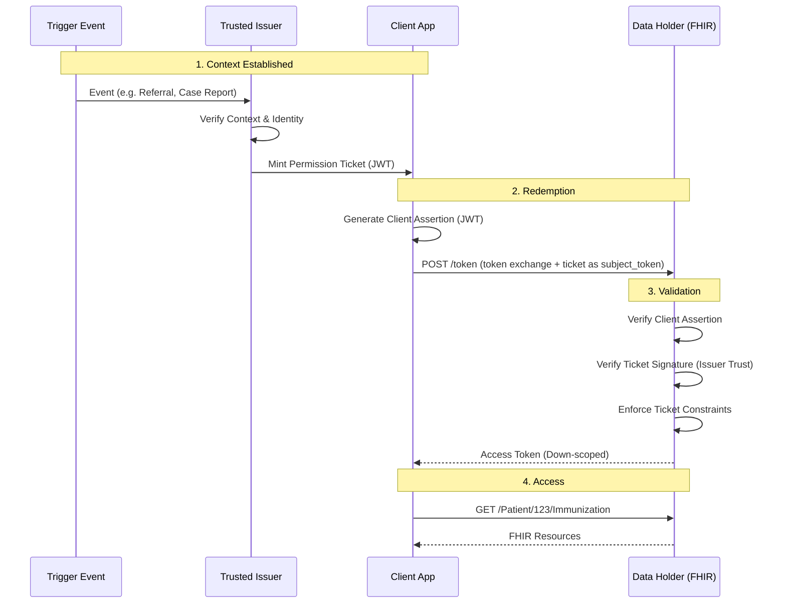



> This is a draft specification developed in the [Argonaut Project](https://confluence.hl7.org/spaces/AP/pages/413255067/SMART+Permission+Tickets). If community experience supports it, the intended destination is HL7 standardization alongside the SMART App Launch family. The base protocol is realm-agnostic; individual ticket types may bind realm-specific artifacts — the payer types bind US claims and HIPAA concepts — and US program requirements such as the CMS Interoperability Framework criteria are motivating examples, not requirements of this specification. Open design questions are tracked in the [Open Questions registry](open-questions.html).
{: .callout .callout-info}

### Introduction

A Permission Ticket is a **signed access ticket**: an issuer-signed JWT that a client presents to a Data Holder's token endpoint via [OAuth 2.0 Token Exchange (RFC 8693)](https://www.rfc-editor.org/rfc/rfc8693). It lets a client ask a Data Holder for a local access token without repeating the whole authorization or verification workflow at each one. The ticket is portable: the same ticket can be presented at any Data Holder within its intended audience, without requiring the issuer to know where the subject has received care.

The ticket is built around a **portable kernel**: only the signed fields a Data Holder plausibly needs to say yes or no to a request. Each ticket conveys a **subject** (whose data), an optional **requester** (on whose behalf), and an **access** object holding the ticket's access constraints (what may be released). A ticket type may add top-level profile claims for the facts its use case needs.

**Subject, requester, and ticket type are policy-selection inputs; the `access` object is an enforced limit** (see [Access Constraints](#access-constraints)). Data Holders already maintain internal access policies — for self-access, proxy classes, B2B disclosure, and more. These policy-selection inputs carry enough issuer-verified facts — who is asking, about whom, and why — for the Data Holder to select the correct local policy, even for a requester it has never seen. The ticket selects among the Data Holder's policies; it does not rewrite them. If the Data Holder accepts the ticket, it issues a local access token scoped by the ticket, the client's request and eligibility, the selected ticket type, and the Data Holder's own policies and technical capabilities.

When present, `presenter_binding` cryptographically binds the ticket to the presenting client's key and/or trust-framework identity. A Data Holder authenticates the client, verifies the ticket signature against the issuer's published keys, enforces presenter binding if present, and grants access per [Access Calculation](#access-calculation). No user login is required at the Data Holder.

### Where Things Belong

The ticket carries only what a Data Holder needs at redemption time. This table shows where each kind of information belongs:

| Information | Belongs in |
|-------------|------------|
| Who signed the ticket | Ticket (`iss`, signature) |
| Who the data is about | Ticket (`subject`, identity evidence) |
| Who is asking, and why they can ask | Ticket (`requester`, ticket type, profile claims) |
| Limits on what may be released | Ticket (`access` constraints) |
| The underlying source document or verification record | Issuer records, not the ticket |
| Detailed jurisdiction-specific rules | Ticket-type profile, trust framework, or Data Holder policy |
| Final release/token decision | Data Holder |
| Downstream use obligations | Trust framework, contract, applicable law, recipient policy |
| Sensitive-data category rules | Optional profile ([Proposal 005](proposal-005-sensitive-data-modeling.html)), not the base ticket |
| Full audit trail | Issuer and Data Holder logs, anchored by ticket `jti` |

#### Resources, References, and Identifiers

When a ticket field names a party or record, three shapes are available, chosen by what the recipient does with it — not by whether an identifier is involved, since every shape can carry one:

- **Resource** (a thin FHIR resource) when the issuer is **asserting attributes the recipient reads and acts on** — matches against, weighs, or branches on. The thing need not already exist at the recipient. So `subject.patient` (demographics to match) and `requester` (identity and authority to weigh) are resources.
- **Reference** when the field **points at a record the recipient already holds or resolves**, and the recipient — not the ticket — is the source of truth for its content. So `claim_linkage.encounter` is a reference.
- **Bare datatype** (`Identifier`, `Address`, `Coding`, url…) when the field is a **value the recipient matches or interprets**, possibly as a set — so `data_holder_filter` carries an address or a list of organization references, `subject.patient_reference` is a plain URL, and profile claims like `measure` are codings.

"We need to convey an identifier" never decides this: an identifier rides in all three. The question is whether the recipient consumes issuer-asserted attributes (resource), dereferences a pointer into its own data (reference), or matches a value (datatype).

### Scope and Non-Goals

**This specification defines:**
- The Permission Ticket artifact format and required claims
- Presentation via OAuth 2.0 Token Exchange (RFC 8693) at the token endpoint
- A custom `subject_token_type` for Permission Tickets
- Discovery of Permission Ticket support via SMART configuration
- Optional sender-constrained binding via `presenter_binding`
- Audience validation for single-Data-Holder and network-wide audience sets
- Subject resolution and validation rules
- Access calculation and access constraint enforcement
- Field handling rules for kernel fields and profile extensions
- Four ticket types, each with its own maturity status in the [Use Case Catalog](use-case-catalog.html); additional candidates are tracked in [Future Use Cases](future-use-cases.html)

**This specification does not define:**
- How a ticket issuer verifies real-world facts before minting a ticket
- Trust framework governance or membership validation procedures
- User-facing consent or authorization UX
- Ticket issuance protocols between clients and issuers
- A universal schema for all possible use cases (ticket types define use-case-specific constraints)
- A consent record, legal authorization document, or jurisdiction-specific authorization model. Those rules live in applicable law, local policy, trust frameworks, contracts, and ticket-type profiles; a ticket type may reference profile-defined supporting records, but the base ticket does not encode every legal, policy, or workflow requirement behind a data request
- Constraints on downstream data use, retention, or re-disclosure by the client after data has been received; these are governed by the trust framework under which the client operates and applicable law

Requested scopes, ticket access constraints, and granted scopes are technical access boundaries. They can support data minimization, but they do not represent the full set of obligations that may apply to the requester, client, issuer, Data Holder, or recipient after data is received.

### Terms and Roles

This specification uses the following role terms consistently:

* **Issuer** — the party that verifies real-world facts and signs the Permission Ticket.
* **Client** — the software application that presents a Permission Ticket. When redeeming a particular ticket, this specification may refer to the client as the **presenting client** to emphasize redemption-time behavior.
* **Data Holder** — the party or system that evaluates the ticket and answers with data.
* **Authorization Server** — the token endpoint operated by or for a Data Holder.
* **Resource Server** — an API surface that serves data for a Data Holder.
* **Subject** — the person whose data the ticket concerns.
* **Requester** — the real-world party for whom the grant exists, as attested by the issuer.
* **Authorizing Party** — the person or organization whose sharing decision the ticket encodes: the patient in self-access and delegated access; the organization acting under law, contract, or mandate in B2B ticket types.
* **Organization** — an organizational identity the ticket names, whether as an `Organization` `requester` or by reference in `data_holder_filter`.
* **Endpoint** — a technical API surface through which a Data Holder answers.
* **Trust Framework** or **Network** — a broader participant set used in framework-style audience validation.

Unless otherwise stated, this specification uses **Data Holder** as the primary receiving-side role term and **Client** as the primary software actor term. Terms like **site** or clinic labels may appear in examples or user-interface discussion, but they are not normative protocol terms unless explicitly identified as such.

### Protocol Overview


```mermaid
sequenceDiagram
    participant Trigger as Trigger Event
    participant Issuer as Trusted Issuer
    participant Client as Client App
    participant Server as Data Holder (FHIR)

    Note over Trigger, Client: 1. Context Established
    Trigger->>Issuer: Event (e.g. Referral, Case Report)
    Issuer->>Issuer: Verify Context & Identity
    Issuer->>Client: Mint Permission Ticket (JWT)

    Note over Client, Server: 2. Redemption
    Client->>Client: Generate Client Assertion (JWT)
    Client->>Server: POST /token (token exchange + ticket as subject_token)

    Note over Server: 3. Validation
    Server->>Server: Verify Client Assertion
    Server->>Server: Verify Ticket Signature (Issuer Trust)
    Server->>Server: Enforce Ticket Constraints
    Server-->>Client: Access Token (Down-scoped)

    Note over Client, Server: 4. Access
    Client->>Server: GET /Patient/123/Immunization
    Server-->>Client: FHIR Resources
```

A trusted issuer mints a Permission Ticket and delivers it to the client. The client presents the ticket as a `subject_token` in an [RFC 8693](https://www.rfc-editor.org/rfc/rfc8693) token exchange request, authenticating itself separately. The Data Holder authenticates the client using its supported OAuth client-authentication mechanism, then validates the ticket: signature, issuer trust, audience, presenter binding, and access constraints. If valid, it issues an access token scoped per [Access Calculation](#access-calculation).

---

### Transport: Token Exchange (RFC 8693)

Permission Tickets are presented via [OAuth 2.0 Token Exchange (RFC 8693)](https://www.rfc-editor.org/rfc/rfc8693). The client authenticates using a standard OAuth client-authentication mechanism and presents the Permission Ticket as a separate `subject_token` parameter. A common pattern is a JWT `client_assertion` per **RFC 7523**, as profiled by **[SMART Backend Services](https://build.fhir.org/ig/HL7/smart-app-launch/backend-services.html)** and **UDAP**. This cleanly separates client **authentication** from the authorization **grant**: the client-authentication artifact proves client identity; the `subject_token` carries the Permission Ticket.

Using a distinct grant type (`urn:ietf:params:oauth:grant-type:token-exchange`) ensures that Data Holders that do not support Permission Tickets will reject the request with `unsupported_grant_type` rather than silently ignoring the ticket.

#### Discovery

Data Holders that support Permission Tickets SHALL advertise this in their `.well-known/smart-configuration`:

```json
{
  "grant_types_supported": [
    "client_credentials",
    "urn:ietf:params:oauth:grant-type:token-exchange"
  ],
  "smart_permission_ticket_types_supported": [
    "https://smarthealthit.org/permission-ticket-type/patient-self-access-v1",
    "https://smarthealthit.org/permission-ticket-type/payer-claims-adjudication-v1"
  ]
}
```

| Field | Description |
|-------|-------------|
| `grant_types_supported` | SHALL include `urn:ietf:params:oauth:grant-type:token-exchange` |
| `smart_permission_ticket_types_supported` | Array of `ticket_type` URIs the Data Holder accepts. Clients SHOULD check this before presenting a ticket. |

#### Trust and Client Registration

This specification does not require a global client registry. Every Data Holder authenticates every presenting client — through local registration, well-known keys, UDAP, OpenID Federation, or another trust-framework mechanism it accepts. When the ticket carries `presenter_binding`, the client must also prove it is the specific client allowed to redeem that ticket. This specification does not distinguish human-driven from autonomous clients; whether an AI agent may register and redeem tickets is an admission decision for the trust framework or Data Holder, not a property of the ticket.

Client identity shows up in two places: **registration** (how a Data Holder learns the client's keys) and **ticket binding** (how a ticket limits which client may redeem it). These are related but independent: a manually registered client may be key-bound if the issuer knows its key, or left unbound if the issuer does not know which client will redeem the ticket. The table shows common examples; other trust frameworks fit the same pattern.

| Approach | Registration | Binding | Key Discovery |
|----------|-------------|---------|---------------|
| **Manual** | Direct key exchange with each Data Holder | `jkt` or none | Pre-registered JWK/JWKS |
| **Well-Known JWKS** | Keys at `{entity_uri}/.well-known/jwks.json`; trust frameworks list recognized entities | `trust_framework_client` | Fetched from well-known endpoint |
| **OpenID Federation** | `trust_chain` in `client_assertion` header; validated via common Trust Anchor | `trust_framework_client` | Resolved from `trust_chain` |
| **UDAP** | X.509 certificate chain from a trusted CA | `trust_framework_client` | `x5c` header of `client_assertion` |

Client ID format and registration details are determined by the chosen approach. Ticket issuance between clients and issuers is out of scope for the base specification; [Proposal 003](proposal-003-smart-launch-issuance.html) drafts one approach.

The **Well-Known JWKS** approach — a deterministic `well-known:{entity_uri}` client identifier resolvable at any Data Holder without per-holder registration — is defined in [Proposal 006: Well-Known JWKS Client Identity](proposal-006-well-known-client-identity.html). It is one option among the registration approaches above, not a base requirement.

**Request:**
```http
POST /token HTTP/1.1
Host: fhir.hospital.com
Content-Type: application/x-www-form-urlencoded

grant_type=urn:ietf:params:oauth:grant-type:token-exchange
&subject_token=eyJhbGciOiJ... (Permission Ticket JWT, signed by issuer)
&subject_token_type=https://smarthealthit.org/token-type/permission-ticket
&scope=patient/Observation.rs
&client_assertion_type=urn:ietf:params:oauth:client-assertion-type:jwt-bearer
&client_assertion=eyJhbGciOiJ... (Client authentication JWT)
```

| Parameter | Value |
|-----------|-------|
| `grant_type` | `urn:ietf:params:oauth:grant-type:token-exchange` |
| `subject_token` | The signed Permission Ticket JWT |
| `subject_token_type` | `https://smarthealthit.org/token-type/permission-ticket` |
| `scope` | Requested SMART scopes |
| `client_assertion_type` | `urn:ietf:params:oauth:client-assertion-type:jwt-bearer` |
| `client_assertion` | Client authentication JWT (for example, a SMART Backend Services or UDAP assertion) |

#### Full Example
Here is what the `client_assertion` looks like when decoded. This example uses SMART Backend Services conventions; it does not contain the Permission Ticket.



The Permission Ticket is sent separately in the `subject_token` parameter. See the [Use Case Catalog](use-case-catalog.html) for decoded ticket payloads.

#### Presentation Model

Client authentication and authorization are separated:

- The **client-authentication artifact** authenticates the client separately from the ticket. In the common JWT-based profiles shown here, the `client_assertion` contains only `iss`, `sub`, `aud`, `jti`, and `exp` — no ticket content.
- The **`subject_token`** carries the Permission Ticket. It is a separate form parameter, not embedded in the assertion.

The ticket's `presenter_binding` claim determines how tightly the ticket is bound to a specific client. There are three modes:

1. **Key-bound** (`presenter_binding.method = "jkt"`): the ticket can only be redeemed by the client whose key matches the bound thumbprint.
2. **Framework-bound** (`presenter_binding.method = "trust_framework_client"`): the ticket can only be redeemed by a client whose trust-framework-recognized identity matches the bound entity (for example `well-known`, `oidf`, or `udap`).
3. **No binding** (`presenter_binding` absent): any authenticated client in the ticket's `aud` may redeem it.

In all three modes, the Data Holder authenticates the client through its standard mechanism (e.g., `client_assertion` JWT). The binding claims add constraints on top of that authentication, not in place of it. See [Presenter Binding](#presenter-binding) below for full verification rules.

The Data Holder SHALL NOT rely on any cross-party-stable client identifier inside the Permission Ticket itself. Client identity is established by the `client_assertion` (`iss`/`sub`).

### Artifact: Ticket Structure
The ticket payload is a JWT. It carries top-level `subject` and `access`, plus optional `requester`, identity-evidence, `presenter_binding`, `revocation`, and `continuation` claims alongside the standard JWT envelope. `ticket_type` is the sole discriminator for the processing rules: which claims are required, which profile claims the type defines, and which access constraints its tickets use.



See the JSON Schema and generated TypeScript definitions below for formal structural definitions.

Every Permission Ticket SHALL include `ticket_type`. The `ticket_type` identifies the ticket's schema and processing rules. The Data Holder uses `ticket_type` to select validation and access logic.

### Presenter Binding
A Permission Ticket MAY bind redemption to a specific client using the `presenter_binding` claim. `presenter_binding` is a discriminated union selected by `method`, with two shapes:

- **Key binding**:
  ```json
  {
    "method": "jkt",
    "jkt": "<RFC 7638 thumbprint>"
  }
  ```
- **Framework binding**:
  ```json
  {
    "method": "trust_framework_client",
    "trust_framework": "<trust framework id>",
    "framework_type": "<udap | well-known | oidf>",
    "entity_uri": "<client entity URI>"
  }
  ```

**Note on `cnf` (decided).** Standard JWT confirmation uses the `cnf` claim ([RFC 7800](https://www.rfc-editor.org/rfc/rfc7800)). This specification diverges: both binding modes live in one `presenter_binding` discriminated union rather than splitting key binding into `cnf` and framework binding into a custom claim. The key-binding semantics are exactly `cnf.jkt` — the same RFC 7638 thumbprint comparison, so thumbprint code written for `cnf.jkt` is reusable as-is — and only the claim shape differs.

#### Binding Modes

| Mode | `method` | Verification |
|------|----------|--------------|
| **Key-bound** | `"jkt"` | Data Holder computes the JWK Thumbprint ([RFC 7638](https://www.rfc-editor.org/rfc/rfc7638)) of the `client_assertion` signing key and compares it to `presenter_binding.jkt`. Reject on mismatch. |
| **Framework-bound** | `"trust_framework_client"` | Data Holder confirms the client matches `entity_uri` within the named `trust_framework`. For UDAP: certificate SAN matches `entity_uri`. For well-known: fetch `{entity_uri}/.well-known/jwks.json` and verify `client_assertion`. For OIDF: validate the client's federation material for `entity_uri` under the named trust framework and verify the presented `client_assertion` keys through that federation trust chain. |
| **No binding** | *(absent)* | Any authenticated client in the ticket's `aud` may redeem it, unless the selected `ticket_type` profile defines a stricter interpretation. |

In all modes, the Data Holder authenticates the presenting client through its standard mechanism. Presenter binding adds a constraint on top of that authentication, not in place of it.

#### Presenter Binding per Ticket Type

Whether `presenter_binding` is required is a ticket-type rule: the individual-access types require it; B2B types leave it optional, since `aud` plus client authentication provide the trust boundary. See the per-profile constraints in the [Use Case Catalog](use-case-catalog.html). Deployments may require binding more broadly by local policy or narrower profiles.

### Server-Side Validation
The Data Holder SHALL validate in two layers:

1.  **Layer 1: Client Authentication (Standard OAuth)**
    *   Validate the client's authentication according to the locally supported OAuth client-authentication mechanism.
    *   When JWT `client_assertion` authentication is used, verify the signature using the configured key material or trust framework for that client.
    *   Ensure the client is eligible to authenticate using that mechanism.

2.  **Layer 2: Ticket Validation (Permission Ticket Specific)**
    *   Verify the `subject_token_type` is `https://smarthealthit.org/token-type/permission-ticket`.
    *   Parse the `subject_token` as a JWT.
    *   **Verify Signature:** Use the `iss` (Trusted Issuer) public key.
    *   **Verify Type:** `ticket_type` SHALL be present and recognized. The Data Holder SHALL verify the `ticket_type` is listed in its `smart_permission_ticket_types_supported`.
    *   **Select Profile Rules:** The recognized `ticket_type` selects the profile rules applied in the remaining steps — which claims are required (presenter binding, identity evidence, requester shape, profile claims), evidence parameters, and ticket-type access limits. This is the single hook point for use-case specifics; every other step is the same for all tickets.
    *   **Verify Trust:** Is this `iss` accepted under the Data Holder's locally configured trust policy *for this ticket type*?
    *   **Verify Envelope:** Confirm `exp` has not passed and `aud` matches this Data Holder (see [Ticket Audience](#ticket-audience-aud-and-effective-eligible-data-holder-set)).
    *   **Check Revocation:** If `revocation` is present, check the ticket's revocation status; if status cannot be determined, reject (see [Revocation](#revocation)).
    *   **Verify Presenter Binding:** If `presenter_binding` is present, verify it according to `presenter_binding.method`. If the selected ticket type requires binding and it is absent, reject.
    *   **Verify Identity Evidence:** If `subject_identity_evidence` or `requester_identity_evidence` is present, verify it per [Identity Evidence](#identity-evidence) — signature, evidence-issuer trust, temporal validity, who the embedded ID token was issued to, and demographic consistency with the party in that slot — plus the selected profile's assurance and claim parameters.
    *   **Process Kernel Fields:** Every kernel field present in the ticket must be handled. Enforced fields — including every member of `access` — SHALL be enforced or the ticket rejected; policy-selection fields SHALL be understood well enough to apply the selected ticket type and local policy. See [Field Handling and Extensions](#field-handling-and-extensions).
    *   **Verify Required Claims:** Confirm every claim the selected ticket type requires is present and well-formed (for example, the delegated-access authority coding, or a required constraint such as the payer profile's `claim_linkage`); reject with `invalid_grant` if missing.
    *   **Resolve Subject:** Resolve the subject to a unique local patient record; reject on zero or ambiguous matches (see [Subject Resolution](#subject-resolution)).
    *   **Grant Access:** If valid, grant access per [Access Calculation](#access-calculation).

### Subject Resolution

Every ticket SHALL include `subject.patient`, a FHIR Patient resource carrying the demographic facts needed for matching (name, date of birth, identifiers). The patient may be thin — it only needs enough information for the Data Holder to resolve to a local record. Keeping the FHIR shape in every ticket means all tickets parse consistently, and relying parties that accept the issuer's attestation directly can work from `subject.patient` alone.

`subject_identity_evidence` (see [Identity Evidence](#identity-evidence)), when present, supplements `subject.patient` with demographics the Data Holder can verify itself, independently of its trust in the ticket issuer. Ticket-type profiles MAY require it. The issuer SHALL keep `subject.patient` consistent with the verified evidence claims. When evidence is present, the Data Holder SHALL confirm the verified evidence demographics are consistent with `subject.patient` and with the resolved local record, and SHALL reject with `invalid_grant` on material mismatch — otherwise a verified identity for one person could lend false assurance to a request about another.

`subject.patient_reference` may provide a direct-target optimization: the URL of the subject's Patient resource at the Data Holder, when the issuer knows it (for example from prior FHIR exchange). When present, the Data Holder SHOULD use it as a hint for faster resolution, falling back to demographic matching on `subject.patient` if it does not resolve. The hint never replaces verification: a record reached via `patient_reference` SHALL be checked for consistency with `subject.patient` demographics (and verified identity evidence, when present) before access is granted. Business identifiers such as an MRN at the Data Holder belong in `subject.patient.identifier`, where they participate in ordinary demographic matching rather than short-circuiting it.

If subject resolution yields zero matches, or more than one match, the Data Holder SHALL reject the request with `invalid_grant` and an appropriate `error_description`.

### Identity Evidence

Tickets MAY include top-level identity-evidence claims carrying verifiable identity facts about the parties named in the ticket. The two slots are symmetric — same shape, same verification pipeline — differing only in which party they identify:

* `subject_identity_evidence` identifies or supports the identity of the patient.
* `requester_identity_evidence` identifies or supports the identity of the requesting party described by `requester`.

**When to include evidence.** Identity evidence SHOULD accompany each individual natural person whose verified identity is the basis of the grant. For patient self-access that is the patient; for delegated access it is both the delegate and the patient. When the requester is an organization, the evidence slots do not apply — organizational trust is established institutionally, through the issuer and trust framework. Ticket-type profiles state which slots apply (see the [Use Case Catalog](use-case-catalog.html)); trust frameworks may strengthen SHOULD to SHALL.

The base evidence shape is an embedded OpenID Connect ID token:

```json
{
  "source": "embedded",
  "token_type": "id_token",
  "jwt": "eyJhbGciOi..."
}
```

**How evidence is acquired.** The embedded token is issued by an identity provider — a party other than the ticket issuer — during an ordinary OpenID Connect sign-in. The token's `aud`, qualified by `azp` when the token carries one, identifies the OIDC client the token was issued to. A ticket-type profile MAY designate another claim for this purpose. Two patterns produce evidence:

* The **ticket issuer** signs the person in. The ID token was issued to the ticket issuer's OIDC client.
* The **requesting client** signs the person in and passes the resulting token to the ticket issuer during issuance. The ID token was issued to the requesting client's OIDC client.

The verification rules below accept both patterns.

If the ticket issuer verifies the person's identity itself at the required assurance level, it SHOULD omit the corresponding evidence slot. A self-issued ID token, where the evidence `iss` equals the ticket `iss`, adds no assurance beyond the ticket signature. In that case, the assurance is an issuer-attested fact backed by the trust framework's requirements on the issuer's verification practices.

**Resolving who the ID token was issued to.** The ID token's `aud`/`azp` ties the sign-in to this ticket's issuance or presentation. The identifier does not always literally equal the OAuth client identifier the verifier sees later. It may be an OIDC client ID at the evidence issuer, while the issuer or Data Holder knows the same software by a URL, registration record, UDAP identity, or trust-framework entity. A verifier may rely on exact string equality or on a recognized mapping, such as registration records, issuer metadata, or a trust-framework directory.

At issuance, before embedding client-obtained evidence, the issuer SHALL verify that the ID token was issued to the same client it authenticated in the issuance ceremony. If the issuer cannot verify that link by exact match or recognized mapping, it SHALL NOT embed the evidence. An issuer that can run its own sign-in MAY embed issuer-obtained evidence instead; an issuer that cannot supply evidence a selected ticket type requires cannot mint that ticket.

**Redisclosure scope.** An embedded ID token travels inside the ticket: the client that holds the ticket carries it, and every Data Holder where the ticket is presented reads it. That may be broader disclosure than the single relying party an identity provider's sign-in ceremony covers — the token may end up held by a client that was never its relying party, such as a delegate's app carrying the patient's identity token. Before embedding evidence, the issuer SHALL confirm the person's authorization covers embedding the token in a ticket held by the presenting client and presented to Data Holders within the ticket's audience — stated at the ceremony where the grant is made. This matches how network-mediated individual access already operates — under TEFCA, the IAL2 ID token travels with each Individual Access Services request to every responding node — so identity providers serving these flows already operate under network-scope disclosure; providers whose terms permit only per-relying-party disclosure cannot supply embedded evidence.

> **Design note.** Keeping disclosure per-party — an opaque reference each Data Holder resolves against the identity provider — was considered and set aside: it requires every Data Holder to hold a client relationship with every evidence issuer, which does not scale across networks. Embedding trades that coupling for one explicit disclosure decision, made where the grant is made.
{: .callout .callout-detail}

At redemption, the Data Holder SHALL verify that the ID token was issued either to the ticket issuer or to the presenting client. Profiles MAY allow only one of those choices. This proves the sign-in happened as part of issuing or presenting this ticket, not as part of some unrelated application's sign-in.

The embedded ID token is not issued to the Data Holder. Data Holders SHALL NOT expect their own URL or client identifier in the embedded token's `aud`.

If a ticket type allows one party to obtain identity evidence and a different party to present the ticket, the ticket-type profile SHALL define which ID-token audience the Data Holder accepts.

**Base verification (both slots).** The embedded JWT is not trusted merely because it appears inside a signed Permission Ticket. When identity evidence is present, the Data Holder SHALL:

* Parse the embedded JWT and verify its signature against the evidence issuer's published keys (for example, via OpenID Connect discovery from the token's `iss`).
* Confirm the evidence issuer is accepted for identity evidence under the Data Holder's configured trust policy. Evidence-issuer trust is configured separately from ticket-issuer trust.
* Confirm the evidence was temporally valid when the ticket was issued (the ticket's `iat`) — the evidence records a verification event at issuance time, not a live authentication at redemption time.
* Confirm who the evidence was issued to by resolving the embedded ID token's `aud`/`azp` as described above.
* Use the token's standard OpenID Connect claims (for example `given_name`, `family_name`, `birthdate`) as verified demographics: for subject resolution when carried in `subject_identity_evidence`, or to corroborate `requester` when carried in `requester_identity_evidence`.
* Confirm the evidence describes the party in its slot: verified demographics in `subject_identity_evidence` SHALL be consistent with `subject.patient`, and in `requester_identity_evidence` with `requester`. The two slots share one verification pipeline, so this check is what stops evidence for one party from vouching for the other.

**Evidence alongside the ticket.** Embedded evidence records a verification event at issuance time; that is what the temporal rule above checks. Some redemption-time policies want fresher proof, such as a recent `auth_time`. This base specification does not define a way to present identity evidence alongside the ticket at redemption; profiles MAY define a carrier for it. When a profile does, and a redemption carries both embedded and alongside evidence for the same subject, the two SHALL be consistent, with the comparison defined by the profile.

**Profile parameters.** Ticket-type profiles and trust frameworks set the parameters of this base verification: which evidence issuers are acceptable, required assurance (for example, IAL2 or specific `acr` values), required claims, and any freshness window tighter than the base rule.

Future versions may define additional identity-evidence token types, such as mobile driver's license (mDL) or other verifiable credential formats.

Identity evidence supplements — it does not replace — the FHIR party representations (see [Subject Resolution](#subject-resolution)). The same rule applies on the requester side: `requester` stays present, and the issuer SHALL keep it consistent with any `requester_identity_evidence`.

> **Design note.** Evidence lives as a top-level sibling claim rather than as a FHIR extension on the party resource. The evidence is a JWT verified with standard OIDC processing at the token endpoint, not clinical content; top-level claims are how this specification handles extensions; and sibling slots keep the two evidence claims identical in shape. There is no ambiguity about who the evidence describes, because a ticket names exactly one subject and at most one requester.
{: .callout .callout-detail}

### Profile Claims

A ticket type may define top-level **profile claims** carrying the facts that type needs — which investigation a public-health request belongs to, for example. The dividing rule, restated from [Access Constraints](access-constraints.html): a field whose neglect would widen release is an access constraint and lives in `access`; a fact the Data Holder weighs in its policy decision is a profile claim. Ignoring a profile claim can only lead to less release, so profile claims do not need the fail-closed handling constraints get. In the current catalog, payer quality gap queries require one (`measure`); the public-health profile on [Future Use Cases](future-use-cases.html) defines another (`reportable_condition`).

`requester` and profile claims are issuer-attested facts. The Data Holder uses them for local policy evaluation and audit. The Data Holder is not expected to repeat upstream verification steps — requester identity, delegation relationship, consent, mandate, contract — when its configured trust policy permits reliance on the issuer. It may still deny, narrow, require a supported fallback, or route to review when required by local policy, the selected ticket type, the subject match result, or technical capability.

Trust in an issuer is specific to the ticket type and trust framework. A Data Holder might trust one issuer for patient self-access but not for delegated access, research, payer, public health, or provider-consult tickets.

If `requester` is absent, the ticket does not assert a separate third-party requester (i.e., it is self-access by the patient identified by `subject.patient`). This does not mean anonymous access — the presenting client is still authenticated by the outer `client_assertion`.

---

### Access Calculation

The Data Holder calculates granted access through the **intersection** of:

1. **Requested Scopes**: The `scope` parameter in the token request
2. **Ticket Access**: Constraints from `access`
3. **Client Eligibility**: Scopes the client is permitted to request under its registration or trust-framework recognition
4. **Ticket-Type Rules**: Requirements and limits defined by the selected `ticket_type` profile
5. **Data Holder Policy and Capability**: The Data Holder's local policies and what its systems can technically enforce

The `access` object describes the maximum access the issuer is asking the Data Holder to consider. It is a limit, not a promise: the Data Holder need not grant all listed access, and may narrow the grant according to local policy and technical capability.

If the intersection yields no valid access, return `invalid_scope` error.

Requested scopes SHALL use SMART scope grammar. This specification allows either `patient/*` or `system/*` scopes. The prefix reflects the OAuth client/access mode at the Data Holder, not whether the ticket is single-patient or population-level. In the current base kernel, every ticket identifies a single patient via `subject.patient`. For single-patient ticket types, clients SHOULD request SMART v2 CRUDS suffix scopes (for example, `patient/Observation.rs`).

#### Access Constraints

The `access` object holds the ticket's named **access constraints**. Every member of `access` is enforce-or-reject: a Data Holder that does not recognize and enforce a member rejects the ticket. The constraint catalog (`smart_scopes`, `data_period`, `data_holder_filter`, and profile-defined constraints), the four-part template every constraint definition follows, the constraint algebra, and the rules for defining new constraints are specified on the [Access Constraints](access-constraints.html) page.

#### Token-Time and Resource-Time Enforcement

Some access constraints — especially `data_period` and `data_holder_filter` — may require filtering at the Resource Server rather than at the token endpoint. If a constraint cannot be fully enforced at token issuance, the Authorization Server SHALL carry the normalized constraint set forward in the issued access token (or make it available via token introspection) so the Resource Server can enforce it.

If a component responsible for enforcing a constraint cannot do so, the request SHALL be rejected rather than silently ignoring the constraint.

Access tokens issued after redemption are ordinary OAuth 2.0 bearer tokens, as in SMART Backend Services. `presenter_binding` constrains who may redeem the ticket; it does not sender-constrain the resulting access token. Deployments MAY sender-constrain access tokens using standard mechanisms such as DPoP or mutual-TLS, which this specification does not define.

#### Using Multiple Tickets

A single Permission Ticket confers one set of access constraints, applied uniformly to all Data Holders in its audience. When the authorizing person requires different access constraints for different Data Holders — for example, sharing lab results from one responder but only conditions from another, or using different lifetimes or Data Holder filters — the issuer should mint separate tickets, each with its own `access` block and, optionally, a narrower `aud` or `data_holder_filter`.

Clients managing multiple tickets present the appropriate ticket in each token exchange request. Since each request carries exactly one `subject_token`, the client selects which ticket to present based on which Data Holder it is connecting to.

This pattern also applies when one set of intended permissions does not fit cleanly into one ticket shape. Rather than model heterogeneous authorization inside one ticket, issuing a set of tickets keeps each ticket simple and its constraints unambiguous.

---

### Field Handling and Extensions

Three rules cover every field a Data Holder may meet:

1. **Kernel fields are handled or the ticket is rejected.** Envelope fields (`iss`, `aud`, `exp`, `jti`, `ticket_type`), `presenter_binding`, `revocation`, and every member of `access` are enforced. `subject`, `requester`, and the identity-evidence slots are processed well enough to apply the selected ticket type and local policy. Claims a ticket type requires come with type support: a Data Holder that lists a `ticket_type` as supported understands the claims and constraints that type defines.
2. **Unknown members of `access` are rejected.** Ignoring a limit always releases more than the issuer authorized.
3. **Unknown top-level claims are ignored.** Standard JWT behavior. A fact the Data Holder does not recognize can only make its policy decision more conservative, never less.

Extensions follow the same border. A profile-grown limit is a new access constraint ([Defining New Access Constraints](access-constraints.html#defining-new-access-constraints)); a profile-grown fact is a new top-level claim, advisory by construction. Extensions SHALL NOT alter the meaning of base fields.

---

### Requester Semantics

`requester` is an **issuer-attested claim** about the real-world party for whom the grant exists. It is distinct from the presenting software client (the presenter authenticates via `client_assertion` and optional `presenter_binding`).

* Absent for self-access. For self-access, the patient's identity is already in `subject.patient`; a separate `requester` would be redundant.
* Present for proxy, organizational, clinician, or other non-self use cases.
* The Data Holder relies on the issuer's attestation; it does **not** independently verify the requester's identity.
* `requester` plays no part in authentication — the client authenticates separately, and redemption is gated by issuer trust, ticket signature, presenter binding, and audience checks. It does play a part in the access decision: the Data Holder uses requester type, identity, and authority to decide whether to accept the ticket and what to grant.
* How much verification stands behind the attestation varies by use case. For delegation, the issuer identity-proofed the requester and confirmed the patient's delegation. For B2B use cases (public health, payer, consult), the issuer knows the requesting organization institutionally rather than identity-proofing an individual.

#### Relationship between `presenter_binding` and `requester`

The `requester` and `presenter_binding` will often identify the same organization: the requesting organization also operates the client software. But they do not need to align. Multiple requesters may share a client; an organization may operate a client on behalf of several requesters; or a platform provider may present tickets on behalf of various requesting organizations. The `requester` describes who the grant is for; the presenter binding constrains which software may redeem it.

#### Delegation and RelatedPerson.relationship

For delegated access, the `requester` is a `RelatedPerson` carrying **exactly one** relationship coding: the requester's authority — why they are permitted to ask — from a closed value set of existing [v3-RoleCode](https://terminology.hl7.org/CodeSystem-v3-RoleCode.html) concepts. Family relationship ("daughter," "spouse") is deliberately not modeled: it is not an authority assertion, proxy policies turn on the authority type and the patient's age, and the requester's `name` covers display.

The value set, per-code issuer verification obligations, validity rules, and a worked example are defined by [Patient-Delegated Access](patient-delegated-access.html).

---

### Issuer vs. Data Holder Responsibility

The issuer does all real-world verification. The ticket carries only what the Data Holder needs for matching, filtering, and local policy selection.

#### What the Issuer Verifies Before Minting

* Patient identity (via digital ID, in-person verification, portal authentication, etc.)
* Requester identity and authority (for delegation: patient designation, POA, guardianship; for B2B: organizational identity)
* Legal/regulatory basis for access (consent obtained, mandate exists, contract in force, care relationship established)
* Scope appropriateness (the requested access is within the delegation scope, study protocol, mandate authority, etc.)
* Any jurisdiction-specific requirements

#### What the Data Holder Is Not Expected to Do

* Repeat the issuer's verification of the delegation relationship, consent, mandate, or contract
* Independently authenticate the requester's identity (the client is authenticated; the requester is an issuer attestation)
* Require off-ticket supporting documents to say yes or no (unless a narrower profile says otherwise)

When its configured trust policy permits reliance on the issuer for the presented ticket type, the Data Holder relies on the issuer for real-world verification; the issuer's accountability under the trust framework backs that reliance. Reliance is not blind: the Data Holder retains its own patient matching, local policy, sensitivity handling, and technical enforceability checks.

---

---

### Ticket Audience (`aud`) and Effective Eligible Data Holder Set

For Permission Tickets, `aud` identifies the coarse intended Data Holder audience for the ticket. It does not imply that the issuer knows where the subject has received care or where data is actually held, and it does not by itself determine the final eligible set. The effective eligible Data Holder set is determined by Data Holders that trust the issuer, match the ticket's `aud`, and satisfy `data_holder_filter` when present.

`aud_type` indicates how `aud` should be interpreted. When present, it applies uniformly to the singleton value or to every entry in the `aud` array. Mixed arrays are invalid. This specification defines two values: `data_holder_url` and `trust_framework`. When `aud_type` is absent, the interpretation is `data_holder_url`. Issuers SHALL include `aud_type: "trust_framework"` whenever `aud` identifies a trust framework rather than a Data Holder URL — a bare URL gives a Data Holder no way to tell the two apart.

This is distinct from `aud` in the outer client-authentication artifact. In JWT `client_assertion` profiles such as SMART Backend Services or UDAP, that `aud` remains the Data Holder's token endpoint URL.

When `aud` is a **specific Data Holder URL** (or array of URLs), the Data Holder's base URL SHALL exactly match one of the values. `aud_type: "data_holder_url"` makes this explicit:

```json
{ "aud": "https://fhir.hospital.com", "aud_type": "data_holder_url" }
```

When `aud` is a **trust framework identifier**, the Data Holder SHALL be a verified participant in that framework (e.g., the Data Holder's Entity ID appears in the framework's federation). `aud_type: "trust_framework"` makes this explicit:

```json
{ "aud": "https://tefca.hhs.gov", "aud_type": "trust_framework" }
```

Data Holders SHALL reject tickets where `aud` validation fails with error `invalid_grant` and `error_description`: "Ticket not valid for this server".

---

### Ticket Type Registry

Each use case maps to a `ticket_type` URI that identifies the ticket's schema and processing rules, with its own status, required claims, constraint set, and worked example:

* [Use Case Catalog](use-case-catalog.html) — patient self access, patient-delegated access, payer claims adjudication, payer quality gap queries
* [Future Use Cases](future-use-cases.html) — public health investigation (fully modeled, deferred) and other candidates under discussion

Data Holders advertise which `ticket_type` URIs they support via `smart_permission_ticket_types_supported` in their `.well-known/smart-configuration`. Unknown `ticket_type` values SHALL be rejected with `invalid_grant`.

> **Note on future multi-token composition:** RFC 8693 defines an optional `actor_token` parameter alongside `subject_token`. Future versions of this specification may use `actor_token` to support multi-token composition scenarios (e.g., a separate identity ticket from a verified identity provider combined with an authorization ticket from a trusted issuer). All current use cases require only a single Permission Ticket as the `subject_token`.

---

### Ticket Lifecycle

#### Validity Period

- Tickets SHALL include an `exp` (expiration) claim
- Data Holders SHALL reject expired tickets
- Recommended validity periods:

| Use Case | Recommended `exp` |
|----------|-------------------|
| Interactive/real-time | 1-4 hours |
| Batch processing | 24 hours |
| Standing authorization | Up to 1 year (with revocation) |

#### Long-Lived Access and Continuation

For access beyond a single session, two patterns cover the space: B2B flows use longer-lived revocable tickets, re-presented as needed and minted with extended validity when re-issuance is costly; app flows use a short-lived ticket whose `continuation` claim hands off to an ordinary SMART refresh-token chain.

Data Holders are not required to issue refresh tokens after ticket redemption. Any local continuation credential a Data Holder does issue is bounded by the effective grant computed at redemption, and SHALL NOT remain usable after the ticket's `exp` unless the ticket carries `continuation`.

The optional top-level `continuation` claim lets the issuer extend that bound — for example, so an established SMART on FHIR refresh-token relationship can outlive a short redemption window:

```json
"continuation": { "refresh_until": 1780160400 }
```

- `refresh_until` states how long the authorized relationship is expected to last; `null` means indefinite. In refresh scenarios this — not `exp` — is where the issuer communicates the authorizing person's intent about access duration: `exp` bounds only new redemptions.
- When `continuation` is present, the Data Holder MAY issue refresh tokens derived from successful redemption. Actual refresh-token lifetimes remain Data Holder policy — shorter or longer than `refresh_until`.
- A ticket carrying `continuation` SHALL also carry `revocation`, and the issuer SHALL maintain the ticket's revocation status through `refresh_until` (indefinitely when `null`) — otherwise revoking the ticket could not reach the credentials derived from it.
- Before honoring a derived refresh token, the Data Holder SHALL check the source ticket's revocation status — which requires retaining enough association with the source ticket to perform that check.
- `continuation` is safe to ignore wholesale: a Data Holder that does not process it simply issues no post-`exp` refresh tokens. A Data Holder that acts on it SHALL enforce all of its members.

#### Revocation

Issuers MAY support revocation of individual tickets. Revocation ends a ticket's use for new redemptions and, for tickets carrying `continuation`, reaches derived refresh tokens until `refresh_until`.

**Status List Pointer**

Tickets supporting revocation include a `revocation` claim:



| Field | Description |
|-------|-------------|
| `revocation.url` | URL of the issuer's status list for this category of tickets |
| `revocation.index` | Zero-based bit index for this ticket in the published status list |

**Status List Format**

The status list is a JSON file served at the URL specified in the ticket:



| Field | Description |
|-------|-------------|
| `kid` | Optional key identifier for the ticket-signing key family covered by this list |
| `bits` | Base64url-encoded gzip-compressed bitstring. A set bit marks the corresponding `revocation.index` as revoked. |

**Revocation Checking**

*Issuers:*
- SHALL publish the status list at the URL specified in tickets
- SHALL serve the status list over HTTPS

*Data Holders:*
- If `revocation` is present in the ticket, SHALL fetch or use a valid cached copy of the status list
- MAY cache status-list responses respecting HTTP cache headers
- SHALL reject tickets whose `revocation.index` bit is set
- If revocation status cannot be determined (no valid cache and retrieval failure), SHALL reject the request (fail-closed)

**Grouping for Privacy**

Issuers MAY use multiple status-list URLs to group tickets by category, preventing unnecessary cross-ticket correlation when checking revocation.

**Finding the Revocation Entry Point**

A person who wants to revoke a ticket will usually go to the app or to a patient portal — not to a URL they wrote down at grant time. Issuers SHOULD give the authorizing person a revocation management URL when the ticket is granted, reachable later without the app's cooperation. Data Holders MAY show redeemed tickets in their patient portals (issuer, expiration, granted access) and point the patient toward the issuer's revocation workflow. A Data Holder cannot revoke another issuer's ticket, but it can stop honoring one for its own data and can route the patient to the party who can.

#### Reusability

A ticket may be presented any number of times during its validity period, to the same or different Data Holders. Data Holders SHALL NOT reject a ticket solely because they have previously seen its `jti`.

---


### Developer Reference

#### TypeScript Types

TypeScript definitions matching the canonical schema are published at [TypeScript Definitions](typescript-definitions.html).

#### Signing Algorithm

*   **Algorithm:** ES256 (ECDSA using P-256 and SHA-256) is RECOMMENDED. RS256 is also supported.
*   **JWS Header:** SHALL include `alg` and `kid` (Key ID) to support key rotation.
*   **Roles:**
    *   The **issuer** signs the `PermissionTicket`.
    *   The **client** signs the `ClientAssertion` it presents to the Data Holder.
*   **Binding:** When present, `presenter_binding.method = "jkt"` binds redemption to a specific client key via its JWK Thumbprint ([RFC 7638](https://www.rfc-editor.org/rfc/rfc7638)). `presenter_binding.method = "trust_framework_client"` binds redemption to a trust-framework-recognized entity. When `presenter_binding` is absent, `aud` + client authentication provide the trust boundary.

For where issuer and client signing keys are published and discovered, see [Issuer Key Publication](#issuer-key-publication) and [Client Key Publication](#client-key-publication) below.

#### Issuer Key Publication

Every Permission Ticket issuer SHALL publish its verification keys as a JWK Set at `${iss}/.well-known/jwks.json`. This is the required framework-agnostic baseline publication path for Permission Ticket verification.

Issuers that participate in a trust framework MAY additionally publish through that framework's native discovery format. The Data Holder MAY use the baseline JWKS path, a framework-native mechanism, or both, according to its own configured trust policy.

*   **OpenID Federation** — the issuer publishes its leaf entity configuration at `${iss}/.well-known/openid-federation`. See [OpenID Federation for Permission Ticket Issuers](proposal-002-oidf-issuers.html) for the metadata layout, the structural binding between `iss` and the OIDF leaf entity ID, the federation-signing vs ticket-signing key separation, and the verifier pipeline.
*   **UDAP** — discovery begins from `${iss}/.well-known/udap`.

Implementations that publish the same issuer through multiple mechanisms SHOULD keep any shared `kid` values aligned across those mechanisms. This is an interoperability recommendation, not a token-time validation requirement.

#### Client Key Publication

Client public keys used to verify a `ClientAssertion` SHALL be available through the client identity approach accepted by the Data Holder, such as out-of-band registration, configured JWKS discovery, certificate-based validation, or trust-framework-native resolution. The specific publication path depends on the client identity approach in use; see [Trust and Client Registration](#trust-and-client-registration) above for representative patterns.

#### Error Responses

When ticket validation fails, the Data Holder SHALL return an OAuth 2.0 error response per RFC 6749.

| Scenario | `error` | `error_description` |
|----------|---------|---------------------|
| Grant type not supported | `unsupported_grant_type` | "Token exchange not supported" |
| Missing or wrong `subject_token_type` | `invalid_request` | "Unsupported subject token type" |
| Missing `subject_token` | `invalid_request` | "No permission ticket provided" |
| Malformed ticket (not valid JWT) | `invalid_grant` | "Malformed permission ticket" |
| Missing `ticket_type` | `invalid_grant` | "Missing ticket type" |
| Ticket signature invalid | `invalid_grant` | "Ticket signature verification failed" |
| Issuer not trusted | `invalid_grant` | "Ticket issuer not trusted: {iss}" |
| Issuer JWKS unavailable | `invalid_grant` | "Unable to retrieve issuer keys" |
| Ticket expired | `invalid_grant` | "Ticket expired" |
| Presenter binding mismatch (key or trust framework) | `invalid_grant` | "Ticket presenter binding mismatch" |
| `aud` mismatch | `invalid_grant` | "Ticket not valid for this server" |
| Identity evidence invalid (base rules or profile parameters) | `invalid_grant` | "Invalid identity evidence" |
| Unknown `ticket_type` | `invalid_grant` | "Unsupported ticket type" |
| Unsupported kernel field | `invalid_grant` | "Cannot enforce kernel field: {field}" |
| Subject not resolvable | `invalid_grant` | "Unable to resolve ticket subject" |
| Ambiguous subject match | `invalid_grant` | "Ambiguous ticket subject match" |
| Ticket revoked | `invalid_grant` | "Ticket has been revoked" |
| Unsupported constraint | `invalid_grant` | "Unsupported access constraint: {field}" |
| No valid scopes after intersection | `invalid_scope` | "No authorized scopes" |

The OAuth `error` codes above are normative. The `error_description` values are representative examples; implementations may use different wording while conveying the same failure. A Data Holder MAY use a general `error_description` when a more specific explanation would reveal sensitive information, confidential policy, or the possible existence of withheld data.

---

### Conformance

This section defines requirements using RFC 2119 keywords (SHALL, SHOULD, MAY).

#### Data Holder Requirements

**SHALL:**
- Support the `urn:ietf:params:oauth:grant-type:token-exchange` grant type at the token endpoint
- Advertise `urn:ietf:params:oauth:grant-type:token-exchange` in `grant_types_supported` in `.well-known/smart-configuration`
- Advertise supported ticket types in `smart_permission_ticket_types_supported` in `.well-known/smart-configuration`
- Accept `subject_token_type` of `https://smarthealthit.org/token-type/permission-ticket`
- Validate client authentication per the locally supported OAuth client-authentication mechanism (for example, SMART Backend Services or UDAP)
- Verify the ticket's signature, `ticket_type`, `aud`, and `exp`
- If `presenter_binding` is present, verify it according to `presenter_binding.method`
- If `subject_identity_evidence` or `requester_identity_evidence` is present, verify it per the base Identity Evidence rules (signature, evidence-issuer trust, temporal validity, who the embedded ID token was issued to, demographic consistency with the party in that slot) and any profile-defined assurance and claim requirements
- Validate `ticket_type` is recognized (listed in `smart_permission_ticket_types_supported`) and select processing rules accordingly
- Reject with `invalid_grant` if any present kernel field cannot be enforced
- Resolve the ticket subject to a local patient record using `subject.patient`, corroborated by verified `subject_identity_evidence` when present; reject if zero or ambiguous matches
- Calculate granted access per [Access Calculation](#access-calculation): the intersection of requested scopes, ticket access, client eligibility, ticket-type rules, and local policy and capability
- Enforce every access constraint declared by the ticket types you support, per the definitions on [Access Constraints](access-constraints.html) — for the current catalog: `smart_scopes`, `data_period`, `data_holder_filter`, and `claim_linkage` for payer claims adjudication
- Reject tickets carrying any `access` member the server does not recognize and enforce
- Enforce subset constraints at the appropriate layer (token endpoint, resource server, or both)
- If `revocation` is present, perform revocation checking before issuing a token; if revocation status cannot be determined, reject the request
- Return appropriate error codes on validation failure

**SHOULD:**
- Cache issuer JWKS with appropriate TTL
- Cache revocation responses per HTTP cache headers
- Log `requester` and profile claims for audit trail

**MAY:**
- Support trust framework audience validation
- Use `subject.patient_reference` as a hint for faster patient resolution

#### Client Requirements

**SHALL:**
- Use `grant_type=urn:ietf:params:oauth:grant-type:token-exchange`
- Include the Permission Ticket as `subject_token` with `subject_token_type=https://smarthealthit.org/token-type/permission-ticket`
- Authenticate to the token endpoint using a Data Holder-supported OAuth client-authentication mechanism
- When using a JWT client assertion, use identical value for `iss` and `sub` in that assertion (the Client ID URL)

For clients using the well-known JWKS identity approach, see [Proposal 006](proposal-006-well-known-client-identity.html).

**SHOULD:**
- Check `smart_permission_ticket_types_supported` in the Data Holder's `.well-known/smart-configuration` before presenting a ticket
- Request only scopes authorized by held tickets
- For single-patient ticket types, request SMART v2 CRUDS suffix scopes (for example `patient/Observation.rs`)
- When using a JWT client assertion, include `jti` in that assertion for replay protection
- For continued access, refresh tickets before expiration or use derived refresh tokens where the ticket's `continuation` claim permits

#### Issuer Requirements

**SHALL:**
- Sign tickets with keys published at `{iss}/.well-known/jwks.json`
- Include claims: `iss`, `aud`, `exp`, `iat`, `jti`, `ticket_type`, `subject`, and `access`; include the profile claims and access constraints the ticket type requires
- Include `aud_type: "trust_framework"` when `aud` identifies a trust framework
- When using `presenter_binding`, bind the ticket appropriately with one method (`jkt` or `trust_framework_client`)
- When the ticket type requires identity evidence, include the applicable `subject_identity_evidence` or `requester_identity_evidence`
- When embedding client-obtained identity evidence, verify that the embedded ID token was issued to the same client authenticated in the issuance ceremony, either by exact match or recognized mapping; if that link cannot be verified, do not embed the evidence
- Before embedding identity evidence, confirm the person's authorization covers disclosing the embedded token to the client that holds the ticket and to Data Holders within the ticket's audience
- Verify the facts it attests (patient identity, requester identity and authority, legal basis, scope appropriateness) before minting, according to the selected ticket type and trust framework
- If `revocation` is present, publish the status list at the URL specified in tickets

**SHOULD:**
- Include identity evidence for each individual whose verified identity is the basis of the grant, per the ticket-type profile
- Omit identity evidence the issuer issued itself; a self-issued ID token adds no assurance beyond the ticket signature
- Give the authorizing person a revocation management URL at grant time, reachable without the client's cooperation
- Use short expiration for interactive use cases (1-4 hours)
- Support revocation for long-lived tickets

---

### Downloads

*   **[Source Code & Examples (ZIP)](source-code.zip)**: Includes TypeScript scripts for key generation, ticket signing, and example generation.
*   **Permission Ticket JSON Schema** and **generated TypeScript types** in the Developer Reference section for formal structural definitions.
