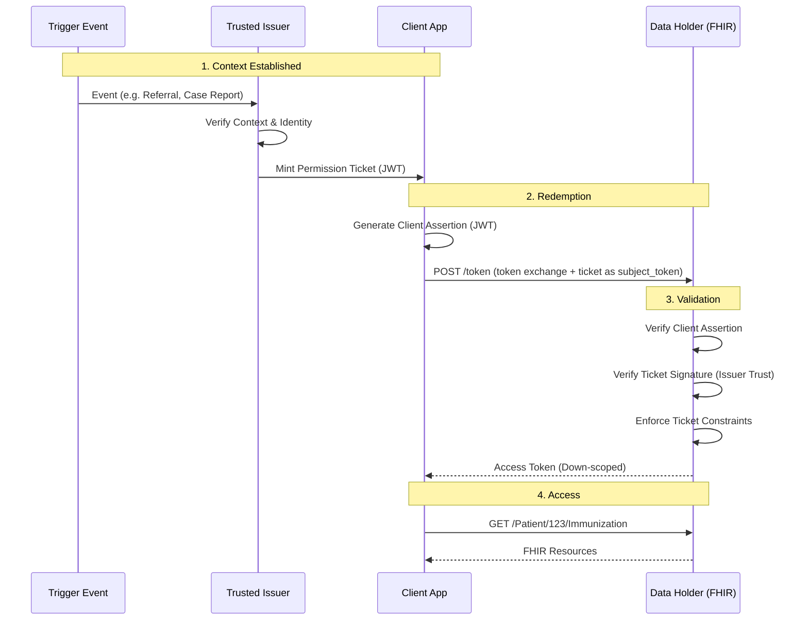

### Introduction

A Permission Ticket is an issuer-signed JWT presented to a Data Holder's token endpoint via [OAuth 2.0 Token Exchange (RFC 8693)](https://www.rfc-editor.org/rfc/rfc8693). It allows a client to redeem a portable authorization grant at any eligible Data Holder within the ticket's audience, without requiring the issuer to know where the subject has received care.

The ticket is built around a **portable kernel**: only the signed fields that a recipient plausibly needs in order to say yes or no to a request live in the common shell. Each ticket conveys a **subject** (whose data), an optional **requester** (on whose behalf), an **access** grant (what resources and constraints), and an optional **context** object whose schema is selected by `ticket_type`.

When present, `presenter_binding` cryptographically binds the ticket to the presenting client's key and/or trust-framework identity. A Data Holder authenticates the client, verifies the ticket signature against the issuer's published keys, enforces presenter binding if present, and grants access scoped to the intersection of requested and authorized access. No user login is required at the Data Holder.

### Scope and Non-Goals

**This specification defines:**
- The Permission Ticket artifact format and required claims
- Presentation via OAuth 2.0 Token Exchange (RFC 8693) at the token endpoint
- A custom `subject_token_type` for Permission Tickets
- Discovery of Permission Ticket support via SMART configuration
- Optional sender-constrained binding via `presenter_binding`
- Audience validation for single-recipient and network-wide recipient sets
- Subject resolution and validation rules
- Access calculation and access constraint enforcement
- Must-understand semantics for base kernel fields and profile extensions
- Seven use-case ticket types

**This specification does not define:**
- How a ticket issuer verifies real-world facts before minting a ticket
- Trust framework governance or membership validation procedures
- User-facing consent or authorization UX
- Ticket issuance protocols between clients and issuers
- A universal schema for all possible use cases (ticket types define use-case-specific constraints)

### Protocol Overview


```mermaid
sequenceDiagram
    participant Trigger as Trigger Event
    participant Issuer as Trusted Issuer
    participant Client as Client App
    participant Server as Data Holder (FHIR)

    Note over Trigger, Client: 1. Context Established
    Trigger->>Issuer: Event (e.g. Referral, Case Report)
    Issuer->>Issuer: Verify Context & Identity
    Issuer->>Client: Mint Permission Ticket (JWT)

    Note over Client, Server: 2. Redemption
    Client->>Client: Generate Client Assertion (JWT)
    Client->>Server: POST /token (token exchange + ticket as subject_token)

    Note over Server: 3. Validation
    Server->>Server: Verify Client Assertion
    Server->>Server: Verify Ticket Signature (Issuer Trust)
    Server->>Server: Enforce Ticket Constraints
    Server-->>Client: Access Token (Down-scoped)

    Note over Client, Server: 4. Access
    Client->>Server: GET /Patient/123/Immunization
    Server-->>Client: FHIR Resources
```

A trusted issuer mints a Permission Ticket and delivers it to the client. The client presents the ticket as a `subject_token` in an [RFC 8693](https://www.rfc-editor.org/rfc/rfc8693) token exchange request, authenticating itself with a separate `client_assertion`. The Data Holder authenticates the client (standard SMART Backend Services), then validates the ticket: signature, issuer trust, audience, presenter binding, and access constraints. If valid, it issues an access token scoped to the intersection of requested and ticket-authorized access.

---

### Technical Specification

#### Transport: Token Exchange (RFC 8693)

Permission Tickets are presented via [OAuth 2.0 Token Exchange (RFC 8693)](https://www.rfc-editor.org/rfc/rfc8693). The client authenticates using **[SMART Backend Services](https://build.fhir.org/ig/HL7/smart-app-launch/backend-services.html)** conventions (JWT `client_assertion` per **RFC 7523**) and presents the Permission Ticket as a separate `subject_token` parameter. This cleanly separates client **authentication** from the authorization **grant**: the `client_assertion` proves client identity; the `subject_token` carries the Permission Ticket.

Using a distinct grant type (`urn:ietf:params:oauth:grant-type:token-exchange`) ensures that Data Holders that do not support Permission Tickets will reject the request with `unsupported_grant_type` rather than silently ignoring the ticket.

##### Discovery

Data Holders that support Permission Tickets SHALL advertise this in their `.well-known/smart-configuration`:

```json
{
  "grant_types_supported": [
    "client_credentials",
    "urn:ietf:params:oauth:grant-type:token-exchange"
  ],
  "smart_permission_ticket_types_supported": [
    "https://smarthealthit.org/permission-ticket-type/patient-self-access-v1",
    "https://smarthealthit.org/permission-ticket-type/public-health-investigation-v1"
  ]
}
```

| Field | Description |
|-------|-------------|
| `grant_types_supported` | SHALL include `urn:ietf:params:oauth:grant-type:token-exchange` |
| `smart_permission_ticket_types_supported` | Array of `ticket_type` URIs the Data Holder accepts. Clients SHOULD check this before presenting a ticket. |

##### Trust and Client Registration

This specification is designed so that **client identity does not need to be universally understood**. The Permission Ticket carries the authorization context; the client only needs to prove it holds the key bound to the ticket (or satisfies the framework binding). Data Holders need to authenticate clients, but do not need to maintain a shared global client registry.

Several client identity approaches are compatible with this architecture. The same approaches appear in two contexts: **registration** (how a Data Holder learns the client's keys) and **ticket binding** (how a ticket constrains which client may redeem it). These are related but not identical: for example, a manually registered unaffiliated client may still be bound by key thumbprint if the issuer knows the exact client key, or may be left unbound if the issuer does not know which client will redeem the ticket. The table below summarizes both.

| Approach | Registration | Ticket Binding (`presenter_binding`) | Key Discovery |
|----------|-------------|--------------------------------------|---------------|
| **UDAP** | Client presents X.509 certificate chain from a trusted CA | `framework_client` with `framework_type: "udap"` and `entity_uri` matching certificate SAN | Certificate in `x5c` header of `client_assertion` |
| **Well-Known JWKS** | Client publishes keys at `{entity_uri}/.well-known/jwks.json`; trust frameworks (published directories) list recognized entities | `framework_client` with `framework_type: "well-known"` and `entity_uri` matching the client's URL identity | Fetched from `{entity_uri}/.well-known/jwks.json` |
| **OpenID Federation** | Client includes a `trust_chain` in the header of its `client_assertion`; Data Holder validates via a common Trust Anchor | `framework_client` with appropriate `framework`/`entity_uri` | Resolved from federation `trust_chain` |
| **Manual / Unaffiliated** | Client registers directly with each Data Holder, exchanging public keys out of band | Either `jkt` binding when the issuer knows the exact client key, or no `presenter_binding` when the issuer does not know which client will redeem the ticket | Pre-registered JWK or JWKS |

Client ID format and registration details are determined by the chosen approach. Client-to-Issuer issuance protocol details are out of scope for this specification; profile-specific guides may define them.

For the **Well-Known JWKS** approach, this specification uses a deterministic client identifier convention:

- the client's stable identifier is `well-known:{entity_uri}`
- `entity_uri` is the HTTPS URL identity of the client
- the same `entity_uri` yields the same `client_id` at every Data Holder, so no per-holder registration-assigned identifier is needed for this class of client

This is how a set of independently operated Data Holders can recognize the same well-known client consistently. The `well-known:` prefix indicates that the remainder of the `client_id` is an entity URL whose keys are published at `{entity_uri}/.well-known/jwks.json`. When a client presents a `client_assertion` with `iss = sub = well-known:{entity_uri}`, the Data Holder strips the prefix, resolves the JWKS from the entity's well-known location, verifies the signature, and then applies any relevant trust-framework checks for that entity.

**The Request:**
```http
POST /token HTTP/1.1
Host: fhir.hospital.com
Content-Type: application/x-www-form-urlencoded

grant_type=urn:ietf:params:oauth:grant-type:token-exchange
&subject_token=eyJhbGciOiJ... (Permission Ticket JWT, signed by issuer)
&subject_token_type=https://smarthealthit.org/token-type/permission-ticket
&scope=patient/Observation.rs
&client_assertion_type=urn:ietf:params:oauth:client-assertion-type:jwt-bearer
&client_assertion=eyJhbGciOiJ... (Client authentication JWT)
```

| Parameter | Value |
|-----------|-------|
| `grant_type` | `urn:ietf:params:oauth:grant-type:token-exchange` |
| `subject_token` | The signed Permission Ticket JWT |
| `subject_token_type` | `https://smarthealthit.org/token-type/permission-ticket` |
| `scope` | Requested SMART scopes |
| `client_assertion_type` | `urn:ietf:params:oauth:client-assertion-type:jwt-bearer` |
| `client_assertion` | Standard SMART Backend Services client authentication JWT |

##### Full Example
Here is what the `client_assertion` looks like when decoded. It is a standard SMART Backend Services authentication JWT — it does not contain the Permission Ticket.



The Permission Ticket is sent separately in the `subject_token` parameter. See the [use case examples](#catalog-of-use-cases) below for decoded ticket payloads.

##### Presentation Model

Client authentication and authorization are separated:

- The **`client_assertion`** authenticates the client per standard SMART Backend Services. It contains only `iss`, `sub`, `aud`, `jti`, and `exp` — no ticket content.
- The **`subject_token`** carries the Permission Ticket. It is a separate form parameter, not embedded in the assertion.

The ticket's `presenter_binding` claim determines how tightly the ticket is bound to a specific client. There are three modes:

1. **Key-bound** (`presenter_binding.method = "jkt"`): the ticket can only be redeemed by the client whose key matches the bound thumbprint.
2. **Framework-bound** (`presenter_binding.method = "framework_client"`): the ticket can only be redeemed by a client whose trust-framework identity matches the bound entity.
3. **No binding** (`presenter_binding` absent): any authenticated client in the ticket's `aud` may redeem it.

In all three modes, the Data Holder authenticates the client through its standard mechanism (e.g., `client_assertion` JWT). The binding claims add constraints on top of that authentication, not in place of it. See [Presenter Binding](#presenter-binding) below for full verification rules.

The Data Holder SHALL NOT rely on any cross-party-stable client identifier inside the Permission Ticket itself. Client identity is established by the `client_assertion` (`iss`/`sub`).

#### Artifact: Ticket Structure
The ticket payload is a JWT. It carries top-level `subject`, `access`, optional `requester`, and optional `context` claims alongside the standard JWT envelope. `ticket_type` is the sole discriminator for the context schema and processing rules.



See the [Logical Model](StructureDefinition-PermissionTicket.html) for formal definitions.

Every Permission Ticket SHALL include `ticket_type`. The `ticket_type` identifies the ticket's schema and processing rules. The Data Holder uses `ticket_type` to select validation and access logic.

#### Presenter Binding
A Permission Ticket MAY bind redemption to a specific client using the `presenter_binding` claim. `presenter_binding` is a discriminated union selected by `method`.

**Note on `cnf`:** Standard JWT confirmation uses the `cnf` claim ([RFC 7800](https://www.rfc-editor.org/rfc/rfc7800)). This specification uses `presenter_binding.method = "jkt"` with a sibling `jkt` field instead, keeping all presenter-binding semantics in one place. The binding semantics are the same as `cnf.jkt`; only the claim shape differs.

##### Binding Modes

| Mode | `presenter_binding` | Verification |
|------|---------------------|-------------|
| **Key-bound** | `{ "method": "jkt", "jkt": "..." }` | Data Holder computes JWK Thumbprint ([RFC 7638](https://www.rfc-editor.org/rfc/rfc7638)) of the `client_assertion` signing key and compares it to `jkt`. Reject on mismatch. |
| **Framework-bound (UDAP)** | `{ "method": "framework_client", "framework_type": "udap", ... }` | Data Holder verifies the client's certificate SAN URI matches `entity_uri` and chains to a trust anchor for the named `framework`. |
| **Framework-bound (Well-Known)** | `{ "method": "framework_client", "framework_type": "well-known", ... }` | Data Holder fetches `{entity_uri}/.well-known/jwks.json`, verifies the `client_assertion` signature, and confirms the entity is recognized within the named `framework`. |
| **No binding** | `presenter_binding` absent | Ticket does not constrain which client may redeem it. Any authenticated client in the ticket's `aud` may present it. |

In all modes, the Data Holder authenticates the presenting client through its standard mechanism. Presenter binding adds a constraint on top of that authentication, not in place of it.

##### Presenter Binding per Ticket Type

`presenter_binding` is OPTIONAL. Some deployments will require it by local policy or narrower profiles, but the base model permits unbound tickets.

| Ticket Type | `presenter_binding` | Rationale |
|-------------|---------------------|-----------|
| UC1: Patient Access | Optional | Issuer may know the exact app key, but need not |
| UC2: Authorized Rep | Optional | Issuer may know the presenting client, but need not |
| UC3: Public Health | Optional | B2B; `aud` + client auth sufficient |
| UC4: Social Care | Optional | B2B; `aud` + client auth sufficient |
| UC5: Payer Claims | Optional | B2B; `aud` + client auth sufficient |
| UC6: Research | Optional | Issuer may use binding, but base model does not require it |
| UC7: Provider Consult | Optional | B2B; strictly better than status quo even without key binding |

#### Server-Side Validation
The Data Holder SHALL perform a two-layer validation:

1.  **Layer 1: Client Authentication (Standard SMART)**
    *   Verify the `client_assertion` signature using the Client's registered public key (JWK).
    *   Ensure the client is registered and active.

2.  **Layer 2: Ticket Validation (Permission Ticket Specific)**
    *   Verify the `subject_token_type` is `https://smarthealthit.org/token-type/permission-ticket`.
    *   Parse the `subject_token` as a JWT.
    *   **Verify Signature:** Use the `iss` (Trusted Issuer) public key.
    *   **Verify Trust:** Is this `iss` in the Data Holder's trusted list?
    *   **Verify Type:** `ticket_type` SHALL be present and recognized. The Data Holder SHALL verify the `ticket_type` is listed in its `smart_permission_ticket_types_supported`.
    *   **Verify Presenter Binding:** If `presenter_binding` is present, verify it according to `presenter_binding.method`.
    *   **Check `must_understand`:** If `must_understand` is present, verify the Data Holder recognizes every listed claim name. Reject with `invalid_grant` if any entry is unrecognized.
    *   **Enforce Kernel Fields:** Every kernel field present in the ticket is must-understand. If the Data Holder encounters a kernel field it cannot enforce, it SHALL reject with `invalid_grant`.
    *   **Grant Access:** If valid, grant the requested scopes *constrained* by the ticket's `access` rules.

#### Subject Resolution

The `subject` identifies whose data the ticket authorizes access to. Every ticket SHALL include `subject.patient`, a FHIR Patient resource carrying the demographic facts needed for matching (name, date of birth, identifiers). The patient may be thin — it only needs enough information for the recipient to resolve to a local record.

Optionally, `subject.recipient_record` may provide a direct-recipient optimization: a FHIR Reference that can carry a `.reference` (literal resource URL), a `.identifier` (business identifier such as an MRN at the target site), or both. When `recipient_record` is present, the Data Holder SHOULD use it as a hint for faster resolution, falling back to demographic matching on `subject.patient` if the reference does not resolve.

If subject resolution yields zero matches, or more than one match, the Data Holder SHALL reject the request with `invalid_grant` and an appropriate `error_description`.

#### Issuer-Attested Claims

`requester` and `context` are issuer-attested facts. The Data Holder uses them for local policy evaluation and audit. The Data Holder does NOT independently re-verify the requester's identity, delegation relationship, consent, mandate, or contract — the issuer's reputation and trust-framework membership back that trust.

If `requester` is absent, the ticket does not assert a separate third-party requester (i.e., it is self-access by the patient identified in `subject.patient`). This does not mean anonymous access — the presenting client is still authenticated by the outer `client_assertion`.

When `ticket_type` defines no context fields, `context` MAY be omitted entirely or be `{}`.

---

### Access Calculation

The Data Holder calculates granted access through the **intersection** of:

1. **Requested Scopes**: The `scope` parameter in the token request
2. **Ticket Access**: Constraints from `access`
3. **Client Registration**: Scopes the client is permitted to request

If the intersection yields no valid access, return `invalid_scope` error.
Requested scopes SHALL use SMART scope grammar. This specification allows either `patient/*` or `system/*` scopes depending on ticket type. For single-patient ticket types, clients SHOULD request SMART v2 CRUDS suffix scopes (for example, `patient/Observation.rs`).

#### SMART Scope Projection

The `access.permissions` array is the normative authorization model. Each `DataPermission` maps to SMART v2 scopes as follows:

* `resource_type` maps to the SMART resource type (e.g., `Observation`, `Condition`, or `*` for all resources)
* `interactions` map to SMART CRUDS suffixes: `create` = `c`, `read` = `r`, `update` = `u`, `delete` = `d`, `search` = `s`

For example, a permission `{ kind: "data", resource_type: "Observation", interactions: ["read", "search"] }` projects to the SMART scope `patient/Observation.rs`.

`OperationPermission` rules (e.g., `$everything`, `$export`) do not have a direct SMART scope equivalent; Data Holders should map these to appropriate local operation-level authorization.

#### Access Constraints

The `access` object defines what access the ticket authorizes:

| Field | Type | Description |
|-------|------|-------------|
| `permissions` | PermissionRule[] | **Required.** Array of typed permission rules (DataPermission or OperationPermission). Each DataPermission specifies a `resource_type`, required `interactions`, and optional narrowing filters (`category_any_of`, `code_any_of`). Each OperationPermission specifies a FHIR operation `name` and optional `target`. |
| `data_period` | Period | One coarse timeframe. Data Holder SHALL filter results to resources whose clinically relevant date falls within this period. If disjoint windows are needed, mint separate tickets. |
| `responder_filter` | ResponderFilter[] | Optional responder-side scoping. Each entry is either a jurisdiction filter (`{ kind: "jurisdiction", address }`) or an organization filter (`{ kind: "organization", organization }`). A responding site or organization may answer if it matches **any** listed filter. |
| `sensitive_data` | "exclude" \| "include" | Sensitive data policy. If absent, the recipient applies its own default policy. |

##### Constraint Algebra

Different access dimensions are combined **conjunctively** (AND): returned data must satisfy every present constraint. Within `responder_filter`, entries are combined **disjunctively** (OR): any listed jurisdiction or organization match authorizes that responder to answer. An absent dimension means no restriction for that dimension.

Within a single `DataPermission`, populated filter groups (`category_any_of`, `code_any_of`) are ANDed across groups, and values within one group are ORed. Multiple `DataPermission` entries are additive (OR) — a resource matching any single permission rule is authorized.

For example, a ticket with:

```json
"responder_filter": [
  { "kind": "jurisdiction", "address": { "state": "CA" } },
  { "kind": "jurisdiction", "address": { "state": "NY" } },
  {
    "kind": "organization",
    "organization": {
      "resourceType": "Organization",
      "identifier": [{ "system": "http://hl7.org/fhir/sid/us-npi", "value": "123" }]
    }
  }
]
```

means: a responding site may answer if it is in CA, in NY, or is operated by the organization with NPI 123.

##### Constraint Semantics

| Dimension | What it restricts | Matching basis |
|-----------|-------------------|----------------|
| `permissions` | Resource types, interactions, and optional category/code filters | Resource type + FHIR REST interaction + coded attributes |
| `data_period` | Relevant clinical or service dates of returned data | Date comparison against `authored`, `recorded`, `issued`, or `effective[x]`, falling back to encounter timing |
| `responder_filter` | Which responding data holders or sites may answer | Jurisdiction address match or organization identity match |
| `sensitive_data` | Whether locally classified sensitive data is included | Recipient-local sensitivity labels and policy |

Data Holders that cannot enforce a presented constraint SHALL reject the ticket with `invalid_grant` and `error_description` indicating the unsupported constraint.

**Example Access Constraints:**

This ticket authorizes read and search access to Conditions and Procedures, but only for data:
- With dates in 2023-2024
- And only from responders that match one of the listed responder filters

#### Timeframe and Data Period Matching

* `data_period` is one coarse timeframe for the ticket.
* If multiple disjoint windows are needed, mint separate tickets.
* Matching semantics: the recipient filters to resources whose clinically relevant date falls within the period. Relevant dates are `authored`, `recorded`, `issued`, or `effective[x]` where present, falling back to encounter timing when no resource-level date is available. Identity-type resources (Patient, Practitioner, Organization, Location) are exempt from date filtering.

#### Sensitive Data

* `"exclude"` means the recipient should exclude locally classified sensitive data.
* `"include"` means the ticket permits such data, **subject to local law and recipient policy** — even with `resource_type: "*"` and `sensitive_data: "include"`, the recipient may still withhold data that local law prohibits releasing (e.g., 42 CFR Part 2 substance abuse records without proper consent).
* If `sensitive_data` is absent, recipients apply their own default policy.
* If classification is unknown and the ticket says `"exclude"`, recipients should default conservatively.

#### Responder Filters

* `responder_filter` restricts which data holders or data holder sites respond to the ticket.
* Each entry is one of:
  * `{ kind: "jurisdiction", address }`
  * `{ kind: "organization", organization }`
* Matching is one-hop against the responding node, not a provenance chain.
* Multiple filter entries are ORed together.

#### Jurisdiction Filters

* Jurisdiction filters are modeled with country/state-style values only.
* A data holder checks whether its own jurisdiction matches the listed address; a multi-site data holder filters to sites in matching jurisdictions.

#### Organization Filters

* Organization filters positively scope which data holders or sites may answer.
* Matching is by organizational identity, typically an NPI carried in `organization.identifier`.

#### Token-Time and Resource-Time Enforcement

Some access constraints — especially `data_period`, `responder_filter`, and `sensitive_data` — may require filtering at the Resource Server rather than at the token endpoint. If a constraint cannot be fully enforced at token issuance, the Authorization Server SHALL carry the normalized constraint set forward in the issued access token (or make it available via token introspection) so the Resource Server can enforce it.

If a component responsible for enforcing a constraint cannot do so, the request SHALL be rejected rather than silently ignoring the constraint.

---

### Must-Understand Semantics

#### Base Must-Understand Set

Every field defined in the kernel is must-understand when present. If a recipient receives a ticket containing a kernel field it cannot enforce, it SHALL reject with `invalid_grant`. The base must-understand set includes:

* JWT envelope: `iss`, `aud`, `exp`, `jti`, `ticket_type`
* `presenter_binding`
* `subject` (`subject.patient` and optional `subject.recipient_record`)
* `requester`
* `access.permissions`
* `access.data_period`
* `access.responder_filter`
* `access.sensitive_data`
* `context`
* `revocation`

#### `must_understand` for Extensions

Profile-specific claims not in the base set are safe to ignore **unless** the issuer lists them in `must_understand`. A recipient that sees a `must_understand` entry it does not recognize SHALL reject the ticket with `invalid_grant`.

`must_understand` lists **top-level claim names** that the recipient MUST understand beyond the base kernel. Each entry is a string matching a top-level claim in the ticket payload. This is inspired by the JWS `crit` header parameter ([RFC 7515](https://www.rfc-editor.org/rfc/rfc7515) Section 4.1.11) but applied to payload claims rather than header parameters.

#### Unknown Fields

Fields not in the base kernel, not in `must_understand`, and not recognized by the recipient are safe to ignore. This is standard JWT behavior.

#### Extension Example

A profile adds encounter-class filtering via a new top-level claim and lists it in `must_understand`:

```json
{
  "iss": "https://issuer.example.org",
  "aud": "https://network.example.org/token",
  "exp": 1775328000,
  "jti": "ext-example-1",
  "ticket_type": "https://example.org/ticket-types/encounter-filtered-v1",
  "must_understand": ["encounter_class_filter"],
  "encounter_class_filter": {
    "include": [
      {
        "system": "http://terminology.hl7.org/CodeSystem/v3-ActCode",
        "code": "AMB"
      }
    ]
  },
  "subject": { "..." : "..." },
  "access": { "..." : "..." },
  "context": {}
}
```

A recipient that understands `encounter_class_filter` enforces it. A recipient that does not recognize the name rejects the ticket because it appears in `must_understand`. If the issuer had omitted `encounter_class_filter` from `must_understand`, recipients that do not recognize it would simply ignore it.

Extensions should be modeled as new top-level claims rather than injecting fields into existing kernel structures. This keeps extensions visible and prevents profiles from silently altering the semantics of base claims.

---

### Requester Semantics

`requester` is an **issuer-attested claim** about the real-world party for whom the grant exists. It is distinct from the presenting software client (the presenter authenticates via `client_assertion` and optional `presenter_binding`).

* Absent for self-access. For self-access, the patient's identity is already in `subject.patient`; a separate `requester` would be redundant.
* Present for proxy, organizational, clinician, or other non-self use cases.
* The recipient trusts the issuer's attestation; it does **not** independently verify the requester's identity against the client authentication event.
* The recipient **may use `requester` for local policy decisions** — scoping data, applying sensitivity rules, choosing which local access-control policies apply, audit logging, etc.
* The **security gate** for ticket redemption remains: issuer trust, ticket signature, presenter binding, and audience validation. `requester` is not part of that gate.
* The level of real-world verification the issuer performed before attesting to the requester varies by use case. For delegation, the issuer typically identity-proofed the requester and confirmed the patient's intent to delegate. For B2B use cases (public health, payer, consult), the issuer has institutional knowledge of the requesting organization rather than individual identity proofing.

#### Relationship between `presenter_binding` and `requester`

The `requester` and `presenter_binding` will often identify the same organization — the requesting organization is also the one operating the client software. But they do not need to align. Multiple requesters may share a client; an organization may operate a client on behalf of several requesters; or a platform provider may present tickets on behalf of various requesting organizations. The `requester` describes who the grant is for; the presenter binding constrains which software may redeem it.

#### Delegation and RelatedPerson.relationship

For delegated access, the `requester` is a `RelatedPerson`. FHIR's `RelatedPerson.relationship` field (0..* CodeableConcept, Preferred binding) can express both the personal relationship **and** the legal authority type using stacked codings from v3-RoleCode:

* Familial: `DAU` (daughter), `MTH` (mother), `SPS` (spouse), etc.
* Legal authority: `GUARD` (guardian), `HPOWATT` (healthcare power of attorney), `DPOWATT` (durable POA), `POWATT` (power of attorney), `SPOWATT` (special POA)

R5 explicitly added the legal authority codes to the RelatedPerson relationship value set. A single `requester` can carry both:

```json
"requester": {
  "resourceType": "RelatedPerson",
  "relationship": [
    { "coding": [{ "system": "http://terminology.hl7.org/CodeSystem/v3-RoleCode", "code": "DAU" }] },
    { "coding": [{ "system": "http://terminology.hl7.org/CodeSystem/v3-RoleCode", "code": "HPOWATT" }] }
  ],
  "name": [{ "family": "Reyes", "given": ["Elena"] }]
}
```

This tells the recipient: "the requester is the patient's daughter and holds healthcare power of attorney." The recipient can use this for local policy decisions (e.g., applying different rules for a guardian vs. a POA holder). The actual POA document, if needed for audit or review, is outside the base ticket kernel.

---

### Issuer vs. Recipient Responsibility

The issuer does all real-world verification. The ticket carries only what the recipient needs for matching, filtering, and local policy selection.

#### What the Issuer Verifies Before Minting

* Patient identity (via digital ID, in-person verification, portal authentication, etc.)
* Requester identity and relationship to patient (for delegation: POA, guardianship, parental authority; for B2B: organizational identity)
* Legal/regulatory basis for access (consent obtained, mandate exists, contract in force, care relationship established)
* Scope appropriateness (the requested access is within the delegation scope, study protocol, mandate authority, etc.)
* Any jurisdiction-specific requirements

#### What the Recipient Uses from the Ticket

* **For matching**: `subject.patient` to resolve to a local patient record
* **For cryptographic validation**: signature, `iss` (issuer trust), `exp`, `aud`, `presenter_binding`
* **For access filtering**: `access.permissions`, `data_period`, `responder_filter`, `sensitive_data`
* **For local policy selection**: `requester` (type, identity, relationship), `ticket_type`, `context` — the recipient may apply different local policies based on these (e.g., broader release for a public health investigation than for a payer claim)
* **For audit**: all of the above

#### What the Recipient Does NOT Do

* Re-verify the delegation relationship, consent, mandate, or contract
* Independently authenticate the requester's identity (the presenter is authenticated; the requester is an issuer attestation)
* Require off-ticket supporting documents to say yes or no (unless a narrower profile says otherwise)

The recipient trusts the issuer for all real-world verification. The issuer's reputation and trust-framework membership back that trust.

---

### Context (Ticket-Type-Specific Semantics)

The `context` claim carries ticket-type-specific mandatory workflow semantics. `ticket_type` is the sole discriminator; there is no separate `context.kind`.

A fact belongs in `context` if every instance of that ticket type needs it for the recipient to say yes or no, but other ticket types do not.

| Ticket Type | Required Context Fields |
|-------------|------------------------|
| UC1, UC2 | *(none; `context` may be omitted)* |
| UC3 | `reportable_condition` |
| UC4 | `concern`, `referral` |
| UC5 | `service`, `claim` |
| UC6 | `study` |
| UC7 | `reason`, `consult_request` |

UC1 and UC2 intentionally define no context fields. Delegation is expressed by the presence and type of `requester`, not by a context discriminator.

---

### Ticket Audience (`aud`) and Recipient Set

For Permission Tickets, `aud` identifies the set of eligible Data Holders that may honor the ticket. It does not imply that the issuer knows where the subject has received care or where data is actually held. This recipient set may be expressed as one or more enumerated recipient URLs, or as a network / trust framework identifier whose membership can be validated by the Data Holder.

This is distinct from `aud` in the outer `client_assertion`, which remains the Data Holder's token endpoint URL per SMART Backend Services.

#### Mode 1: Enumerated Recipients

The `aud` is a specific URL or array of URLs:



**Validation:** The Data Holder's base URL SHALL exactly match one of the enumerated values.

#### Mode 2: Trust Framework

The `aud` references a trust framework identifier:



**Validation:** The Data Holder SHALL be a verified participant in the referenced trust framework. Verification mechanisms are trust-framework-specific (e.g., the Data Holder's Entity ID appears in the framework's federation).

#### Recommendations

| Scenario | Recommended `aud` |
|----------|-------------------|
| Ticket for known single recipient | Specific Data Holder URL |
| Ticket valid across a network | Trust framework identifier |
| Ticket for multiple known recipients | Array of Data Holder URLs |

Data Holders SHALL reject tickets where `aud` validation fails with error `invalid_grant` and `error_description`: "Ticket not valid for this server".

---

### Ticket Type Registry

Each use case maps to a `ticket_type` URI that identifies the ticket's schema and processing rules:



Data Holders advertise which `ticket_type` URIs they support via `smart_permission_ticket_types_supported` in their `.well-known/smart-configuration`. Unknown `ticket_type` values SHALL be rejected with `invalid_grant`.

> **Note on future multi-token composition:** RFC 8693 defines an optional `actor_token` parameter alongside `subject_token`. Future versions of this specification may use `actor_token` to support multi-token composition scenarios (e.g., a separate identity ticket from a verified identity provider combined with an authorization ticket from a trusted issuer). All current use cases require only a single Permission Ticket as the `subject_token`.

---

### Ticket Lifecycle

#### Validity Period

- Tickets SHALL include an `exp` (expiration) claim
- Data Holders SHALL reject expired tickets
- Recommended validity periods:

| Use Case | Recommended `exp` |
|----------|-------------------|
| Interactive/real-time | 1-4 hours |
| Batch processing | 24 hours |
| Standing authorization | Up to 1 year (with revocation) |

#### Long-Lived Access

For scenarios requiring access beyond a single session (e.g., ongoing care relationships, research studies), two approaches are supported:

**Approach 1: Refresh via Issuer**

The client periodically obtains fresh tickets from the issuer. Suitable when:
- Issuer interaction is low-friction (automated, no user involvement)
- Access should be re-validated regularly

**Approach 2: Long-Lived Tickets with Revocation**

The issuer mints a ticket with extended validity (weeks to months) and supports revocation. Suitable when:
- Issuer interaction is high-friction (e.g., in-person identity verification via Clear, notarized documents)
- Access may need to be terminated before natural expiration
- The cost of re-issuance (user time, verification fees) is prohibitive

#### Revocation

Issuers MAY support revocation of individual tickets before expiration. If a ticket includes a `revocation` claim, it SHALL also include a `jti` (unique ticket ID).

**Status List Pointer**

Tickets supporting revocation include a `revocation` claim:



| Field | Description |
|-------|-------------|
| `revocation.url` | URL of the issuer's status list for this category of tickets |
| `revocation.index` | Zero-based bit index for this ticket in the published status list |

**Status List Format**

The status list is a JSON file served at the URL specified in the ticket:



| Field | Description |
|-------|-------------|
| `kid` | Optional key identifier for the ticket-signing key family covered by this list |
| `bits` | Base64url-encoded gzip-compressed bitstring. A set bit marks the corresponding `revocation.index` as revoked. |

**Revocation Checking**

*Issuers:*
- SHALL publish the status list at the URL specified in tickets
- SHALL serve the status list over HTTPS

*Data Holders:*
- If `revocation` is present in the ticket, SHALL fetch or use a valid cached copy of the status list
- MAY cache status-list responses respecting HTTP cache headers
- SHALL reject tickets whose `revocation.index` bit is set
- If revocation status cannot be determined (no valid cache and retrieval failure), SHALL reject the request (fail-closed)

**Grouping for Privacy**

Issuers MAY use multiple status-list URLs to group tickets by category, preventing unnecessary cross-ticket correlation when checking revocation.

#### Reusability

- Tickets are **reusable** until expiration (or revocation)
- Data Holders are NOT REQUIRED to enforce single-use semantics
- If single-use is required for a use case, the issuer should use very short expiration times

---

### Catalog of Use Cases

Here are seven scenarios demonstrating how Permission Tickets model diverse authorization needs. Each use case maps to a single `ticket_type`.

#### Per-Profile Constraints

The table below summarizes required and optional fields for each ticket type:

| Use Case | `presenter_binding` | Requester | Context Fields | Access Dimensions |
|----------|---------------------|-----------|--------------|-------------------|-------------------|
| UC1: Patient Self Access | Optional | — | *(none)* | `permissions` (required) |
| UC2: Patient-Delegated Access | Optional | `RelatedPerson` (required) | *(none)* | `permissions` (required) |
| UC3: Public Health | Optional | `Organization` (required) | `reportable_condition` | `permissions`, `data_period`, `responder_filter` |
| UC4: Social Care | Optional | `Organization` (required) | `concern`, `referral` | `permissions` |
| UC5: Payer Claims | Optional | `Organization` (required) | `service`, `claim` | `permissions`, `data_period`, `responder_filter` |
| UC6: Research | Optional | `Organization` (required) | `study` | `permissions`, `data_period` |
| UC7: Provider Consult | Optional | `PractitionerRole` (required) | `reason`, `consult_request` | `permissions` |

#### Use Case 1: Patient Self Access
*A patient uses a high-assurance Digital ID wallet to authorize an app to fetch their data from multiple hospitals.*

##### Ticket Schema
*   **Subject:** `Patient` (matched by demographics: Name, DOB, Identifier).
*   **Requester:** None (self-access).
*   **Context:** *(none; `context` may be omitted or empty for this ticket type)*.
*   **Access:** `permissions` with specific resource types and interactions.



#### Use Case 2: Patient-Delegated Access
*An adult daughter accesses her elderly mother's records. The relationship is verified by a Trusted Issuer, not the Hospital.*

##### Ticket Schema
*   **Subject:** `Patient` (matched by demographics or identifier).
*   **Requester:** `RelatedPerson` with relationship codings expressing both personal relationship and legal authority type.
*   **Context:** *(none; same as UC1 — delegation is expressed by the presence and type of `requester`)*
*   **Access:** `permissions` with specific resource types and interactions.



#### Use Case 3: Public Health Investigation
*A Hospital creates a Case Report. The Public Health Agency (PHA) uses a ticket to query for follow-up data.*

##### Ticket Schema
*   **Subject:** `Patient` (matched by demographics or identifier).
*   **Requester:** `Organization` (public health agency).
*   **Context:** `reportable_condition` (coded condition).
*   **Access:** `permissions`, optional `data_period`, `responder_filter`, `sensitive_data`.



#### Use Case 4: Social Care (CBO) Referral
*A community-based organization needs to access referral-related data. A Food Bank volunteer needs to update a referral status.*

##### Ticket Schema
*   **Subject:** `Patient` (matched by demographics or identifier).
*   **Requester:** `Organization` (social care hub).
*   **Context:** `concern` (coded concern), `referral` (ServiceRequest).
*   **Access:** `permissions` with specific resource types and interactions.



#### Use Case 5: Payer Claims Adjudication
*A Payer requests clinical documents to support a specific claim.*

##### Ticket Schema
*   **Subject:** `Patient` (matched by demographics or identifier).
*   **Requester:** `Organization` (Payer).
*   **Context:** `service` (coded service), `claim` (Claim resource).
*   **Access:** `permissions`, optional `data_period`, `responder_filter`.



#### Use Case 6: Research Study
*A patient consents to a study. The ticket proves consent exists without requiring the researcher to be a "user" at the hospital.*

##### Ticket Schema
*   **Subject:** `Patient` (matched by demographics or identifier).
*   **Requester:** `Organization` (research institute).
*   **Context:** `study` (ResearchStudy resource).
*   **Access:** `permissions`, optional `data_period`, `sensitive_data`.



#### Use Case 7: Provider-to-Provider Consult
*A Specialist (Practitioner) requests data from a Referring Provider.*

##### Ticket Schema
*   **Subject:** `Patient` (matched by demographics or identifier).
*   **Requester:** `PractitionerRole` (specialist role).
*   **Context:** `reason` (coded reason), `consult_request` (ServiceRequest).
*   **Access:** `permissions` with specific resource types and interactions.



---

### Developer Reference

#### TypeScript Interfaces

The following TypeScript interfaces define the structure of the Permission Ticket, the Client Assertion, and the Token Exchange request.

```typescript
// ─── FHIR Primitives ────────────────────────────────────────────────────────

export type Uri = string;
export type Instant = string; // ISO 8601 timestamp per FHIR
export type NonEmptyArray<T> = [T, ...T[]];
export type JwtAudience = string | NonEmptyArray<string>;

// ─── FHIR Building Blocks ───────────────────────────────────────────────────

export interface FHIRCoding {
    system?: string;
    code?: string;
    display?: string;
}

export interface FHIRCodeableConcept {
    coding?: FHIRCoding[];
    text?: string;
}

export interface FHIRIdentifier {
    system?: string;
    value?: string;
    type?: FHIRCodeableConcept;
}

export interface FHIRHumanName {
    family?: string;
    given?: string[];
    prefix?: string[];
    suffix?: string[];
}

export interface FHIRPeriod {
    start?: string;
    end?: string;
}

export interface FHIRReference {
    reference?: string;
    identifier?: FHIRIdentifier;
    type?: string;
    display?: string;
}

export interface FHIRAddress {
    country?: string;
    state?: string;
}

// ─── Permission Ticket ──────────────────────────────────────────────────────

export interface PermissionTicket {
    iss: Uri;
    aud: JwtAudience;
    exp: number;
    jti: string;
    ticket_type: Uri;
    iat?: number;

    presenter_binding?:
        | {
            method: "jkt";
            jkt: string;
          }
        | {
            method: "framework_client";
            framework: Uri;
            framework_type: "well-known" | "udap";
            entity_uri: Uri;
          };

    revocation?: {
        url: Uri;
        index: number;
    };

    /**
     * Payload claim names the recipient MUST understand beyond the base kernel.
     * Inspired by JWS crit (RFC 7515 §4.1.11), applied to payload claims.
     */
    must_understand?: string[];

    subject: Subject;

    /**
     * The real-world party for whom the grant exists.
     * Issuer-attested; the recipient trusts this without independent verification.
     */
    requester?: Requester;

    /**
     * Normative authorization model.
     */
    access: AccessGrant;

    /**
     * Ticket-type-specific mandatory workflow semantics.
     * Omitted when the ticket type defines no context fields.
     */
    context?: TicketContext;
}

export interface Subject {
    patient: {
        resourceType: "Patient";
        identifier?: FHIRIdentifier[];
        name?: FHIRHumanName[];
        birthDate?: string;
        gender?: string;
    };
    recipient_record?: FHIRReference & { type?: "Patient" };
}

export type Requester =
    | { resourceType: "RelatedPerson"; relationship?: FHIRCodeableConcept[];
        name?: FHIRHumanName[]; identifier?: FHIRIdentifier[] }
    | { resourceType: "Practitioner"; name?: FHIRHumanName[];
        identifier?: FHIRIdentifier[] }
    | { resourceType: "PractitionerRole"; code?: FHIRCodeableConcept[];
        identifier?: FHIRIdentifier[] }
    | { resourceType: "Organization"; name?: string;
        identifier?: FHIRIdentifier[] };

export type SensitiveDataPolicy = "exclude" | "include";

export type RestInteraction =
    | "read"
    | "search"
    | "history"
    | "create"
    | "update"
    | "patch"
    | "delete";

export interface DataPermission {
    kind: "data";
    resource_type: string;
    interactions: NonEmptyArray<RestInteraction>;
    category_any_of?: NonEmptyArray<FHIRCoding>;
    code_any_of?: NonEmptyArray<FHIRCoding>;
}

export interface OperationPermission {
    kind: "operation";
    name: string;
    target?: FHIRReference;
}

export type PermissionRule = DataPermission | OperationPermission;

export interface AccessGrant {
    permissions: NonEmptyArray<PermissionRule>;
    data_period?: FHIRPeriod;
    responder_filter?: NonEmptyArray<
        | { kind: "jurisdiction"; address: FHIRAddress }
        | { kind: "organization"; organization: FHIROrganization }
    >;
    sensitive_data?: SensitiveDataPolicy;
}

// ─── Context Types ──────────────────────────────────────────────────────────

export type PatientAccessContext = Record<string, never>;

export interface PublicHealthContext {
    reportable_condition: FHIRCodeableConcept;
}

export interface SocialCareReferralContext {
    concern: FHIRCodeableConcept;
    referral: any;
}

export interface PayerClaimsContext {
    service: FHIRCodeableConcept;
    claim: any;
}

export interface ResearchContext {
    study: any;
}

export interface ProviderConsultContext {
    reason: FHIRCodeableConcept;
    consult_request: any;
}

export type TicketContext =
    | PatientAccessContext
    | PublicHealthContext
    | SocialCareReferralContext
    | PayerClaimsContext
    | ResearchContext
    | ProviderConsultContext;

// ─── Client Assertion & Token Exchange ──────────────────────────────────────

export interface ClientAssertion {
    iss: string;          // Client ID
    sub: string;          // Client ID
    aud: string;          // Token Endpoint URL
    jti: string;          // Unique Assertion ID
    iat?: number;         // Issued-at Timestamp
    exp?: number;         // Expiration Timestamp
}

export interface TokenExchangeRequest {
    grant_type: "urn:ietf:params:oauth:grant-type:token-exchange";
    subject_token: string;  // Signed Permission Ticket JWT
    subject_token_type: "https://smarthealthit.org/token-type/permission-ticket";
    scope?: string;         // Requested SMART scopes
    client_assertion_type: "urn:ietf:params:oauth:client-assertion-type:jwt-bearer";
    client_assertion: string; // Signed Client Assertion JWT
}
```

#### Signing Algorithm
*   **Algorithm:** ES256 (ECDSA using P-256 and SHA-256) is RECOMMENDED. RS256 is also supported.
*   **Header:** SHALL include `alg` and `kid` (Key ID) to facilitate key rotation.
*   **Keys:**
    *   **Issuer:** Signs the `PermissionTicket`. Public keys are discovered via the trust framework the issuer participates in:
        *   **Direct trust (framework-agnostic):** publish via a JWK Set URL the Data Holder has been pre-configured to trust, e.g. `${issuerBaseUrl}/.well-known/jwks.json`. This is the common-denominator fallback.
        *   **OpenID Federation:** publish keys inside an entity configuration at `${entityId}/.well-known/openid-federation`; verification keys are taken from the resolved trust chain after metadata policy is applied.
        *   **UDAP:** discover issuer trust from `${iss}/.well-known/udap` using a configured UDAP trust community and verifier-side policy. This specification does not require UDAP participation to alter the `PermissionTicket` payload or JOSE header.
    *   **Client:** Signs the `ClientAssertion`. Public keys SHALL be registered with the Data Holder or exposed via JWKS.
*   **Binding:** When present, `presenter_binding.method = "jkt"` binds redemption to a specific client key via its JWK Thumbprint ([RFC 7638](https://www.rfc-editor.org/rfc/rfc7638)). `presenter_binding.method = "framework_client"` binds redemption to a framework-recognized entity. When `presenter_binding` is absent, `aud` + client authentication provide the trust boundary.

#### Issuer Key Publication

The common-denominator issuer publication path is a JWK Set URL such as `${issuerBaseUrl}/.well-known/jwks.json`. This direct JWKS path is framework-agnostic and serves as the fallback publication mechanism when no more specific framework path is configured for the issuer.

OpenID Federation issuers publish verification keys through their entity configuration at `${entityId}/.well-known/openid-federation`. The Data Holder resolves the issuer's trust chain to a configured trust anchor, applies metadata policy, and takes verification keys from the resolved issuer metadata.

UDAP issuers publish verification keys through the standard UDAP discovery surface at `${iss}/.well-known/udap`. The Data Holder evaluates the issuer through a configured UDAP trust community and verifier-side policy rooted in `iss`, without requiring UDAP participation to alter the `PermissionTicket` payload or JOSE header.

When multiple publication paths are available, the Data Holder SHOULD evaluate them according to its configured issuer-trust policy for that issuer. When multiple sources are configured for the same issuer, the Data Holder is RECOMMENDED to verify that they do not disagree on any shared `kid`; this consistency check is RECOMMENDED at the specification level and enforced as a hard check in the reference implementation.

#### Error Responses

When ticket validation fails, the Data Holder SHALL return an OAuth 2.0 error response per RFC 6749.

| Scenario | `error` | `error_description` |
|----------|---------|---------------------|
| Grant type not supported | `unsupported_grant_type` | "Token exchange not supported" |
| Missing or wrong `subject_token_type` | `invalid_request` | "Unsupported subject token type" |
| Missing `subject_token` | `invalid_request` | "No permission ticket provided" |
| Malformed ticket (not valid JWT) | `invalid_grant` | "Malformed permission ticket" |
| Missing `ticket_type` | `invalid_grant` | "Missing ticket type" |
| Ticket signature invalid | `invalid_grant` | "Ticket signature verification failed" |
| Issuer not trusted | `invalid_grant` | "Ticket issuer not trusted: {iss}" |
| Issuer JWKS unavailable | `invalid_grant` | "Unable to retrieve issuer keys" |
| Ticket expired | `invalid_grant` | "Ticket expired" |
| Presenter binding mismatch (key or framework) | `invalid_grant` | "Ticket presenter binding mismatch" |
| `aud` mismatch | `invalid_grant` | "Ticket not valid for this server" |
| Unknown `ticket_type` | `invalid_grant` | "Unsupported ticket type" |
| Unrecognized `must_understand` entry | `invalid_grant` | "Unrecognized must_understand claim: {name}" |
| Unsupported kernel field | `invalid_grant` | "Cannot enforce kernel field: {field}" |
| Subject not resolvable | `invalid_grant` | "Unable to resolve ticket subject" |
| Ambiguous subject match | `invalid_grant` | "Ambiguous ticket subject match" |
| Ticket revoked | `invalid_grant` | "Ticket has been revoked" |
| Revocable ticket missing `jti` | `invalid_grant` | "Revocable ticket missing jti" |
| Unsupported constraint | `invalid_grant` | "Unsupported access constraint: {field}" |
| No valid scopes after intersection | `invalid_scope` | "No authorized scopes" |

---

### Conformance

This section defines requirements using RFC 2119 keywords (SHALL, SHOULD, MAY).

#### Data Holder Requirements

**SHALL:**
- Support the `urn:ietf:params:oauth:grant-type:token-exchange` grant type at the token endpoint
- Advertise `urn:ietf:params:oauth:grant-type:token-exchange` in `grant_types_supported` in `.well-known/smart-configuration`
- Advertise supported ticket types in `smart_permission_ticket_types_supported` in `.well-known/smart-configuration`
- Accept `subject_token_type` of `https://smarthealthit.org/token-type/permission-ticket`
- Validate client assertion per SMART Backend Services
- Verify the ticket's signature, `ticket_type`, `aud`, and `exp`
- If `presenter_binding` is present, verify it according to `presenter_binding.method`
- Validate `ticket_type` is recognized (listed in `smart_permission_ticket_types_supported`) and select processing rules accordingly
- Process `must_understand`: reject with `invalid_grant` if any listed claim name is unrecognized
- Reject with `invalid_grant` if any present kernel field cannot be enforced
- Resolve `subject.patient` to a local patient record; reject if zero or ambiguous matches
- Calculate granted access as intersection of requested scopes, ticket `access.permissions`, and client registration
- Enforce all presented `access` constraints (`permissions`, `data_period`, `responder_filter`, `sensitive_data`) or reject with `invalid_grant`
- Enforce subset constraints at the appropriate layer (token endpoint, resource server, or both)
- If `revocation` is present, verify `jti` is also present; perform revocation checking before issuing a token; if revocation status cannot be determined, reject the request
- Return appropriate error codes on validation failure

**SHOULD:**
- Cache issuer JWKS with appropriate TTL
- Cache revocation responses per HTTP cache headers
- Log `requester` and `context` for audit trail

**MAY:**
- Support trust framework audience validation
- Use `subject.recipient_record` as a hint for faster patient resolution

#### Client Requirements

**SHALL:**
- Use `grant_type=urn:ietf:params:oauth:grant-type:token-exchange`
- Include the Permission Ticket as `subject_token` with `subject_token_type=https://smarthealthit.org/token-type/permission-ticket`
- Sign client assertion with registered or federated key
- Use identical value for `iss` and `sub` in client assertion (the Client ID URL)

For well-known clients, that Client ID URL is the deterministic identifier `well-known:{entity_uri}` rather than a Data Holder-assigned registration identifier.

**SHOULD:**
- Check `smart_permission_ticket_types_supported` in the Data Holder's `.well-known/smart-configuration` before presenting a ticket
- Request only scopes authorized by held tickets
- For single-patient ticket types, request SMART v2 CRUDS suffix scopes (for example `patient/Observation.rs`)
- Include `jti` in client assertion for replay protection
- Refresh tickets before expiration for continued access

#### Issuer Requirements

**SHALL:**
- Sign tickets with keys published at `{iss}/.well-known/jwks.json`
- Include claims: `iss`, `aud`, `exp`, `jti`, `ticket_type`, `subject`, `access`, and `context` when the ticket type defines context fields
- When using `presenter_binding`, bind the ticket appropriately with one method (`jkt` or `framework_client`)
- If `revocation` is present, include `jti` and publish the status list at the URL specified in tickets

**SHOULD:**
- Verify real-world facts (patient identity, requester identity, legal basis, scope appropriateness) before minting
- Include `iat` for audit
- Use short expiration for interactive use cases (1-4 hours)
- Support revocation for long-lived tickets
- Include `must_understand` when minting tickets with profile-specific extension claims

---

### Downloads

*   **[Source Code & Examples (ZIP)](source-code.zip)**: Includes TypeScript scripts for key generation, ticket signing, and example generation.
*   **[Permission Ticket Logical Model](StructureDefinition-PermissionTicket.html)** for formal definitions.
