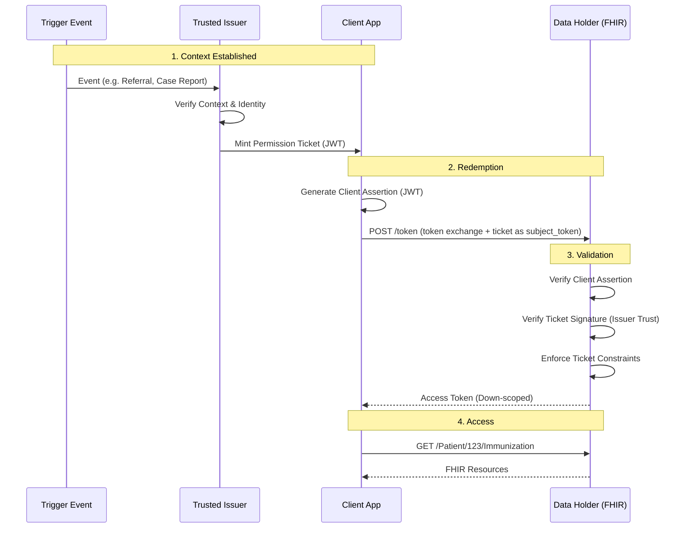

### Introduction

A Permission Ticket is an issuer-signed, sender-constrained JWT presented to a Data Holder's token endpoint via [OAuth 2.0 Token Exchange (RFC 8693)](https://www.rfc-editor.org/rfc/rfc8693). It allows a client to redeem a portable authorization grant at any eligible Data Holder within the ticket's audience, without requiring the issuer to know where the subject has received care.

Each ticket conveys a common **authorization** structure: a **subject** (whose data), an optional **requester** (on whose behalf), and **access** constraints (what, and how much). Ticket-type-specific business semantics live in an optional **details** object whose schema is selected by `ticket_type`. SMART scopes provide the coarse access ceiling. Structured access constraints express finer limits — time range, jurisdiction, source organization.

When present, a `cnf.jkt` claim cryptographically binds the ticket to the presenting client's key. A Data Holder authenticates the client, verifies the ticket signature against the issuer's published keys, enforces key binding if present, and grants access scoped to the intersection of requested and authorized access. No user login is required at the Data Holder.

### Scope and Non-Goals

**This specification defines:**
- The Permission Ticket artifact format and required claims
- Presentation via OAuth 2.0 Token Exchange (RFC 8693) at the token endpoint
- A custom `subject_token_type` for Permission Tickets
- Discovery of Permission Ticket support via SMART configuration
- Optional sender-constrained binding via `cnf.jkt`
- Audience validation for single-recipient and network-wide recipient sets
- Subject resolution modes and validation rules
- Access calculation and access constraint enforcement
- Seven use-case ticket types

**This specification does not define:**
- How a ticket issuer verifies real-world facts before minting a ticket
- Trust framework governance or membership validation procedures
- User-facing consent or authorization UX
- Ticket issuance protocols between clients and issuers
- A universal schema for all possible use cases (ticket types define use-case-specific constraints)

### Protocol Overview


```mermaid
sequenceDiagram
    participant Trigger as Trigger Event
    participant Issuer as Trusted Issuer
    participant Client as Client App
    participant Server as Data Holder (FHIR)

    Note over Trigger, Client: 1. Context Established
    Trigger->>Issuer: Event (e.g. Referral, Case Report)
    Issuer->>Issuer: Verify Context & Identity
    Issuer->>Client: Mint Permission Ticket (JWT)

    Note over Client, Server: 2. Redemption
    Client->>Client: Generate Client Assertion (JWT)
    Client->>Server: POST /token (token exchange + ticket as subject_token)

    Note over Server: 3. Validation
    Server->>Server: Verify Client Assertion
    Server->>Server: Verify Ticket Signature (Issuer Trust)
    Server->>Server: Enforce Ticket Constraints
    Server-->>Client: Access Token (Down-scoped)

    Note over Client, Server: 4. Access
    Client->>Server: GET /Patient/123/Immunization
    Server-->>Client: FHIR Resources
```

A trusted issuer mints a Permission Ticket and delivers it to the client. The client presents the ticket as a `subject_token` in an [RFC 8693](https://www.rfc-editor.org/rfc/rfc8693) token exchange request, authenticating itself with a separate `client_assertion`. The Data Holder authenticates the client (standard SMART Backend Services), then validates the ticket: signature, issuer trust, audience, key binding, and access constraints. If valid, it issues an access token scoped to the intersection of requested and ticket-authorized access.

---

### Technical Specification

#### Transport: Token Exchange (RFC 8693)

Permission Tickets are presented via [OAuth 2.0 Token Exchange (RFC 8693)](https://www.rfc-editor.org/rfc/rfc8693). The client authenticates using **[SMART Backend Services](https://build.fhir.org/ig/HL7/smart-app-launch/backend-services.html)** conventions (JWT `client_assertion` per **RFC 7523**) and presents the Permission Ticket as a separate `subject_token` parameter. This cleanly separates client **authentication** from the authorization **grant**: the `client_assertion` proves client identity; the `subject_token` carries the Permission Ticket.

Using a distinct grant type (`urn:ietf:params:oauth:grant-type:token-exchange`) ensures that Data Holders that do not support Permission Tickets will reject the request with `unsupported_grant_type` rather than silently ignoring the ticket.

##### Discovery

Data Holders that support Permission Tickets SHALL advertise this in their `.well-known/smart-configuration`:

```json
{
  "grant_types_supported": [
    "client_credentials",
    "urn:ietf:params:oauth:grant-type:token-exchange"
  ],
  "smart_permission_ticket_types_supported": [
    "https://smarthealthit.org/permission-ticket-type/network-patient-access-v1",
    "https://smarthealthit.org/permission-ticket-type/public-health-investigation-v1"
  ]
}
```

| Field | Description |
|-------|-------------|
| `grant_types_supported` | SHALL include `urn:ietf:params:oauth:grant-type:token-exchange` |
| `smart_permission_ticket_types_supported` | Array of `ticket_type` URIs the Data Holder accepts. Clients SHOULD check this before presenting a ticket. |

##### Trust and Client Registration

This specification is designed so that **client identity does not need to be universally understood**. The Permission Ticket carries the authorization context; the client only needs to prove it holds the key bound to the ticket. Data Holders need to authenticate clients, but do not need to maintain a shared global client registry.

Several client registration models are compatible with this architecture:

*   **[OpenID Federation 1.0](https://openid.net/specs/openid-federation-1_0.html)**: The client includes a `trust_chain` in the **header** of its `client_assertion`, allowing the Data Holder to verify the client's metadata and trust status dynamically via a common Trust Anchor — no pre-registration required.
*   **[UDAP](https://www.udap.org/)**: Clients present signed metadata using certificates from a trusted CA. Data Holders validate the certificate chain to authenticate the client.
*   **Manual Registration**: Clients register directly with each Data Holder, exchanging public keys out of band. Suitable for small-scale deployments or where dynamic trust is not available.

Client ID format and registration details are determined by the chosen registration model. Client-to-Issuer issuance protocol details are out of scope for this specification; profile-specific guides may define them.

**The Request:**
```http
POST /token HTTP/1.1
Host: fhir.hospital.com
Content-Type: application/x-www-form-urlencoded

grant_type=urn:ietf:params:oauth:grant-type:token-exchange
&subject_token=eyJhbGciOiJ... (Permission Ticket JWT, signed by issuer)
&subject_token_type=https://smarthealthit.org/token-type/permission-ticket
&scope=patient/Observation.rs
&client_assertion_type=urn:ietf:params:oauth:client-assertion-type:jwt-bearer
&client_assertion=eyJhbGciOiJ... (Client authentication JWT)
```

| Parameter | Value |
|-----------|-------|
| `grant_type` | `urn:ietf:params:oauth:grant-type:token-exchange` |
| `subject_token` | The signed Permission Ticket JWT |
| `subject_token_type` | `https://smarthealthit.org/token-type/permission-ticket` |
| `scope` | Requested SMART scopes |
| `client_assertion_type` | `urn:ietf:params:oauth:client-assertion-type:jwt-bearer` |
| `client_assertion` | Standard SMART Backend Services client authentication JWT |

##### Full Example
Here is what the `client_assertion` looks like when decoded. It is a standard SMART Backend Services authentication JWT — it does not contain the Permission Ticket.



The Permission Ticket is sent separately in the `subject_token` parameter. See the [use case examples](#catalog-of-use-cases) below for decoded ticket payloads.

##### Presentation Model

Client authentication and authorization are separated:

- The **`client_assertion`** authenticates the client per standard SMART Backend Services. It contains only `iss`, `sub`, `aud`, `jti`, and `exp` — no ticket content.
- The **`subject_token`** carries the Permission Ticket. It is a separate form parameter, not embedded in the assertion.

When the ticket includes `cnf.jkt`, the Data Holder SHALL verify that the thumbprint matches the key used to sign the `client_assertion` — this ensures the ticket can only be redeemed by the client it was issued to. When `cnf` is absent, the Data Holder relies on `aud` validation and standard client authentication.

The Data Holder SHALL NOT rely on any cross-party-stable client identifier inside the Permission Ticket itself. Client identity is established by the `client_assertion` (`iss`/`sub`). The ticket's `sub` claim is issuer-local and opaque — it identifies the authorization grant, not the client.

#### Artifact: Ticket Structure
The ticket payload is a JWT. It carries a common `authorization` claim with subject, access constraints, and optional requester. Ticket-type-specific business semantics (reason codes, case identifiers, etc.) live in an optional `details` object whose schema is defined by the `ticket_type` URI.



See the [Logical Model](StructureDefinition-PermissionTicket.html) for formal definitions.

Every Permission Ticket SHALL include `ticket_type`. The `ticket_type` identifies the ticket's schema and processing rules. The Data Holder uses `ticket_type` to select validation and access logic.

#### Ticket Client-Key Binding
A Permission Ticket MAY bind redemption to a specific client key using the `cnf` (Confirmation, [RFC 7800](https://www.rfc-editor.org/rfc/rfc7800)) claim:

- `cnf.jkt`: JWK Thumbprint ([RFC 7638](https://www.rfc-editor.org/rfc/rfc7638)) of the authorized client's public key

When `cnf` is present, the Data Holder SHALL compute the JWK Thumbprint of the key used to verify the `client_assertion` signature and compare it to `cnf.jkt`. The ticket SHALL be rejected if the thumbprints do not match.

When `cnf` is absent, the ticket does not constrain which client may present it. The Data Holder still authenticates the client via the `client_assertion` and validates the ticket's `aud` claim. This mode is appropriate for B2B flows where the issuer may not know the recipient's specific client key at ticket-minting time — for example, when a ticket accompanies a referral or case report and the recipient organization's app is not yet determined.

`cnf` is RECOMMENDED. Individual ticket types define whether it is required or optional:

| Ticket Type | `cnf` | Rationale |
|-------------|-------|-----------|
| UC1: Patient Access | Required | Issuer has direct relationship with client |
| UC2: Authorized Rep | Required | Issuer has direct relationship with client |
| UC3: Public Health | Optional | B2B; `aud` + client auth sufficient |
| UC4: Social Care | Optional | B2B; `aud` + client auth sufficient |
| UC5: Payer Claims | Optional | B2B; `aud` + client auth sufficient |
| UC6: Research | Required | Issuer has direct relationship with client |
| UC7: Provider Consult | Optional | B2B; strictly better than status quo even without key binding |

#### Server-Side Validation
The Data Holder SHALL perform a two-layer validation:

1.  **Layer 1: Client Authentication (Standard SMART)**
    *   Verify the `client_assertion` signature using the Client's registered public key (JWK).
    *   Ensure the client is registered and active.

2.  **Layer 2: Ticket Validation (Permission Ticket Specific)**
    *   Verify the `subject_token_type` is `https://smarthealthit.org/token-type/permission-ticket`.
    *   Parse the `subject_token` as a JWT.
    *   **Verify Signature:** Use the `iss` (Trusted Issuer) public key.
    *   **Verify Trust:** Is this `iss` in the Data Holder's trusted list?
    *   **Verify Type:** `ticket_type` SHALL be present and recognized. The Data Holder SHALL verify the `ticket_type` is listed in its `smart_permission_ticket_types_supported`.
    *   **Verify Binding:** If `cnf` is present, does the JWK Thumbprint of the `client_assertion` signing key match the ticket's `cnf.jkt`?
    *   **Grant Access:** If valid, grant the requested scopes *constrained* by the ticket's `authorization.access` rules.

#### Subject Resolution

The `authorization.subject` identifies whose data the ticket authorizes access to. Every subject SHALL include a `type` field that declares how the Data Holder should resolve the subject to a local patient. The three modes are:

| Mode | Required Fields | Prohibited Fields | Description |
|------|----------------|-------------------|-------------|
| `match` | `traits` | `id`, `reference`, `identifier` | Data Holder matches by demographics (name, DOB, identifiers in `traits`) |
| `identifier` | `identifier` | `traits`, `id`, `reference` | Data Holder looks up by business identifier (MRN, MPI ID, etc.) |
| `reference` | `reference` or `id` | `traits`, `identifier` | Data Holder resolves a local resource reference directly |

If subject resolution yields zero matches, or more than one match, the Data Holder SHALL reject the request with `invalid_grant` and an appropriate `error_description`.

#### Issuer-Attested Claims

`authorization.requester` and `details` are issuer-attested facts. The Data Holder uses them for policy evaluation and audit, unless a specific ticket type requires additional holder-side verification.

If `requester` is absent, the ticket does not assert a separate third-party requester. This does not mean anonymous access — the presenting client is still authenticated by the outer `client_assertion`.

If `details` is absent, the ticket type has no business-specific fields beyond the common authorization claims.

---

### Access Calculation

The Data Holder calculates granted access through the **intersection** of:

1. **Requested Scopes**: The `scope` parameter in the token request
2. **Ticket Access**: Constraints from `authorization.access`
3. **Client Registration**: Scopes the client is permitted to request

If the intersection yields no valid access, return `invalid_scope` error.
Requested scopes SHALL use SMART scope grammar. This specification allows either `patient/*` or `system/*` scopes depending on ticket type. For single-patient ticket types, clients SHOULD request SMART v2 CRUDS suffix scopes (for example, `patient/Observation.rs`).

#### Access Constraints

The `authorization.access` object defines what access the ticket authorizes:

| Field | Type | Description |
|-------|------|-------------|
| `scopes` | string[] | SMART scopes (e.g., `patient/*.rs`). Wildcard scopes expand to match specific requests. |
| `periods` | Period[] | Time restrictions. Data Holder SHALL filter results to resources with relevant dates within these periods. |
| `jurisdictions` | object[] | Jurisdictional restrictions at **state granularity** (country, state/subdivision). Street, city, and postal code are not used. If present, Data Holder SHALL limit results to data whose jurisdiction of care or source data matches one of the listed jurisdictions. |
| `organizations` | object[] | Source organization restrictions. If present, Data Holder SHALL limit results to data from matching organizations. Matching SHALL be by identifier when available; `name` is display-only and SHALL NOT be the sole matching key when an identifier is present. |

##### Constraint Algebra

Different access dimensions are combined **conjunctively** (AND): returned data must satisfy every present constraint. Multiple values within the same dimension are combined **disjunctively** (OR): data matching any listed value within a dimension satisfies that dimension. An absent dimension means no restriction for that dimension.

For example, a ticket with `jurisdictions: [{state: "CA"}, {state: "NY"}]` and `organizations: [{identifier: [...npi: "123"]}]` means: data from (CA **or** NY) **and** from the organization with NPI 123.

##### Constraint Semantics

| Dimension | What it restricts | Matching basis |
|-----------|-------------------|----------------|
| `scopes` | Coarse SMART authorization ceiling (resource types and actions) | SMART scope grammar |
| `periods` | Relevant clinical or service dates of returned data | Date comparison against resource date elements |
| `jurisdictions` | Jurisdiction of care or source data, at state granularity | Country and state/subdivision codes |
| `organizations` | Source organization of returned data | Organization identifier (NPI, etc.) |

Data Holders that cannot enforce a presented constraint SHALL reject the ticket with `invalid_grant` and `error_description` indicating the unsupported constraint.

**Example Access Constraints:**

This ticket authorizes read access to Conditions and Procedures, but only for data:
- With dates in 2023-2024
- From California or New York
- From the organization with NPI 1234567890

#### Token-Time and Resource-Time Enforcement

Some access constraints — especially `periods`, `jurisdictions`, and `organizations` — may require filtering at the Resource Server rather than at the token endpoint. If a constraint cannot be fully enforced at token issuance, the Authorization Server SHALL carry the normalized constraint set forward in the issued access token (or make it available via token introspection) so the Resource Server can enforce it.

If a component responsible for enforcing a constraint cannot do so, the request SHALL be rejected rather than silently ignoring the constraint.

---

### Ticket Audience (`aud`) and Recipient Set

For Permission Tickets, `aud` identifies the set of eligible Data Holders that may honor the ticket. It does not imply that the issuer knows where the subject has received care or where data is actually held. This recipient set may be expressed as one or more enumerated recipient URLs, or as a network / trust framework identifier whose membership can be validated by the Data Holder.

This is distinct from `aud` in the outer `client_assertion`, which remains the Data Holder's token endpoint URL per SMART Backend Services.

#### Mode 1: Enumerated Recipients

The `aud` is a specific URL or array of URLs:



**Validation:** The Data Holder's base URL SHALL exactly match one of the enumerated values.

#### Mode 2: Trust Framework

The `aud` references a trust framework identifier:



**Validation:** The Data Holder SHALL be a verified participant in the referenced trust framework. Verification mechanisms are trust-framework-specific (e.g., the Data Holder's Entity ID appears in the framework's federation).

#### Recommendations

| Scenario | Recommended `aud` |
|----------|-------------------|
| Ticket for known single recipient | Specific Data Holder URL |
| Ticket valid across a network | Trust framework identifier |
| Ticket for multiple known recipients | Array of Data Holder URLs |

Data Holders SHALL reject tickets where `aud` validation fails with error `invalid_grant` and `error_description`: "Ticket not valid for this server".

---

### Ticket Type Registry

Each use case maps to a `ticket_type` URI that identifies the ticket's schema and processing rules:



Data Holders advertise which `ticket_type` URIs they support via `smart_permission_ticket_types_supported` in their `.well-known/smart-configuration`. Unknown `ticket_type` values SHALL be rejected with `invalid_grant`.

> **Note on future multi-token composition:** RFC 8693 defines an optional `actor_token` parameter alongside `subject_token`. Future versions of this specification may use `actor_token` to support multi-token composition scenarios (e.g., a separate identity ticket from a verified identity provider combined with an authorization ticket from a trusted issuer). All current use cases require only a single Permission Ticket as the `subject_token`.

---

### Ticket Lifecycle

#### Validity Period

- Tickets SHALL include an `exp` (expiration) claim
- Data Holders SHALL reject expired tickets
- Recommended validity periods:

| Use Case | Recommended `exp` |
|----------|-------------------|
| Interactive/real-time | 1-4 hours |
| Batch processing | 24 hours |
| Standing authorization | Up to 1 year (with revocation) |

#### Long-Lived Access

For scenarios requiring access beyond a single session (e.g., ongoing care relationships, research studies), two approaches are supported:

**Approach 1: Refresh via Issuer**

The client periodically obtains fresh tickets from the issuer. Suitable when:
- Issuer interaction is low-friction (automated, no user involvement)
- Access should be re-validated regularly

**Approach 2: Long-Lived Tickets with Revocation**

The issuer mints a ticket with extended validity (weeks to months) and supports revocation. Suitable when:
- Issuer interaction is high-friction (e.g., in-person identity verification via Clear, notarized documents)
- Access may need to be terminated before natural expiration
- The cost of re-issuance (user time, verification fees) is prohibitive

#### Revocation

Issuers MAY support revocation of individual tickets before expiration. If a ticket includes a `revocation` claim, it SHALL also include a `jti` (unique ticket ID).

**Revocation Identifier**

Tickets supporting revocation include a `revocation` claim:



| Field | Description |
|-------|-------------|
| `revocation.url` | URL of the issuer's Credential Revocation List (CRL) for this category of tickets |
| `revocation.rid` | Revocation identifier for this ticket. SHALL be opaque (not contain PII). |

**Generating `rid`:** Issuers SHOULD use a one-way transformation to prevent correlation:
```
rid = base64url(hmac-sha-256(issuer_secret || kid, ticket_jti)[0:8])
```

**Revocation List Format**

The CRL is a JSON file served at the URL specified in the ticket:



| Field | Description |
|-------|-------------|
| `kid` | Key ID used to sign tickets covered by this CRL |
| `method` | Revocation method identifier. Value `"rid"` indicates the method defined in this specification. |
| `ctr` | Monotonic counter incremented on each update. Verifiers use this to detect changes. |
| `rids` | Array of revoked `rid` values. Optional `.timestamp` suffix (Unix seconds) revokes only tickets issued before that time. |

**Timestamp Suffix Example:**

The entry `"def456uvw.1710460800"` revokes tickets with `rid` = `def456uvw` that were issued (`iat`) before March 15, 2024 00:00:00 UTC. Tickets with that `rid` issued after this timestamp remain valid.

**Revocation Checking**

*Issuers:*
- SHALL publish CRL at the URL specified in tickets
- SHALL serve CRL over HTTPS
- SHALL increment `ctr` on every update
- SHOULD provide an integrity-protected CRL representation (for example, signed JSON/JWS)

*Data Holders:*
- If `revocation` is present in ticket, SHALL check the CRL
- MAY cache CRL responses respecting HTTP cache headers
- SHALL reject tickets whose `rid` appears in the CRL (respecting timestamp suffix if present)
- If CRL status cannot be determined (no valid cache and retrieval failure), SHALL reject the request (fail-closed)

**Grouping for Privacy**

Issuers MAY use multiple CRL URLs to group tickets by category, preventing correlation across ticket types when checking revocation.

#### Reusability

- Tickets are **reusable** until expiration (or revocation)
- Data Holders are NOT REQUIRED to enforce single-use semantics
- If single-use is required for a use case, the issuer should use very short expiration times

---

### Catalog of Use Cases

Here are seven scenarios demonstrating how FHIR resources are used to model diverse authorization needs. Each use case maps to a single `ticket_type`.

#### Per-Profile Constraints

The table below summarizes required and optional fields for each ticket type:

| Use Case | `cnf` | Subject Mode | Requester | Details | Access Dimensions |
|----------|-------|-------------|-----------|---------|-------------------|
| UC1: Patient Access | Required | `match` | — | — | `scopes` (required) |
| UC2: Authorized Rep | Required | `identifier` | `RelatedPerson` (required) | `basis`, `verifiedAt`, `jurisdiction` | `scopes` (required) |
| UC3: Public Health | Optional | `reference` | `Organization` (required) | `condition` (Coding), `case` (Reference) | `scopes`, `periods` |
| UC4: Social Care | Optional | `reference` | `PractitionerRole` (required) | `concern` (Coding), `referral` (Reference) | `scopes` |
| UC5: Payer Claims | Optional | `reference` | `Organization` (required) | `service` (Coding), `claim` (Reference) | `scopes` |
| UC6: Research | Required | `identifier` | `Organization` (required) | `condition` (Coding), `study` (Reference) | `scopes`, `periods` |
| UC7: Provider Consult | Optional | `reference` | `Practitioner` (required) | `reason` (Coding), `request` (Reference) | `scopes` |

#### Use Case 1: Network-Mediated Patient Access
*A patient uses a high-assurance Digital ID wallet to authorize an app to fetch their data from multiple hospitals.*

##### Ticket Schema
*   **Subject:** `Patient` (type=`match`, matched by demographics: Name, DOB, Identifier).
*   **Requester:** None (implicitly the app/patient).
*   **Details:** None.
*   **Access:** `scopes` = `patient/Immunization.rs`, `patient/AllergyIntolerance.rs`.



#### Use Case 2: Authorized Representative (Proxy)
*An adult daughter accesses her elderly mother's records. The relationship is verified by a Trusted Issuer, not the Hospital.*

##### Ticket Schema
*   **Subject:** `Patient` (type=`identifier`, matched by MPI identifier).
*   **Requester:** `RelatedPerson` (Name, Telecom, Relationship Code).
*   **Details:** `basis` = `patient-designated`, `verifiedAt`, `jurisdiction` (optional).
*   **Access:** `scopes` = `patient/*.rs`.



#### Use Case 3: Public Health Investigation
*A Hospital creates a Case Report. The Public Health Agency (PHA) uses the report as a ticket to query for follow-up data.*

##### Ticket Schema
*   **Subject:** `Patient` (type=`reference`, by local resource ID).
*   **Requester:** `Organization` (Name, Identifier, Type).
*   **Details:** `condition` = Tuberculosis (SCT 56717001), `case` = Reference (by identifier to PHA case).
*   **Access:** `scopes` = `patient/*.rs`, `periods` (Start Date).



#### Use Case 4: Social Care (CBO) Referral
*A transactional/ad-hoc user. A Food Bank volunteer needs to update a referral status. She does not have an NPI or a user account.*

##### Ticket Schema
*   **Subject:** `Patient` (type=`reference`, by resource reference).
*   **Requester:** `PractitionerRole` (Contained `Practitioner` + `Organization`).
*   **Details:** `concern` = Food insecurity (SCT 733423003), `referral` = Reference to local ServiceRequest.
*   **Access:** `scopes` = `patient/ServiceRequest.rsu`, `patient/Task.rsu`.



#### Use Case 5: Payer Claims Adjudication
*A Payer requests clinical documents to support a specific claim.*

##### Ticket Schema
*   **Subject:** `Patient` (type=`reference`, by resource reference).
*   **Requester:** `Organization` (Payer NPI).
*   **Details:** `service` = Appendectomy (SCT 80146002), `claim` = Reference (by identifier to payer claim).
*   **Access:** `scopes` = `patient/DocumentReference.rs`, `patient/Procedure.rs`.



#### Use Case 6: Research Study
*A patient consents to a study. The ticket proves consent exists without requiring the researcher to be a "user" at the hospital.*

##### Ticket Schema
*   **Subject:** `Patient` (type=`identifier`, by MRN).
*   **Requester:** `Organization` (Research Institute ID).
*   **Details:** `condition` = Malignant tumor of lung (SCT 363358000), `study` = Reference (by identifier to research study).
*   **Access:** `scopes` = `patient/*.rs`, `periods` (Start/End Date).



#### Use Case 7: Provider-to-Provider Consult
*A Specialist (Practitioner) requests data from a Referring Provider.*

##### Ticket Schema
*   **Subject:** `Patient` (type=`reference`, by resource reference).
*   **Requester:** `Practitioner` (NPI).
*   **Details:** `reason` = Atrial fibrillation (SCT 49436004), `request` = Reference to local ServiceRequest.
*   **Access:** `scopes` = `patient/*.rs`.



---

### Developer Reference

#### TypeScript Interfaces

The following TypeScript interfaces define the structure of the Permission Ticket, the Client Assertion, and the Token Exchange request.

```typescript
export interface PermissionTicket {
    iss: string;          // Issuer URL (Trusted Issuer)
    sub: string;          // Issuer-defined subject of the authorization grant (issuer-local, not a cross-party client identifier)
    aud: string | string[]; // Audience: recipient URL(s) or network / trust framework identifier
    exp: number;          // Expiration Timestamp
    ticket_type: string;  // Ticket type URI identifying the ticket schema and processing rules
    cnf?: {
        jkt: string; // JWK Thumbprint (RFC 7638) of the authorized client key
    };
    iat?: number;         // Issued-at timestamp
    jti?: string;         // Unique Ticket ID
    revocation?: {
        url: string;      // CRL URL
        rid: string;      // Revocation ID
    };
    authorization: {
        subject: {
            type: "match" | "identifier" | "reference"; // Subject resolution mode
            resourceType?: string;
            id?: string;
            identifier?: any[];
            traits?: {
                resourceType: "Patient";
                name?: { family?: string; given?: string[] }[];
                birthDate?: string;
                identifier?: any[];
            };
            reference?: string;
        };
        access: {
            scopes?: string[];
            periods?: { start?: string; end?: string; }[];
            jurisdictions?: Address[];
            organizations?: Organization[];
        };
        requester?: {
            resourceType: "PractitionerRole" | "RelatedPerson" | "Organization" | "Practitioner";
            name?: any;
            identifier?: any[];
            telecom?: any[];
            type?: any[];
            relationship?: any[];
            contained?: any[];
            practitioner?: { reference: string };
            organization?: { reference: string };
        };
    };
    details?: Record<string, any>; // Schema defined by ticket_type
}

export interface ClientAssertion {
    iss: string;          // Client ID
    sub: string;          // Client ID
    aud: string;          // Token Endpoint URL
    jti: string;          // Unique Assertion ID
    iat?: number;         // Issued-at Timestamp
    exp?: number;         // Expiration Timestamp
}

export interface TokenExchangeRequest {
    grant_type: "urn:ietf:params:oauth:grant-type:token-exchange";
    subject_token: string;  // Signed Permission Ticket JWT
    subject_token_type: "https://smarthealthit.org/token-type/permission-ticket";
    scope?: string;         // Requested SMART scopes
    client_assertion_type: "urn:ietf:params:oauth:client-assertion-type:jwt-bearer";
    client_assertion: string; // Signed Client Assertion JWT
}
```

#### Signing Algorithm
*   **Algorithm:** ES256 (ECDSA using P-256 and SHA-256) is RECOMMENDED. RS256 is also supported.
*   **Header:** SHALL include `alg` and `kid` (Key ID) to facilitate key rotation.
*   **Keys:**
    *   **Issuer:** Signs the `PermissionTicket`. Public keys SHALL be exposed via a JWK Set URL (e.g., `https://trusted-issuer.org/.well-known/jwks.json`).
    *   **Client:** Signs the `ClientAssertion`. Public keys SHALL be registered with the Data Holder or exposed via JWKS.
*   **Binding:** When present, `PermissionTicket.cnf.jkt` binds redemption to a specific client key via its JWK Thumbprint ([RFC 7638](https://www.rfc-editor.org/rfc/rfc7638)). Data Holders compute the thumbprint of the `client_assertion` signing key and verify it matches. When `cnf` is absent, `aud` + client authentication provide the trust boundary.

#### Error Responses

When ticket validation fails, the Data Holder SHALL return an OAuth 2.0 error response per RFC 6749.

| Scenario | `error` | `error_description` |
|----------|---------|---------------------|
| Grant type not supported | `unsupported_grant_type` | "Token exchange not supported" |
| Missing or wrong `subject_token_type` | `invalid_request` | "Unsupported subject token type" |
| Missing `subject_token` | `invalid_request` | "No permission ticket provided" |
| Malformed ticket (not valid JWT) | `invalid_grant` | "Malformed permission ticket" |
| Missing `ticket_type` | `invalid_grant` | "Missing ticket type" |
| Ticket signature invalid | `invalid_grant` | "Ticket signature verification failed" |
| Issuer not trusted | `invalid_grant` | "Ticket issuer not trusted: {iss}" |
| Issuer JWKS unavailable | `invalid_grant` | "Unable to retrieve issuer keys" |
| Ticket expired | `invalid_grant` | "Ticket expired" |
| Client key binding mismatch (`cnf` present) | `invalid_grant` | "Ticket not bound to client key" |
| `aud` mismatch | `invalid_grant` | "Ticket not valid for this server" |
| Unknown `ticket_type` | `invalid_grant` | "Unsupported ticket type" |
| Subject not resolvable | `invalid_grant` | "Unable to resolve ticket subject" |
| Ambiguous subject match | `invalid_grant` | "Ambiguous ticket subject match" |
| Subject type / field mismatch | `invalid_grant` | "Subject type inconsistent with populated fields" |
| Ticket revoked | `invalid_grant` | "Ticket has been revoked" |
| Revocable ticket missing `jti` | `invalid_grant` | "Revocable ticket missing jti" |
| Unsupported constraint | `invalid_grant` | "Unsupported access constraint: {field}" |
| No valid scopes after intersection | `invalid_scope` | "No authorized scopes" |

---

### Conformance

This section defines requirements using RFC 2119 keywords (SHALL, SHOULD, MAY).

#### Data Holder Requirements

**SHALL:**
- Support the `urn:ietf:params:oauth:grant-type:token-exchange` grant type at the token endpoint
- Advertise `urn:ietf:params:oauth:grant-type:token-exchange` in `grant_types_supported` in `.well-known/smart-configuration`
- Advertise supported ticket types in `smart_permission_ticket_types_supported` in `.well-known/smart-configuration`
- Accept `subject_token_type` of `https://smarthealthit.org/token-type/permission-ticket`
- Validate client assertion per SMART Backend Services
- Verify the ticket's signature, `ticket_type`, `aud`, and `exp`; if `cnf` is present, verify `cnf.jkt` binding against the `client_assertion` signing key
- Validate `ticket_type` is recognized (listed in `smart_permission_ticket_types_supported`) and select processing rules accordingly
- Validate subject resolution mode (`type`) and ensure populated fields are consistent with the declared mode
- Calculate granted scopes as intersection of requested, ticket access, and client registration
- Enforce all presented `access` constraints (`scopes`, `periods`, `jurisdictions`, `organizations`) or reject with `invalid_grant`
- Enforce subset constraints at the appropriate layer (token endpoint, resource server, or both)
- If `revocation` is present, verify `jti` is also present; perform revocation checking before issuing a token; if revocation status cannot be determined, reject the request
- Return appropriate error codes on validation failure

**SHOULD:**
- Cache issuer JWKS with appropriate TTL
- Cache revocation responses per HTTP cache headers
- Log `authorization.requester` and `details` for audit trail

**MAY:**
- Support trust framework audience validation

#### Client Requirements

**SHALL:**
- Use `grant_type=urn:ietf:params:oauth:grant-type:token-exchange`
- Include the Permission Ticket as `subject_token` with `subject_token_type=https://smarthealthit.org/token-type/permission-ticket`
- Sign client assertion with registered or federated key
- Use identical value for `iss` and `sub` in client assertion (the Client ID URL)

**SHOULD:**
- Check `smart_permission_ticket_types_supported` in the Data Holder's `.well-known/smart-configuration` before presenting a ticket
- Request only scopes authorized by held tickets
- For single-patient ticket types, request SMART v2 CRUDS suffix scopes (for example `patient/Observation.rs`)
- Include `jti` in client assertion for replay protection
- Refresh tickets before expiration for continued access

#### Issuer Requirements

**SHALL:**
- Sign tickets with keys published at `{iss}/.well-known/jwks.json`
- Include claims: `iss`, `sub`, `aud`, `exp`, `ticket_type`, `authorization`
- When the ticket type requires `cnf`, bind the ticket to a specific client key via `cnf.jkt` (JWK Thumbprint)
- If `revocation` is present, include `jti` and publish CRL at the URL specified in tickets

**SHOULD:**
- Include `jti` for unique ticket identification
- Verify client identity and authorization before minting tickets
- Use short expiration for interactive use cases (1-4 hours)
- Support revocation for long-lived tickets
- Use opaque `rid` values that do not leak PII

---

### Downloads

*   **[Source Code & Examples (ZIP)](source-code.zip)**: Includes TypeScript scripts for key generation, ticket signing, and example generation.
*   **[Permission Ticket Logical Model](StructureDefinition-PermissionTicket.html)** for formal definitions.
