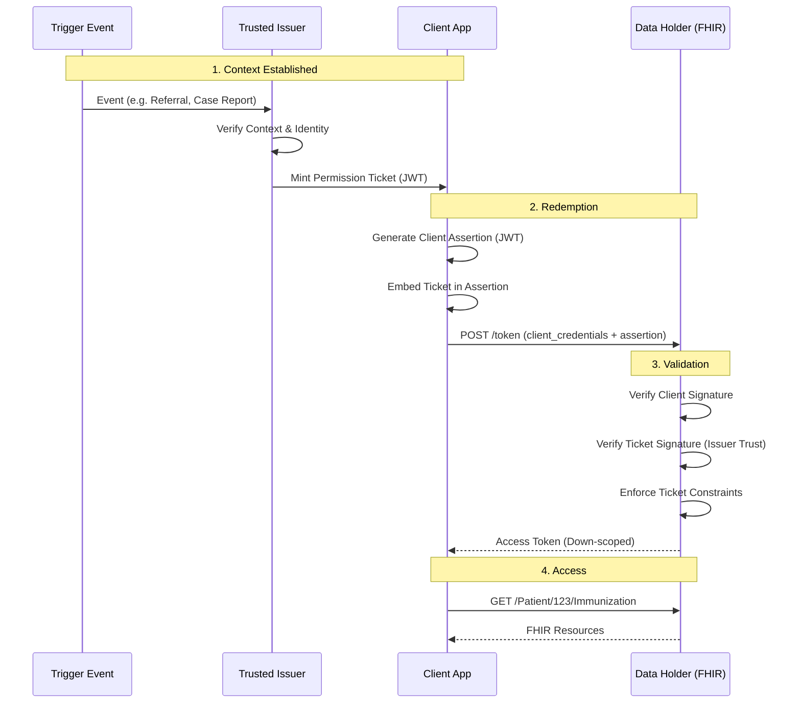

## The Solution: Permission Tickets

A **Permission Ticket** is a JWT minted by a Trusted Issuer. It acts as a self-contained authorization grant.

### Core Principles
1.  **Issuer-Signed:** The ticket is minted by an entity the Data Holder trusts (e.g., a Trust Broker, an Identity Verifier, or the Data Holder itself).
2.  **Client-Bound:** The ticket is cryptographically bound to the Client ID of the requesting application.
3.  **FHIR-Native:** The payload uses strict FHIR Resource structures (`Patient`, `PractitionerRole`, `Organization`) to define identities, making integration with existing EHR logic seamless.
4.  **Zero-Interaction:** The Data Holder validates the ticket signature and grants access immediately. No user login page is presented.

### Authorization Flow

---

## Operational Roles

To make this work, we rely on **OIDC Federation** principles.

1.  **Trust Broker / Identity Issuer:**
    *   Responsible for verifying the "Trigger" (e.g., checking the User's ID, verifying the Legal Guardian relationship).
    *   Mints the ticket.
    *   *Examples:* TEFCA QHIN, State HIE, Specialized Credential Service Provider (CSP).

2.  **The Ticket Holder (Client App):**
    *   The entity that wants data.
    *   Must have a registered Client ID (public key) in the federation.
    *   Stores the ticket and presents it when calling the Data Holder.

3.  **The Data Holder (Server):**
    *   Receives the request.
    *   **Verifies:**
        *   Is the Issuer trusted?
        *   Is the Ticket bound to this Client?
    *   **Logs:** Writes the specific `actor` from the ticket (e.g., "Alice @ FoodBank") into the Audit Log.
    *   **Enforces:** Limits the Access Token scopes based on the `capability` block.
